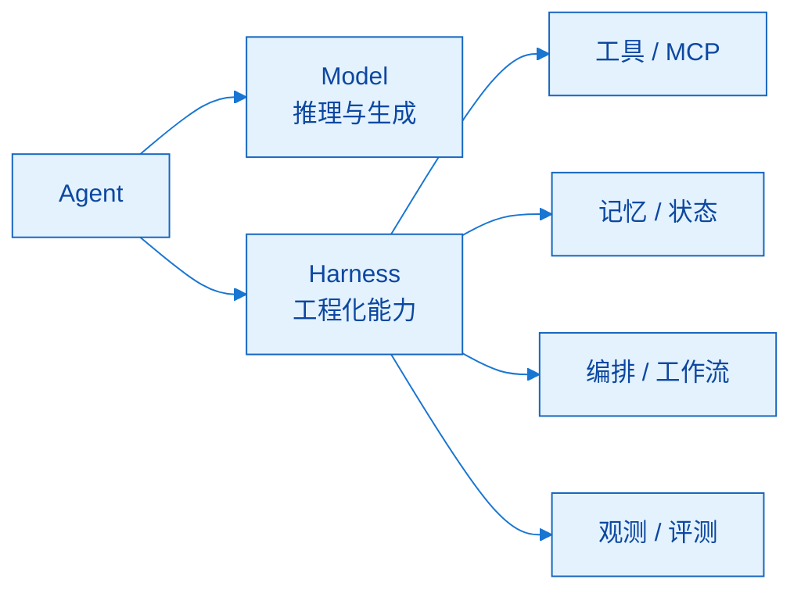
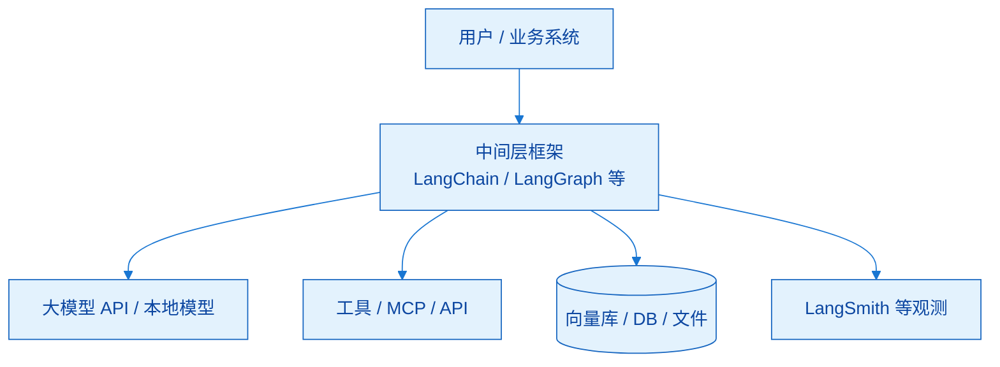
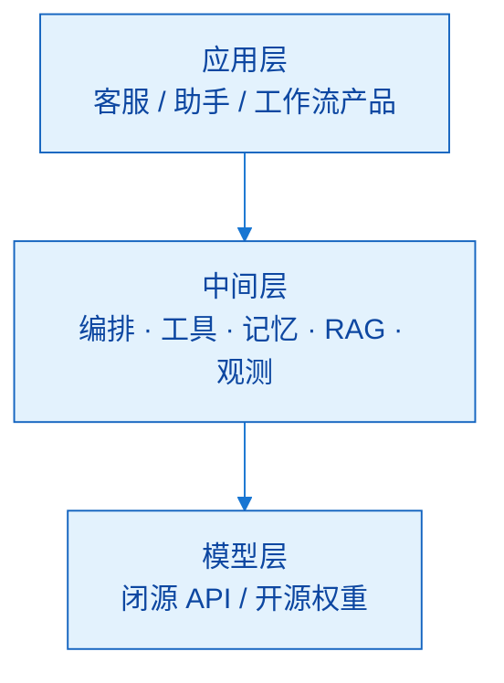
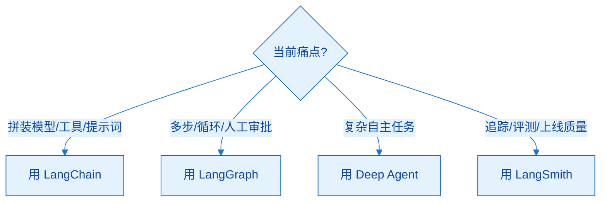
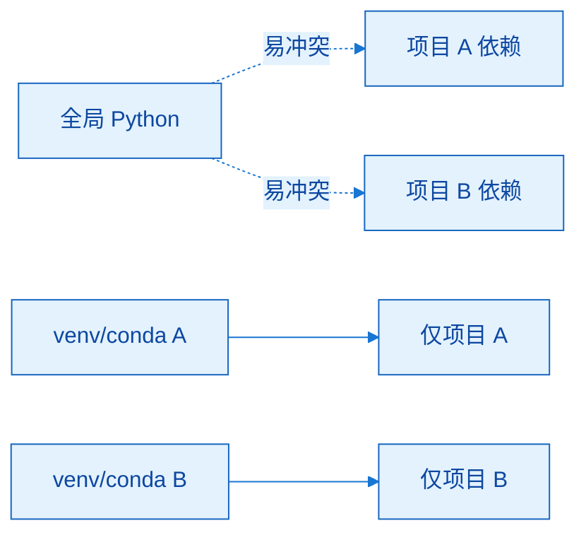
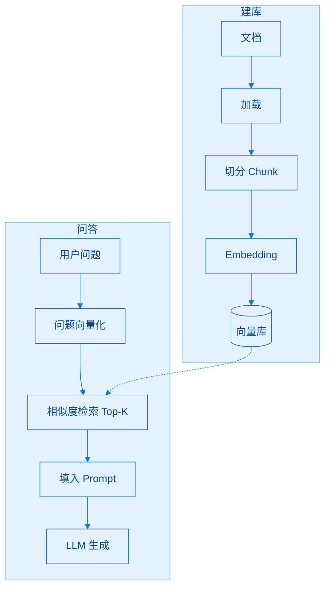
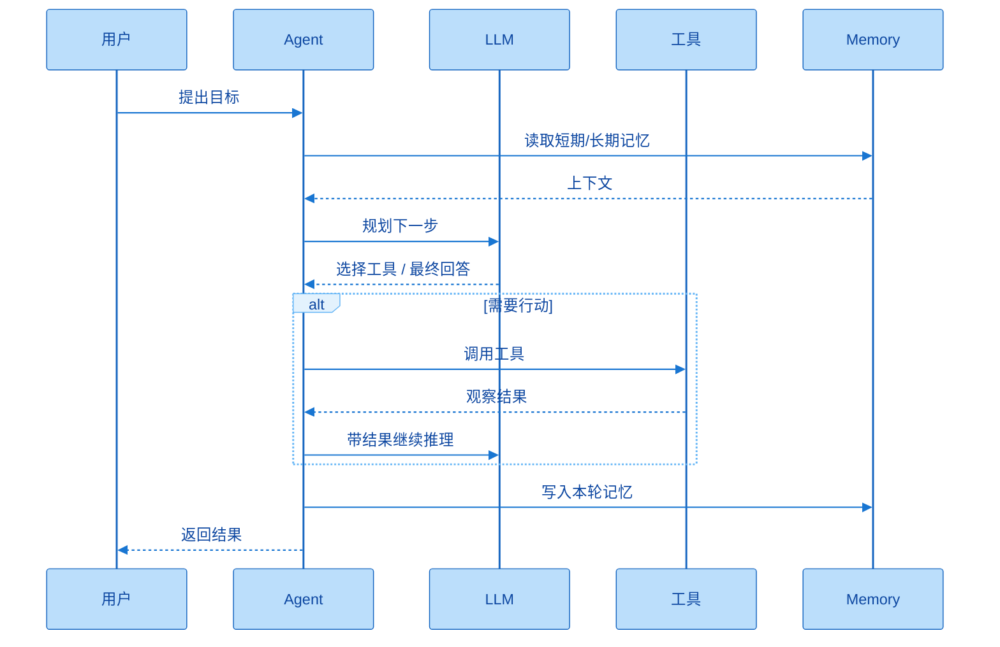
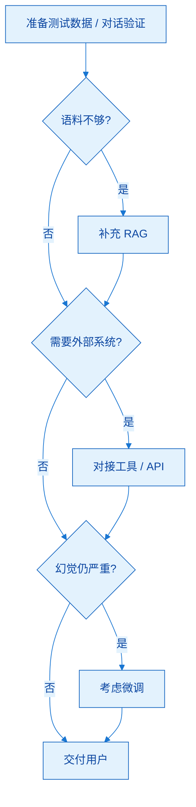

# LangChain 概述

> **版本**：LangChain **1.2.12**（Python ≥ 3.10）

本章建立整门课的世界观：为什么需要框架、LangChain 是什么、生态四大支柱、环境怎么搭，以及 RAG / Agent / 技术选型阶梯。目标是「脱离视频也能讲清楚第一章」，而不是只记几个口号。

---

## 一、本章学什么

用 **Why → What → How（环境）→ How（场景）** 建立大模型应用世界观：

| 顺序 | 主题 | 你应能做到 |
|------|------|------------|
| Why | 时代背景、模型局限、岗位地图 | 说清为何学框架、自己站哪一层 |
| What | 命名、演进、模块、四大支柱 | 分清狭义/广义、0.3 vs 1.x、四支柱职责 |
| How | conda、装包、IDE | 环境可复现，版本锁死 1.2.12 |
| 场景 | RAG、Agent、四阶梯 | 默画流程，会按痛点选型 |

这一章几乎不写业务代码，却决定后面会不会学偏：若只追 MCP、Skills、「养虾养马」等热点名词，会永远在应用层打转；若先把中间层框架吃透，再回看热点，才能分清「能力」与「产品包装」。

**核心公式（贯穿全课）**

```text
Agent = Model + Harness（工程化能力）
```

智能体不等于「换一个更强的大模型」。Model 负责推理；Harness 负责接工具、管记忆、做编排与观测、把能力收成可上线系统。LangChain（及家族）是当前最常用的 Harness / 中间层之一。学它，本质是学「如何给大脑装上手脚和流程」。



图中 Model 是「想」，Harness 是「做」。产品差异越来越多落在 Harness：同一模型换中间层，行为可以差很多。


### 补充想法：第一章与第二章如何衔接

第一章回答「为什么要中间层」；第二章开始「怎么把某一个模型接进中间层」。建议第一章读完就定下个人目标岗位（应用开发 / 算法 / 其它），并接受「本课默认栈 = Python + LangChain 1.2.x」——后面换模型可以，但不要每章换框架。

---

## 二、课程定位与时代背景

### 2.1 时代脉络

| 时间 | 事件 | 行业重心 |
|------|------|----------|
| 2022.11 | ChatGPT 引爆全球 | 对话式 LLM 进入大众视野 |
| 2023 | 国内百模大战 | 比拼基座与语料 |
| 2024 | 你追我赶 | 仍偏模型能力竞赛 |
| 2025.01 | DeepSeek R1 等加速普及 | 模型走向更广人群 |
| 2025 下半年 | 场景应用 / Agent 时代 | **从基座比拼 → 落地** |
| 2026 上半年 | Harness、全民用 AI 浪潮 | 工程化与 Agent 外壳变焦 |

串起来看：前几年比「谁模型更强」；进入 2025 下半年后，比的是「谁能在客服、知识库、流程自动化里稳定干活」。竞争焦点从模型能力转向 **Harness 工程化**——这正是框架课存在的理由。

```mermaid
%%{init: {
  "theme": "base",
  "themeVariables": {
    "primaryColor": "#BBDEFB",
    "primaryTextColor": "#0D47A1",
    "primaryBorderColor": "#1565C0",
    "secondaryColor": "#E3F2FD",
    "secondaryTextColor": "#0D47A1",
    "secondaryBorderColor": "#64B5F6",
    "tertiaryColor": "#E3F2FD",
    "tertiaryTextColor": "#1565C0",
    "tertiaryBorderColor": "#90CAF9",
    "lineColor": "#1976D2",
    "textColor": "#0D47A1",
    "mainBkg": "#E3F2FD",
    "nodeBorder": "#1565C0",
    "clusterBkg": "#E3F2FD",
    "clusterBorder": "#64B5F6",
    "titleColor": "#0D47A1",
    "edgeLabelBackground": "#E3F2FD",
    "actorBkg": "#BBDEFB",
    "actorBorder": "#1565C0",
    "actorTextColor": "#0D47A1",
    "signalColor": "#1976D2",
    "signalTextColor": "#0D47A1",
    "labelBoxBkgColor": "#E3F2FD",
    "labelBoxBorderColor": "#64B5F6",
    "labelTextColor": "#0D47A1",
    "loopTextColor": "#0D47A1",
    "noteBkgColor": "#E3F2FD",
    "noteTextColor": "#0D47A1",
    "noteBorderColor": "#64B5F6",
    "activationBkgColor": "#90CAF9",
    "activationBorderColor": "#1565C0",
    "sequenceNumberColor": "#FFFFFF"
  }
}}%%
flowchart LR
  subgraph T["LLM 应用重心迁移（课件脉络）"]
    direction LR
    Y22["2022<br/>ChatGPT 出圈"]:::b1
    Y23["2023<br/>百模大战 / Prompt 热潮"]:::b2
    Y24["2024<br/>仍偏基座能力竞赛"]:::b3
    Y25["2025下<br/>场景落地 / Agent 时代"]:::b4
    Y26["2026<br/>Harness 与工程化变焦"]:::b5
    Y22 --> Y23 --> Y24 --> Y25 --> Y26
  end
  classDef b1 fill:#E3F2FD,stroke:#90CAF9,color:#0D47A1
  classDef b2 fill:#BBDEFB,stroke:#64B5F6,color:#0D47A1
  classDef b3 fill:#90CAF9,stroke:#42A5F5,color:#0D47A1
  classDef b4 fill:#BBDEFB,stroke:#1976D2,color:#0D47A1
  classDef b5 fill:#90CAF9,stroke:#1565C0,color:#0D47A1
```



时间线不必背年份，要抓住趋势：从「谁模型更强」转向「谁能稳定落地」。


### 2.2 为什么学框架（而不是只玩豆包）

- 会 Python / 会用豆包，中间仍隔「一片海」→ 框架是桥  
- GitHub 与招聘 JD 里，LangChain 出现频率高  
- 学框架能看清 Agent **能力边界**，不被热点名词带着跑  

三点其实同一件事：会聊天产品 ≠ 会做可落地应用。缺的是把模型、工具、记忆、编排拼起来的工程能力。透过框架设计，你能看出「什么该模型做、什么该系统做」，从而在 MCP、Skills、各类 Agent 产品之间保持清醒。

### 2.3 本课内容与三个项目

| 项目落点 | 大致对应能力 |
|----------|----------------|
| 多轮对话聊天机器人 | 提示词 / 消息 / 多轮 |
| 多功能智能助手 | Agent + 工具等 |
| AI 客服知识库 Assistant | RAG + Agent 综合 |

课程锁定 **1.2.12**，并刻意覆盖 1.x 重点：结构化输出、中间件、短/长期记忆、RAG 等，避免「装了最新版却只讲 0.3 套路」。课件、代码、辅助工具齐备；学习时以官方文档为词典，以本课为讲解与路线图。

### 补充想法：简历怎么写这一章的产出

第一章本身难直接写进简历，但可以写成学习目标：「基于 LangChain 1.2 完成 Agent / RAG 方向应用开发，理解 Model+Harness」。真正可展示的是后面三个项目；第一章的价值是保证你选对赛道，不把时间耗在基座训练幻想或纯刷热点上。

---

## 三、为什么需要 LangChain

### 3.1 学习新事物的三问

1. **Why** — 为什么需要  
2. **What** — 是什么  
3. **How** — 怎么用  

任何新技术都可按此三问学习。本章主攻 Why / What，How 从环境准备开始，并在后续十一章展开。若跳过 Why 直接抄代码，遇到「要不要上 RAG / 要不要微调」时会没有判断标准。

### 3.2 大模型三个天然局限

| # | 局限 | 含义 | 常见误解 |
|---|------|------|----------|
| 1 | 知识受限于训练数据 | 有语料截止日，之后事件可能不懂 | 「豆包能查新闻」= 产品已联网，不是裸模型能力 |
| 2 | 不能天然连外部世界 | 不能联网、调 Web API、查库 | 军师没有士兵与情报站 |
| 3 | 无状态 / 无上下文记忆 | 说过「我叫小明」下一句可能忘 | 多轮体验差；需应用层维护历史 |

裸模型像「只有大脑的军师」：会出主意，没有四肢五感，也记不住你是谁。要把模型做成实用应用，必须组合 **模型 + 外部工具 + 数据源 + 记忆**——这正是 LangChain 一类中间层存在的原因。



没有中间层时，业务代码直接散落调用 LLM、工具、存储；有了中间层，这些横切能力可复用、可替换、可观测。


### 3.3 框架定位：三层蛋糕

```text
应用层：豆包、元宝、淘宝客服、你的 Agent…
中间层：LangChain（首选落地框架之一）
模型层：GPT / DeepSeek / 通义…
```

底层「会想」，顶层「给用户用」，中间层「把想法接到真实世界」。LangChain 不替代模型，也不等于最终 App，它是连接二者的工程层。



三层是同一条调用链上的职责切分：需求从应用层来，能力从模型层来，工程从中间层落地。


**中间层三职责（课件）**

1. 打通大模型与外部资源（库、搜索、API、文件系统）  
2. 封装工具调用、记忆等，降低 Agent 开发难度  
3. 支撑多智能体协作（依托 LangGraph 等）  

先「连得上」，再「封装省事」，再「协作可扩展」。你在业务里写的大多数胶水代码，最终都会落在这三类职责上。

### 3.4 典型应用场景（六类）

| 场景 | 痛点 | 框架能帮什么 |
|------|------|----------------|
| RAG | 知识滞后、幻觉 | 外挂知识库，检索后生成 |
| Agent | 模型只会说不会做 | 规划 + 工具 + 行动循环 |
| 对话系统 | 多轮失忆 | 记忆管理 + 私有数据 |
| 多模态 | 纯文本不够 | 图/音/视综合推理 |
| 内容生成 | 格式不稳 | 模板 + 解析 / 结构化输出 |
| 数据连接 | 非结构化难用 | 加载文档、NL2SQL 等 |

当前舆论常把「大模型应用 ≈ Agent」，Agent 又常内嵌 RAG。学习心态：先掌握框架主线能力，再回看具体产品（含 MCP、Skills 等），避免把「某个爆火应用」当成唯一技术栈。

### 补充想法：为什么「中间层」比「再学一个模型 API」更划算

厂商 API 会变，模型会换；中间层把「换模型」变成改配置，把「接工具/记忆」变成可组合模块。职业周期里你可能换三次主模型，但不想换三次应用架构——这就是押注框架而非押注单一模型品牌的 Rational。

---

## 四、大模型相关岗位

自下而上（金字塔）：

| 层次 | 岗位 | 特点 |
|------|------|------|
| 底层 | 运维 / Infer 工程师 | GPU/TPU 部署与优化，偏硬，大厂机座团队需求相对集中 |
| 中下 | 数据开发与清洗 | 语料清洗标注，训练「燃料」，不高端但不可或缺 |
| 中 | 基座研发与优化 | 学历门槛极高（常博士），坑位少、薪资可极高 |
| 中上 | 微调 / 算法工程师 | 行业后训练、多模态等；一本+可考虑 |
| **上层** | **大模型 / Agent 应用开发** | **本课目标；岗位最多；应用为王** |

读表时抓住二分法：**造模型** vs **用模型**。越往下越造、越硬、人越少；越往上越用、越贴业务、需求越大。本课明确站在上层应用开发——用 LangChain 高效做 Agent / RAG 类产品。

要点：

- 应用开发是广义学习者最值得关注的方向  
- 做微调也最好懂应用，否则微调目标漂移  
- LangChain = 应用层高频工具，不是炼丹炉替代品  

即便走算法线，不懂「应用要什么」，微调也容易做成实验室分数游戏。反过来，应用开发者懂一点模型局限，才能和算法同事对齐预期。

### 补充想法：如何对照自身选层

| 背景 | 更现实的切入 |
|------|----------------|
| 后端 / 全栈 | 上层应用开发（本课） |
| 数据工程 | 中下数据 + 上层 RAG 数据管道 |
| 研究生算法 | 中上微调，同时补应用 |
| 运维 / 基础设施 | 底层 Infer + 应用侧部署 |

不要把「年薪百万基座岗」当默认目标；先问自己三年内更能交付哪一层的成果。

---

## 五、LangChain 是什么

### 5.1 定义与命名

| 项 | 内容 |
|----|------|
| 创建 | 2022.10，Harrison Chase（哈里森·蔡斯） |
| 命名 | Language（面向 LLM）+ Chain（链式连接） |
| 理念 | 把大模型与计算资源、数据、组件链接，构建 AI 应用 |

名字即设计：面向语言模型，用「链」的思想组合能力。它比 ChatGPT 公开发布略早，说明从一开始就押注应用层。狭义「学 LangChain」多指开发框架；广义指整个家族生态（Graph、Smith、Deep Agent 等）。

### 5.2 发展五阶段

| 阶段 | 时间 | 关键词 |
|------|------|--------|
| 诞生 | 2022.10 | 开源起步 |
| 探索期 | 2022Q4–2023Q1 | PromptTemplate、LLMChain，Star 暴涨 |
| 体系化 | 2023 | Tool、Agent、Retrieval；Hub、LangSmith |
| 平台化 | 2024–2025上 | LangGraph、LangServe |
| 深层智能体 | 2025下至今 | Deep Agent（Agent Harness）；**1.0 正式版** |

从「链式小模块」走到「智能体平台 + Harness」，你现在学的 1.2 站在第五阶段的稳定底座上，而不是 0.x 动荡期。

### 5.3 两个重要版本：0.3 vs 1.x

| 维度 | v0.3 | v1.x / 1.2 |
|------|------|------------|
| 观感 | 既爱又恨，「版本碎钞机」 | 生产级稳定，新范式 |
| 设计 | 以 Chain 为核心 | 从链式 → **智能体框架** |
| Agent | `initialize_agent` 等 | 推荐 `create_agent`，底层 LangGraph |
| 工具 | 类型安全较弱 | Pydantic Schema |
| 结构化输出 | Parser / 正则为主 | Structured Output 一等公民 |
| 输出形态 | 偏纯文本再解析 | `content_blocks` 等标准化 |
| 扩展 | 缺系统扩展 | **Middleware 中间件** |
| 多模态 | 不完善 | 明显加强 |
| 异步 | 一般 | 有优化叙述 |
| 包结构 | 较乱、耦合高 | core / classic / community 清晰 |
| Python | ≥ 3.9 | **≥ 3.10** |
| 用途 | 仅维护老项目 | **新项目首选** |

0.3 时期：API 变动快、抽象重、文档滞后；同时 GPT-4 原生具备工具调用等能力，部分人觉得「框架多余」，社区一度流失。约 **2025-10-20** 发布 1.0（与 LangGraph 1.0），官方承诺 2.0 前无破坏性变更，并有大额融资背书。新学习路径应直接 1.2，不要把 0.3 管道符教程当默认圣经。有人戏称 1.x「像 LangGraph 2.0」——含义是编排重心已在 Agent / Graph，而不只是 Chain。

### 补充想法：看到 0.3 教程怎么办

| 你看到的 | 建议 |
|----------|------|
| `LLMChain` + 管道符 `|` | 了解历史即可，新代码优先 Agent / 新 API |
| `initialize_agent` | 对照文档找 `create_agent` 等价物 |
| 旧 import 路径 | 查是否已迁到 `langchain-classic` |

把 0.3 材料当「考古」，不当「施工图」。

---

## 六、主要模块与 API 文档

### 6.1 包结构

| 包 | 内容 | 使用态度 |
|----|------|----------|
| `langchain-core` | Runnable、BaseMessage 等核心 API | **优先用，心里踏实** |
| `langchain-classic` | 0.x 旧 API、不推荐写法 | 兼容老代码 |
| `langchain-community` + 厂商包 | openai / anthropic 等 | 按需安装，避免臃肿 |
| `langgraph` | 图编排、循环、复杂任务 | 深度整合，后续重点 |

三层书架 + 编排引擎：core 是标准库心态；classic 是旧物仓；community/厂商包是插件；langgraph 是复杂流程引擎。新代码优先 core，不要习惯性从 classic 翻 deprecated API。

### 6.2 文档入口与学习原则

| 用途 | 链接 |
|------|------|
| 官网 | https://www.langchain.com/ |
| GitHub | https://github.com/langchain-ai |
| 英文 Docs | https://docs.langchain.com/oss/python/langchain/overview |
| 中文 Docs | https://docs.langchain.org.cn/oss/python/langchain/overview |
| API Reference | https://reference.langchain.com/python/langchain/ |
| 模块总览 | https://reference.langchain.com/python/langchain/overview |

课件金句：

> 不要试图学完所有 API。搞懂核心逻辑与核心模块，用到再查。当成**工具箱**，不是教科书。

官网 Products / Docs / Learn 可浏览全貌；真正写代码时以 Reference 查参数。本课十一章会覆盖 Agents、Models、Messages、Tools、Streaming、Structured Output、Middleware、记忆、RAG、MCP、人在环等——与文档「核心组件」高度对齐。

### 补充想法：文档怎么查最快

先用本笔记定位「我在解决哪类问题」，再带着关键词进 Reference（如 `init_chat_model`、`BaseMessage`）。不要从左侧目录第一页通读到最后——那是官方作者视角，不是学习者视角。

---

## 七、家族四大支柱

截至约 2025.11，生态四大支柱：

| 支柱 | 层级角色 | 一句话 | 选用口诀 |
|------|----------|--------|----------|
| **LangChain** | 基础能力层 | 模型 / 消息 / 工具 / Agent / 中间件等 | 解决「**快**」；简单 Agent → **本课主体** |
| **LangGraph** | 运行时编排层 | 有向图：Node / Edge / State | 解决「**稳**」；复杂工作流 |
| **Deep Agent** | 智能体抽象 / Harness | 规划、子 Agent、长期记忆、虚拟文件系统等 | 解决「**复杂任务**」；大活少从零造 |
| **LangSmith** | 监控与评估层 | 全链路追踪、调试、评测、协作 | 不能只靠 print；质量闭环 |

**LangChain 价值再展开：** 统一模型抽象、模块化（Message/Tool/Agent/Middleware）、丰富集成——像智能体「操作系统内核」。结论：无需复杂编排时，选 LangChain 即可。

**LangGraph 再展开：** 任务变成多步骤、有状态时，用图描述流转。Node = 功能/决策点，Edge = 路径条件，State = 共享并持久的上下文。官方强调：快起步用 Chain，复杂控制用 Graph，二者协同。

**Deep Agent 再展开：** 官方定位 Agent Harness，建在 Chain + Graph 之上；核心能力含显式规划、虚拟文件系统、子智能体、长期记忆、可扩展中间件。用于「不想从零写复杂控制逻辑」的深度智能体。

**LangSmith 再展开：** 追踪模型调用、提示、输出、工具；做调试、评测、团队共享测试集。系统一复杂，print 不够用。

关系口诀：

```text
LangChain  = 有什么能力
LangGraph  = 怎么跑（编排）
Deep Agent = 更强自主 / 多智能体
LangSmith  = 看得见、评得了
```

三者非互斥：可从 Chain 快速验证，用 Graph 打磨生产稳定性，用 Deep Agent 加强自主，全程用 Smith 盯质量。



选型不是互斥：常见组合是 LangChain + LangGraph 开发，LangSmith 观测；Deep Agent 在复杂任务时再上。


### 补充想法：学习顺序不要倒挂

先把本课 LangChain 主线（模型、消息、工具、Agent、RAG、记忆、中间件）跑通，再按需加 Graph / Deep Agent。一上来啃多智能体图编排，容易「什么都见过、什么都写不出来」。Smith 可在第二章后尽早穿插，因为观测能加速一切调试。

---

## 八、开发前准备（环境）

### 8.1 前置知识

**Python：** 变量、流程、函数与参数、类与对象、装饰器；列表/元组/集合/字典；JSON；异常；模块与包管理；线程/协程了解更好。

**LLM 常识：** 知道 LLM、Token、Prompt、Embedding；用过豆包 / 千问 / DeepSeek 等产品；知道还有 OpenAI、Anthropic、百炼等提供商。

LangChain 有 Python / JS；**Python 功能最完整、更新最快、社区最活跃**，本课只用 Python。其它语言（Java/C# 等）另有生态，但不是本课路径。

### 8.2 为何要虚拟环境

全局环境像所有项目共用一个调料架：项目 A 要某包 1.x，项目 B 要 2.x，必然冲突。虚拟环境让每个项目拥有独立解释器与依赖集合。



隔离的本质是「每项目一套解释器 + 包集合」，这样 `langchain==1.2.12` 才锁得住。

### 8.3 三方案对比

| 工具 | 管解释器 | 管 Python 包 | 管非 Python 依赖 | 适合 |
|------|----------|--------------|------------------|------|
| **conda**（本课） | ✅ | ✅ | ✅（CUDA 等） | AI / 深度学习 / 复杂依赖 |
| uv | ✅ | ✅ | ❌ | 纯 Python、现代包管理 |
| venv | 基于已有解释器 | ✅ | ❌ | 轻量、教学 |

conda 不只是 pip 替代品，还能管 CUDA、系统库等；AI 工程优先。uv 快，适合纯 Python。venv 官方自带，不负责安装新解释器。本课依赖偏纯 Python，三种都行；统一 **conda** 是为减少同学环境差异。conda 环境里可用 pip，但建议：底层优先 conda，Python 包不足再用 pip，避免无脑交替导致依赖树混乱。

### 8.4 Miniconda 与推荐命令

建议装 **Miniconda**（比 Anaconda 轻；课程用不到上百个预装科学包）。安装路径**不要中文和空格**。

```bash
# 创建环境（写死版本，减少踩坑）
conda create --name langchain1.2 python=3.13.12
conda env list
conda init          # 后请重开终端
conda activate langchain1.2
python -V

# 退出 / 删除（需要时）
conda deactivate
conda remove --name langchain1.2 --all
```

LangChain 1.2 要求 Python **≥ 3.10**；课件示例使用 3.13.12 一类具体小版本，建议与课件对齐，少自己「追最新补丁」除非你愿意处理兼容性。

### 8.5 安装 LangChain 1.2.12

```bash
# 方式1：conda（优先尝试）
conda install langchain==1.2.12
# 或指定频道
conda install -c conda-forge langchain==1.2.12

# 方式2：pip（conda 找不到或约束过严时很常见）
pip install langchain==1.2.12
# 国内镜像示例
pip install langchain==1.2.12 -i https://pypi.tuna.tsinghua.edu.cn/simple

conda list   # 或 pip show langchain
```

**务必写死版本**，不要裸 `pip install langchain` 追最新。课上演示过：conda 渠道可能找不到指定版本，或与当前 Python 小版本约束冲突，此时改用 pip 更宽松——这是正常排错，不是「conda 没用」。

IDE（PyCharm / VS Code）新建项目时，解释器指向该 conda 环境，跑：

```python
import langchain
print(langchain.__version__)  # 期望 1.2.12
```

出现正确版本，第一章环境目标即达成。

### 补充想法：环境清单模板

建议自备一页「环境卡片」：`OS / Miniconda 路径 / env 名 / Python 版本 / langchain 版本 / IDE 解释器路径`。换电脑或重装时按卡片复现，比翻聊天记录靠谱。第二章起还会加 `.env` 与各平台 Key，可另开「密钥卡片」且勿提交 Git。

---

## 九、应用场景 1：RAG

### 9.1 行业体感与要解决的问题

大模型应用常见评价：**门槛低、天花板高**——Cherry Studio、Dify 等几分钟能搭玩具；要低幻觉、可上线，难度不亚于一套后台。

| 问题 | 表现 |
|------|------|
| 知识冻结 | 训练截止后的新知识模型不知道 |
| 幻觉 | 领域语料不足时一本正经编造 |

RAG 的存在就是为了给模型「开卷」：把私有/最新资料变成可检索外挂。

### 9.2 定义

**RAG = Retrieval-Augmented Generation（检索增强生成）**

| 词 | 含义 |
|----|------|
| Retrieval | 从知识库找相关片段 |
| Augmented | 把片段补进提示词 |
| Generation | 模型基于增强上下文生成答案 |

类比：**闭卷考试**（裸模型）vs **开卷考试**（带知识库）。准确率从「凭印象」变成「有据可查」。

### 9.3 主流流程（建库 + 问答）

```text
【建库】
多格式文档(PDF/Word/MD/HTML…)
  → 加载成文本
  → 切成 Chunk（切片）
  → Embedding 向量化
  → 写入向量数据库

【问答】
用户提问
  → 问题向量化
  → 相似度检索 Top-K 切片
  → 填入 Prompt 模板
  → LLM 生成更靠谱的答案
```

建库解决「知识在哪、如何表示」；问答解决「这次问题该看哪几页」。向量库存的是高维数值表示，用相似度找「意思接近」的片段，而不是简单关键词匹配（具体算法后文展开）。



建库把知识变成可检索表示；问答每次只取出相关切片再生成，这就是「开卷考试」的工程形态。


### 9.4 工程难点预告（第十章展开）

| 难点 | 为什么难 |
|------|----------|
| 文件解析 | 多格式；同一 PDF 含文/图/表 |
| 切分策略 | 太长超上下文、太碎丢语义；字符/token/语义/递归等策略 |
| 检索 | 算法与召回质量决定上限 |
| 重排序 Re-ranker | 高精度场景可上；低延迟场景要权衡 |

重点不是背住「RAG」三个字母，而是承认：**检索质量 ≈ 回答质量**。Agent 章会看到 RAG 也可作为长期记忆/知识外挂的一部分。

### 补充想法：什么时候还不上 RAG

纯开放闲聊、不依赖私有知识时，不必硬上向量库。需求验证阶段甚至可先「把资料塞进长上下文」做原型，确认业务成立再工程化 RAG——与后文「先对话验证再补 RAG」一致。

---

## 十、应用场景 2：Agent

### 10.1 定义与译名

充分利用大模型的**推理决策**能力，构造能独立思考、逐步完成目标的 **Agent（智能体）**。「代理」易让人以为只是转发请求；**智能体**更贴切。

### 10.2 公式与五要素

```text
Agent = 大模型 + 规划决策 + 工具调用 + Memory + Action
```

| 要素 | 含义 | 类比：去西藏 |
|------|------|----------------|
| LLM | 大脑 | 规划行程的你 |
| Planning | 拆解复杂目标 | 先飞哪、再住哪 |
| Tools | 手脚 / 五感 | 滴滴、携程、美团 |
| Memory | 短期会话 + 长期偏好 | 别订到新疆酒店 |
| Action | 真去执行 | 说走就走 |

原始人打猎类比同样好用：感知（看到鹿）→ 决策（用长矛）→ 行动（投掷）→ 记忆（哪里有水有鱼）。OpenAI 元老提出的现代 Agent 架构被广泛接受，要素与上表同构。缺工具则只会空谈；缺记忆则计划跑偏；缺行动则纸上谈兵。



Agent 不是「问一句答一句」，而是感知 → 决策 → 行动 → 记忆的循环；中间层负责把循环跑稳。


### 10.3 实践注意

| 注意点 | 说明 |
|--------|------|
| 不必次次最强模型 | Agent 可能多次调模型；全用最强又贵又慢（「一夜烧钱」反面教材） |
| 短期记忆 | 当前会话窗口；受上下文长度限制（主流窗口已很大） |
| 长期记忆 | 跨会话偏好与指令；常结合知识库/向量库；后文专章 |

简单子任务可用小模型；规划可用更强模型——这是费用与体验的基本杠杆，第二章多模型栈会更具体。

### 补充想法：Agent 与「自动化脚本」的边界

传统脚本：人写死分支。Agent：模型在循环里选工具、看观察、再决策。脚本确定性强、Agent 灵活但更难测。生产上常「Agent 做编排决策 + 关键写操作仍走确定性 API / 人工确认（人在环）」——中间件章会碰到这类能力。

---

## 十一、四个递进场景与选型

### 11.1 能力阶梯

| 阶梯 | 能力 | 说明 |
|------|------|------|
| ① | 纯 Prompt | 一问一答，无状态 |
| ② | + 记忆 | 记得上文 → 开始像智能体 |
| ③ | + 工具 / Function Calling | 查天气等，从「说」到「做」 |
| ④ | + RAG | 私有知识库；可作长期记忆一部分 |
| （靠后） | Fine-tuning 微调 | 治幻觉的重要但昂贵手段 |

阶梯价值是「别跳级」：先跑通对话，再叠记忆、工具、RAG。微调人贵、数据贵，还有调坏风险，通常放在工程组合之后。智能客服里：对话记忆记用户问题，产品语料进 RAG——两者经常同时出现。

### 11.2 选型流程（简化版）

```text
准备测试数据 → 用对话应用验证可行性
    ↓ 语料不够？
补充 RAG
    ↓ 仍需外部系统？
对接工具（Web / API）
    ↓ 幻觉仍严重？
考虑模型微调
    ↓
交付用户
```

原则：**先工程组合（RAG + 工具），后动模型（微调）。** 实际项目手段远不止三种，但这是建立直觉的主轴。面对「客服胡说产品参数」，优先补产品知识库（RAG）与查单工具，而不是先招微调团队。



原则仍是：先工程组合（RAG + 工具），后动模型（微调）。阶梯图值得钉在显示器旁。


### 补充想法：用阶梯写技术方案一页纸

立项时强制写清：当前停在第几阶、下一阶补什么、成功指标是什么（准确率/延迟/成本）。避免一上来画「多智能体 + 微调 + 自研向量库」大饼。第一章的阶梯图，值得钉在显示器旁边。

---

## 十二、本章速记卡

```text
1. Agent = Model + Harness；LangChain ≈ 中间层 / Harness
2. 模型三短板：知识截止 | 无四肢 | 无记忆
3. 三层：模型层 / 中间层 / 应用层
4. 岗位：应用为王 → 本课做 Agent / RAG 应用开发
5. Language + Chain；狭义框架 vs 广义家族
6. 1.x：从 Chain 范式 → Agent 框架；新项目别用 0.3 当默认
7. Core 优先 | Classic 兼容 | Community 按需 | Graph 编排
8. 四大支柱：Chain(快) / Graph(稳) / DeepAgent(复杂) / Smith(观测)
9. conda + Python≥3.10 + langchain==1.2.12（写死版本）
10. RAG = 检索增强生成 = 开卷考试；建库 + 问答两段
11. Agent = 大脑 + 规划 + 工具 + 记忆 + 行动
12. 选型：Prompt → 记忆 → 工具 → RAG →（最后）微调
```

按「公式 → 局限 → 定位 → 生态 → 环境 → 场景 → 选型」口述一遍；能讲给非技术朋友听懂，第一章才算真正进脑。

---

## 十三、自检清单

- [ ] 能口述 `Agent = Model + Harness`，并举一个 Harness 职责例子  
- [ ] 能说出三局限，并解释「豆包能联网」为何不能反驳裸模型局限  
- [ ] 能手绘三层蛋糕与岗位金字塔，并标出自己的目标层  
- [ ] 能对比 0.3 与 1.x 至少四条关键差异  
- [ ] 能说明 core / classic / community / langgraph 的使用态度  
- [ ] 能用「快 / 稳 / 复杂 / 看得见」对应四大支柱  
- [ ] 虚拟环境已建好，`langchain.__version__` 为 1.2.12  
- [ ] 能默画 RAG 建库与问答流程，并列出至少两个工程难点  
- [ ] 能写出 Agent 五要素，并解释为何不必次次最强模型  
- [ ] 面对幻觉，能按选型流程说出前两步该做什么  

建议自测：合上笔记，用手机录音讲 5 分钟「什么是 LangChain、为什么要学」；回放时检查有没有把豆包能力说成裸模型能力、有没有把微调放在 RAG 前面。
