# 模型的创建与调用

> **版本**：LangChain **1.2.x**（对话模型为主；Python ≥ 3.10）

官方文档对照：

- 英文：https://docs.langchain.com/oss/python/langchain/models  
- 中文：https://docs.langchain.org.cn/oss/python/langchain/models  
- 参数说明：https://docs.langchain.org.cn/oss/python/langchain/models#parameters  

官方文档权威但偏短，本章笔记按课件结构尽量写全：准备 → 三种在线初始化路径 → 常用参数 → 本地 Ollama → 调用六种入口 → 拓展参数。配套代码目录：`langchain1.2_tutorial/chapter02_model`。

---

## 一、本章学什么

| 板块 | 核心问题 | 你应能做到 |
|------|----------|------------|
| 准备 | 连谁、密钥放哪、依赖怎么装 | 搭好 `.env` + 虚拟环境依赖 |
| 专用类 | 厂商各自怎么 new | 用 DeepSeek / 智谱 / 通义专用类跑通 `invoke` |
| 兼容 | 没有专用类怎么办 | 用 `ChatOpenAI` + `base_url` 接任意 OpenAI 兼容端点 |
| 中转 | 国外模型怎么曲线访问 | 配置 OpenRouter / CloseAI |
| 统一接口 | 1.x 怎么少记几套写法 | 熟练 `init_chat_model`，分清 `model_provider` |
| 参数 | 温度、长度怎么控 | 按场景选 `temperature` / `max_tokens` |
| 本地 | 本机怎么跑 | 装 Ollama，用 `ChatOllama` 或统一接口调用 |
| 调用 | 怎么问、怎么听回答 | 掌握 `invoke` 三种入参、返回值字段、`stream`/`batch`/异步 |
| 拓展 | 特殊字段与单次覆盖 | 会用 `model_kwargs`、`extra_body`、`config` |

这一章可以记成两句话：**先把模型「接上电」，再学会「怎么问、怎么听」。** 接上电解决的是 provider、Key、URL、初始化写法；怎么问解决的是 input 形态与六种调用入口；怎么听解决的是 `AIMessage` 里哪些字段有用。学习顺序建议与课件一致：不要跳过「兼容 vs 专用」和「中转平台上的 provider 该写谁」——这是后面所有章节调模型的地基。


第二章沿这条主线展开：先接上电，再会三种调用，再上异步，最后把「默认配置」和「单次覆盖」分开。


### 补充想法：这一章在整门课里的位置

后面 Agent、工具、RAG 每一处都要「手里先有一个 model 对象」。若本章只求「能 print 一句回复」，后面换模型、控成本、流式 UI、批量评测都会反复踩坑。建议在本章结束时固定一种**个人默认栈**（例如 CloseAI + `init_chat_model` + `.env`），后续章节除非对比需要，否则不要每节换一套初始化。

---

## 二、模型调用的准备工作

### 2.1 一张老图：提示 → 模型 → 解析

在 0.x 时代，官网常用 Model I/O 三步图：

| 步骤 | 英文习惯 | 对应组件 |
|------|----------|----------|
| 输入提示 | Format | Prompt Template |
| 调用模型 | Predict | Model |
| 输出解析 | Parse | Output Parser |

把三步串起来：你先把用户意图填进模板，再送给模型，最后把自由文本解析成程序能用的结构（字符串、JSON、对象等）。**本章只深入中间的「模型初始化与调用」**；提示词模板、结构化输出在后续章节展开。1.x 官网弱化了这张老图，但心智模型仍然成立——只是对话模型成为默认形态后，「补全模型」分支被拿掉了。


三步串起来：先填模板，再调模型，再解析成程序可用的结构。本章只深入中间的「模型」。


### 2.2 为何本章只讲对话模型

| 时代 | 模型形态 | 框架角色 |
|------|----------|----------|
| GPT-3 为主 | 补全（像成语接龙），不稳定 | 很多对话/工具/结构化靠 LangChain 高层封装 |
| GPT-3.5 起 | 对话模型主流，指令跟随更强 | 许多能力成为模型原生能力 |
| 当前 | 对话模型默认 | 课程与实战只初始化 Chat Model |

历史上「非对话 / 补全」与「对话」曾并列；现在即便你只传一个普通字符串，也会按对话/消息路径调用。开发时统一用 Chat Model，避免再维护一套 Completion API 心智。

### 2.3 初始化分类：一句话拆三个角度

> **用谁家的 API，以什么方式创建，调用存放在哪里的大模型。**

| 角度 | 选项 | 推荐 |
|------|------|------|
| 谁家的 API | ① 模型提供商专用库（`ChatDeepSeek` 等）② LangChain 统一方式（`init_chat_model`，推荐作为新代码习惯） | 两种都要会；新项目偏统一 |
| 参数写哪 | ① `.env` 配置文件（推荐）② 代码硬编码 | 生产与作业都用 `.env` |
| 模型在哪 | ① 在线 API ② 本地部署（Ollama 等） | 学习与项目默认在线；本地作实验 |

这句话不长，却决定了后面所有示例的骨架：先选入口（专用 / 兼容 / 统一 / 本地），再选密钥放置方式，再确认模型是云上还是本机。LangChain **不托管任何 LLM 权重**，只做集成与编排；没有第三方服务或本机推理进程，框架本身「调不动模型」。

### 2.4 线上大模型服务平台

| 平台 | 网址方向 | 备注 |
|------|----------|------|
| OpenRouter | openrouter.ai | 全球主流聚合，含国外模型 |
| CloseAI | closeai-asia / 相关控制台 | 亚洲向中转，含国外模型；国内使用相对省事 |
| 阿里云百炼 | bailian.console.aliyun.com | 企业友好，常有免费 Token/图片额度 |
| 硅基流动 | siliconflow.cn | 性价比高；小参数模型偏学习向 |
| 百度千帆 | 百度智能云千帆 | 百度生态 |
| 火山引擎 | volcengine ark | 字节多模态生态 |

「平台」≠「单厂商官网」：平台上通常能选多家模型；官网往往只卖自家模型。想用国外顶尖闭源模型，优先看 OpenRouter / CloseAI；只用国内模型，百炼、硅基等即可。无论哪家，调用前心里要有三要素：**模型名、API Key、Base URL**（有的专用类内置默认 URL，可省略显式传入）。OpenRouter 充值有最低额与税费规则，且部分模型可能有区域限制；CloseAI 对国内网络更友好。课程后续演示常以 CloseAI + 国内 DeepSeek 或国外 GPT 类模型为例，你可按预算与网络二选一，不必全部开通。

### 2.5 提前安装依赖

```bash
conda activate langchain1.2
pip install -r requirements.txt
```

把 `requirements.txt` 放在项目根目录一次性安装，并把主要包**版本写死**，避免「看视频时依赖已更新、彼此不兼容」。各小节若再列出零散依赖，一般已包含在总文件中，**无需重复安装**，列出只为标明本章核心库（如 `langchain-deepseek`、`langchain-openai`、`python-dotenv`、`dashscope`、`langchain-ollama` 等）。

### 补充想法：密钥与多环境

同一台机器可能同时有「课程 CloseAI」「公司百炼」「本机 DeepSeek 官网」多套 Key。建议在 `.env` 里用前缀区分（如 `CLOSEAI_`、`DEEPSEEK_`、`DASHSCOPE_`），代码里按场景 `getenv`，不要共用一个叫 `API_KEY` 的模糊名字——否则换平台时最容易串 Key。团队协作时只提交 `.env.example`（占位符），真实 `.env` 进 `.gitignore`。

---

## 三、专用 API：厂商 Model Class

### 3.1 总体写法

```text
导入 ChatXxx
→ load_dotenv(override=True)
→（可选）显式 getenv
→ ChatXxx(model=..., api_key=..., api_base/base_url=...)
→ model.invoke("...")
```

专用类最直接，也最「像各厂商 SDK」。官网集成列表与 Reference 可查有哪些 Chat 类。注意：**参数名因类而异**——DeepSeek 常用 `api_base`，OpenAI 兼容常用 `base_url`；以该类 Field 定义为准，不要凭记忆混用。

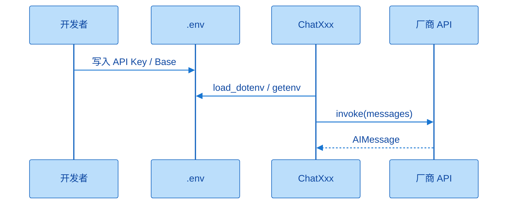

专用类路径：环境变量提供密钥，类负责默认端点与参数名；你主要关心 `model=` 与一次 `invoke`。


### 3.2 DeepSeek 官网

**依赖（若未装进 requirements）：** `langchain-deepseek`（会连带需要 openai 相关能力）、`python-dotenv`。

**`.env` 示例：**

```text
DEEPSEEK_API_KEY=<Your API Key>
DEEPSEEK_BASE_URL=https://api.deepseek.com
```

官网文档里常同时给出 OpenAI 兼容与 Anthropic 兼容形态；通用实践优先 OpenAI 兼容地址。模型名以控制台当前可用为准（课件示例用过较新的 flash 类型号，学习时选便宜、仍在线的型号即可）。

**三种写法对比：**

| 写法 | 做法 | 何时用 |
|------|------|--------|
| 显式读取 | `getenv` 后传入 `api_key` / `api_base` | 想看清数据流、变量名与库默认不一致时 |
| 依赖默认 | 只传 `model=`，Key 名恰好为 `DEEPSEEK_API_KEY` | 日常推荐；URL 常有默认值 |
| 硬编码 | Key 写在 `.py` / Notebook 单元格 | 仅临时测通；有泄露与误提交风险 |

三种都能调通。源码里 `api_key` 常通过 `secret_from_env("DEEPSEEK_API_KEY")` 注入；`api_base` 可从环境变量或默认 `https://api.deepseek.com/v1` 一类地址来。变量名必须和库约定一致，改成 `API_KEY_1` 就不会自动读到。硬编码演示完应立刻作废或删除 Key。

**最小骨架（显式版）：**

```python
from langchain_deepseek import ChatDeepSeek
from dotenv import load_dotenv
import os

load_dotenv(override=True)
llm = ChatDeepSeek(
    api_key=os.getenv("DEEPSEEK_API_KEY"),
    api_base=os.getenv("DEEPSEEK_BASE_URL"),  # 注意参数名是 api_base
    model="deepseek-v4-flash",  # 按控制台实际型号调整
)
print(llm.invoke("请介绍一下你自己"))
```

`override=True` 表示：即使用户系统/终端里已有同名环境变量，也以 `.env` 文件为准，避免「改了文件却不生效」的幽灵配置。

### 3.3 智谱大模型

- 官网控制台申请 Key；相关依赖含 `langchain-community`、`pyjwt` 等。  
- 环境变量习惯名：`ZHIPUAI_API_KEY`；Base 可写官网文档中的地址，专用类下常常可省略。  
- 类名：`ChatZhipuAI`；`model` 选控制台文本模型（越新通常越贵）。  

经验与 DeepSeek 类似：变量名跟类文档建议走；只留 `model=` 往往也能跑。专用厂商类一般不需要你每次手写 URL，因为厂商已经「钉死」默认端点。

### 3.4 通义千问（阿里云百炼）

- 类：`ChatTongyi`；依赖常涉及 `dashscope`。  
- `.env` 主要配 `DASHSCOPE_API_KEY`。  
- **重要坑：** 不要给 `ChatTongyi` 乱加 OpenAI 兼容模式的 `DASHSCOPE_BASE_URL`。百炼同时提供「专用 SDK」与「OpenAI 兼容接口」；`ChatTongyi` 走专用 SDK，硬塞兼容 URL 可能导致连接被重置一类错误。若你坚持用兼容 URL，应改走 `ChatOpenAI` / `init_chat_model` + compatible-mode 地址，而不是 `ChatTongyi`。  

模型名在百炼「模型广场 → 文本生成」中选取（如课件示例 `qwen-plus`）。新用户常有免费额度，仍建议账户里留一点余额以免额度策略变化导致调试中断。

### 补充想法：专用类的学习价值

即使你最终只打算用 `init_chat_model`，也值得亲手跑通至少一家专用类：只有看见 `api_base` vs `base_url`、自动读环境变量、默认 URL 这些细节，才能理解统一接口底层「自动选驱动类」时为什么会报错。专用类是「显微镜」，统一接口是「遥控器」。

---

## 四、兼容用法：`ChatOpenAI`

### 4.1 动机

| 原因 | 说明 |
|------|------|
| 覆盖缺口 | 并非所有厂商都有 LangChain 专用 Chat 类 |
| 配置繁琐 | 专用参数命名不统一；有的还要 APP_ID + 多密钥 |
| 行业事实 | 多数平台提供 OpenAI 兼容 HTTP API |

ChatGPT 带动了「OpenAI API 形态」事实上的标准，后续很多厂商选择兼容。于是可以用**同一套** `ChatOpenAI(api_key=..., base_url=..., model=...)` 去接 DeepSeek、智谱、百炼兼容端点等。导入使用现行 `from langchain_openai import ChatOpenAI`，不要用已标记过时的旧路径。

### 4.2 写法要点与智谱踩坑

兼容写法下，**三要素通常都要显式正确**——尤其是 `base_url` 必须是文档里的 **OpenAI 兼容 / 通用端点**，不能想当然沿用专用类内部默认值。课上典型坑：智谱专用类不写 URL 也能通；换成 `ChatOpenAI` 后仍用旧 Base，出现 Not Found；到官网「快速开始 / API 文档」复制新的兼容地址后恢复。通义若走兼容，应使用 `compatible-mode` 类 URL，并与 `ChatTongyi` 路径分开记。

```python
from langchain_openai import ChatOpenAI
from dotenv import load_dotenv
import os

load_dotenv(override=True)
llm = ChatOpenAI(
    api_key=os.getenv("DEEPSEEK_API_KEY"),
    base_url=os.getenv("DEEPSEEK_BASE_URL"),
    model="deepseek-v4-flash",
)
print(llm.invoke("1 + 1 = ？"))
```

这段骨架里，换平台 = 换三元组（key、base_url、model 字符串），类名可以不变。这就是兼容用法的产品价值。

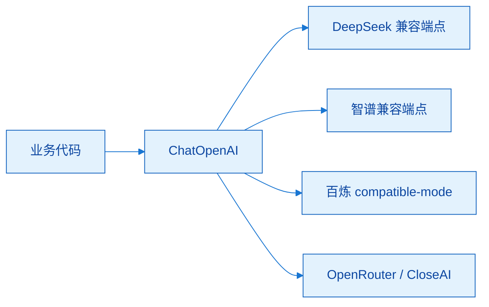

兼容层的价值是：换成另一家时，业务侧仍是同一个类与 `invoke`，变的是三元组。


### 补充想法：兼容层的代价

兼容层抹平差异，也可能抹掉厂商特性（推理开关、特殊 headers 等）。后面 `extra_body` / `model_kwargs` 正是为「兼容之后还要厂商特化」准备的逃生舱。架构上可记：**默认走兼容，特例再透传。**

---

## 五、中转平台：OpenRouter 与 CloseAI

### 5.1 中转平台是什么

中转 / 聚合平台转发各厂商 API，用统一账单和（通常）OpenAI 兼容接口访问多家模型，并收取中介费用。与百炼等「国内模型超市」相比，OpenRouter / CloseAI 更常被用来访问 **OpenAI / Claude / Gemini** 等国外闭源模型。

| 平台 | 专用集成 | 兼容 `ChatOpenAI` | 使用直觉 |
|------|----------|-------------------|----------|
| OpenRouter | 有 `ChatOpenRouter`（`langchain-openrouter`） | 可以 | 模型极多；国际化；可能有网络门槛 |
| CloseAI | **无**专用 Chat 类 | **必须**兼容写法 | 中文控制台；国内更友好；课程后续常用 |

两者都要在控制台创建 Key、复制 Base URL、在模型价目/列表里复制**精确模型名**。OpenRouter 模型名常带厂商前缀（如 `deepseek/deepseek-v4-flash`）；CloseAI 按自家价目表字符串填写。充值与试用额度以各平台当前规则为准；长期用再充值，短期演示可先吃试用。

### 5.2 OpenRouter 示例要点

`.env` 习惯：

```text
OPENROUTER_API_KEY=...
OPENROUTER_API_BASE=https://openrouter.ai/api/v1
```

可用 `ChatOpenRouter(model=..., api_key=...)`（Base 常可默认），或完全等价地用 `ChatOpenAI` + 同一套 key/base。变量名与库内 `secret_from_env` 约定对齐后，也可省略显式传入 key。

### 5.3 CloseAI 示例要点

无 `ChatCloseAI` 之类 API，固定思维：

```python
ChatOpenAI(
    model="deepseek-v4-flash",  # 或平台上的 gpt 型号名
    api_key=os.getenv("CLOSEAI_API_KEY"),
    base_url=os.getenv("CLOSEAI_BASE_URL"),
)
```

同一套 key/base，只改 `model` 字符串即可在「国内 DeepSeek」与「国外 GPT」之间切换。这正是课程后半默认演示栈的原因：一条兼容管道，测两套模型。

### 5.4 小结提问（自我检查）

OpenRouter 能不能也用 `ChatOpenAI`？**能。** CloseAI 能不能用「ChatCloseAI」？**不能，只能兼容。** 这两个问题能脱口而出，中转这一节就算过关。

### 补充想法：个人默认栈怎么选

| 你的情况 | 更稳的默认 |
|----------|------------|
| 无稳定国际网络 | CloseAI（或纯国内百炼/官网） |
| 要频繁对比国外模型 | OpenRouter |
| 只要通义生态 | 百炼 + `ChatTongyi` 或兼容 |
| 只要 DeepSeek 官网价 | `ChatDeepSeek` / 兼容直连 |

选定后写进自己的 `.env.example` 注释，避免每章临时改入口导致 Notebook「昨天还能跑今天不行」。

---

## 六、`init_chat_model`：1.x 统一接口

### 6.1 它是什么

```python
from langchain.chat_models import init_chat_model

model = init_chat_model(
    "provider:model_name",  # 或分写 model= 与 model_provider=
    api_key="...",          # 可选，常从环境变量读
    temperature=0.7,
    max_tokens=1000,
    # **kwargs
)
```

这是 LangChain 1.x 推出的**统一初始化函数**：根据模型标识 / `model_provider` 自动选择底层 `ChatXxx`。注意导入用现行路径，避免 `classic` 里已废弃的同名符号。

### 6.2 与直接 `ChatXxx` 的区别

| 维度 | 专用 / ChatOpenAI | `init_chat_model` |
|------|-------------------|-------------------|
| 心智 | 你必须知道 new 谁 | 你主要关心 provider + 模型字符串 |
| 切换模型 | 可能换类、换 import | 多半只改字符串与密钥 |
| 本质 | 直接实例 | **对前者的封装与路由** |

统一接口并不淘汰旧写法：兼容 `ChatOpenAI`、专用类在维护老代码时仍然有效。它解决的是「智能体系统里频繁换模型时样板代码太多」。

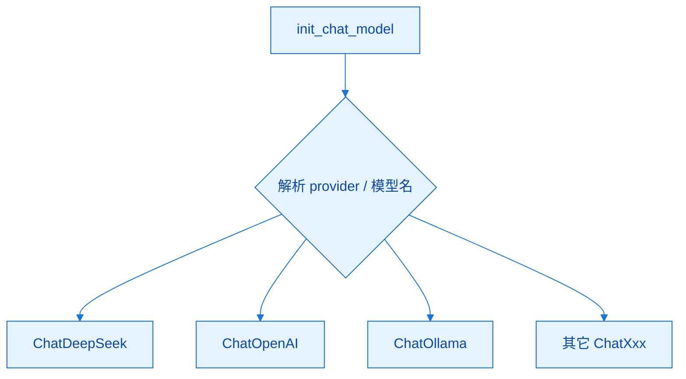

`init_chat_model` 是路由器：你写字符串，它选底层驱动类。换模型多半只改字符串与密钥。


### 6.3 写法灵活性与易错点

| 写法 | 示例直觉 |
|------|----------|
| 合并字符串 | `model="deepseek:deepseek-v4-flash"` |
| 分写 | `model="deepseek-v4-flash", model_provider="deepseek"` |
| 仅 model | 有时能自动推断成功，**不保证全覆盖** |

**高发错误：** 在 CloseAI 上调用「DeepSeek 能力」时，把 `model_provider` 写成 `deepseek`。那样会走 `ChatDeepSeek`（直连官网语义），与 CloseAI 的 key/base 不匹配。正确直觉：CloseAI 管道是 OpenAI 兼容，**provider 应写 `openai`**，模型名用 CloseAI 价目表中的字符串。

**另一高发错误：** 本地 Ollama 模型名里带 `deepseek`，不写 `model_provider="ollama"`，自动推断误判到 DeepSeek 云。本地必须显式 `ollama`。

**通义注意：** 若官方 `model_provider` 列表尚未纳入独立的 dashscope/qwen 取值，用统一接口调百炼兼容端时，实践上常写成 `openai` + 兼容 Base URL，而不是臆造未收录的 provider 名。以你安装的 LangChain 版本文档中的 provider 列表为准。

### 6.4 同一「DeepSeek」四种入口的调用矩阵

| 模型所在入口 | 可用方式（课件小结） |
|--------------|----------------------|
| DeepSeek 官网 | `ChatDeepSeek`、`ChatOpenAI`、`init_chat_model` |
| 阿里云百炼上的 DeepSeek | `ChatTongyi`（改 model）、`ChatOpenAI`、`init_chat_model` |
| OpenRouter 上的 DeepSeek | `ChatOpenRouter`、`ChatOpenAI`、`init_chat_model` |
| CloseAI 上的 DeepSeek | `ChatOpenAI`、`init_chat_model`（无 CloseAI 专用类） |

这张表专门治疗「讲了好多写法是不是白学」的焦虑：对象都是 DeepSeek 能力，但**挂载入口不同，可用类集合不同**。新代码推荐收敛到：`.env` +（`init_chat_model` 或 `ChatOpenAI`）；专用类作为排错与理解工具保留。

### 补充想法：Agent 里如何管理多模型

生产 Agent 常要「强模型规划 + 弱模型执行」。用统一接口时，可维护一个小字典：`{"planner": "openai:gpt-...", "worker": "openai:deepseek-..."}`，运行时只换 key。配合后文 `config.configurable`，还能在单次调用级覆盖模型——这是费用控制与降级策略的基础，不必等学完 Agent 章再回头补。

---

## 七、模型初始化常用参数

### 7.1 参数表（常用版）

| 参数 | 类型 | 说明 | 默认 |
|------|------|------|------|
| `model` | str | 模型名（必需），如 `openai:gpt-4o` 或纯型号名 | 无 |
| `model_provider` | str | 提供商，决定底层驱动类 | 无 |
| `api_key` | str | 密钥；可不传而读环境变量 | None |
| `base_url` | str | API 地址 | None |
| `temperature` | float | 随机性，约 0.0–2.0 | 0.7 |
| `max_tokens` | int | 限制**输出**最大 token | None |
| `timeout` | float | 超时秒数 | None |
| `max_retries` | int | 失败最大重试 | 6 |

这些是 Model Class 与 `init_chat_model` 的交集常识。个别厂商平台文档可能把温度写成 0～1，LangChain 侧常见叙述是 0.0～2.0——以你所用封装文档为准。连接类参数（key/url/timeout/retries）决定「稳不稳连上」；生成类参数（model/temperature/max_tokens）决定「答得怎样、多长、多贵」。

### 7.2 temperature 场景表

| 区间 | 场景 |
|------|------|
| 0.0–0.3 | 数学、数据抽取、分类、代码——要稳定可复现 |
| 0.5–0.7 | 聊天、问答——平衡 |
| 0.8–1.5 | 文案、头脑风暴——要创意 |
| 1.5–2.0 | 诗歌、故事——高随机；过高易胡言/乱码感 |

温度不是智商旋钮。结构化 JSON 抽取应靠近 0；广告语可以 1.0～1.5。可用「同一提示跑 3 次」观察：低温时开头更趋同，高温时发散更明显（体感因模型而异，但方向成立）。

### 7.3 Token 与 `max_tokens`

- Token：分词后的基本单位，也是计费依据；人民日报曾有「词元」一类通俗译法。  
- 不同模型 tokenizer 不同，**同一段中文 token 数可以不同**；可用 OpenAI / 百度等官方计数器对比直觉。  
- 粗算：中文约 1～1.8 字/token，英文约 3～4 字符/token。  
- `max_tokens=10` 这类硬限制会让回答截断；元数据里 `finish_reason` 常为 `length`；正常结束多为 `stop`。  

输入也会消耗 token，但 `max_tokens` 参数管的是**生成上限**。截断不等于模型「不会答」，而是你不允许它答完。

### 补充想法：参数与产品指标

把 temperature、max_tokens 写进配置中心按「场景配置文件」管理（如 `extract.json` 低温短输出、`chat.json` 中温中输出），比每个 Notebook 魔法数字更可维护。后续接 LangSmith 评测时，才能对比「同一提示词、不同解码参数」的效果，而不是把模型能力与随机性混在一谈。

---

## 八、本地模型：Ollama

### 8.1 定位

Ollama：GitHub 上的本地大模型集成框架——下载、启动、本地推理。LangChain 还支持 vLLM 等；企业上线更常见 Linux + Docker + vLLM，课程在 Windows 上用 Ollama **演示原理**。本地小模型省钱，但幻觉通常更明显；正式跟课建议仍以云上模型为主。

心智图：在线平台模型 与 本地 Ollama 模型，都经由 LangChain 应用调用——框架不在乎权重文件在哪，只在乎聊天接口是否可用。

### 8.2 安装与下模型（要点）

| 步骤 | 注意 |
|------|------|
| 下载安装包 | 较大；可不放入课程资料包 |
| 指定安装目录 | Windows 可用安装器参数指到非 C 盘目录 |
| 改模型存储路径 | 在设置里指到大磁盘，避免 C 盘爆满 |
| 选模型体量 | 个人电脑慎上过大参数；演示用小模型即可 |
| 命令行 | `ollama run <model>`、`ollama list`、`ollama --version` 等 |

客户端 New Chat 也可拉模型，但列表往往不如官网模型页全。云端推理若走 Ollama 平台付费通道，与「纯本地」不是一回事。首次 `run` 会拉取权重，完成后可对话；`bye` 退出。

### 8.3 LangChain 调用

**方式 1：`ChatOllama`**

```python
from langchain_ollama import ChatOllama

ollama_llm = ChatOllama(
    model="deepseek-r1:1.5b",  # 以你 list 到的为准
    # base_url="http://localhost:11434",  # 本机默认常可省略
)
print(ollama_llm.invoke("你好，请介绍一下你自己。"))
```

**方式 2：`init_chat_model`**

```python
from langchain.chat_models import init_chat_model

ollama_llm = init_chat_model(
    model="deepseek-r1:1.5b",
    model_provider="ollama",  # 必写，避免误判
)
```

本机默认端口 **11434**。局域网其它机器上的 Ollama，把 `base_url` 写成 `http://<IP>:11434`。统一接口忘记 `model_provider="ollama"` 时，可能错误走到云上 DeepSeek——这是本地节最关键的坑。

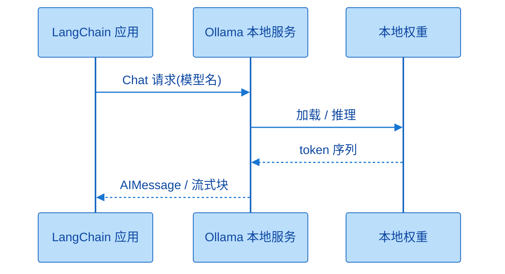

Ollama 把「下载模型 + 本地 HTTP 服务」打包好了；LangChain 只是把它当成又一个 ChatModel 后端。


### 补充想法：本地与云上的分工

本地适合：敏感数据不出机、离线演示、免费试 API 形状。云上适合：质量、速度、工具调用与长上下文。可做「开发期本地小模型冒烟，预发/生产打云上」的两段式，但不要假设本地 1.5B 与云上大杯行为一致——评测集要分开建。

---

## 九、模型的调用

### 9.1 六种方法总览

| 方法 | 模式 | 典型场景 |
|------|------|----------|
| `invoke` | 阻塞，一次返回全文 | 脚本、后台任务、不需打字机效果 |
| `stream` | 流式迭代 chunk | 聊天 UI、长文、要降低「是否卡死」焦虑 |
| `batch` | 多输入并行（侧重吞吐） | 一批独立问题 |
| `ainvoke` | 异步 invoke | 高并发 Web、与事件循环协作 |
| `astream` | 异步 stream | 异步栈上的流式 |
| `abatch` | 异步 batch | 异步栈上的批量 |

`invoke` 期间你什么也做不了，只能等——这就是阻塞。`stream` 像豆包/官网聊天那种「一个个字蹦出来」，本质是迭代器。`batch` 把多个请求打包，减少「一问一等」的往返。异步三件套 = 同步三件套前面加 `a`，避免堵死事件循环。流式依赖供应商是否支持；极老的模型可能既无流式也无工具调用。

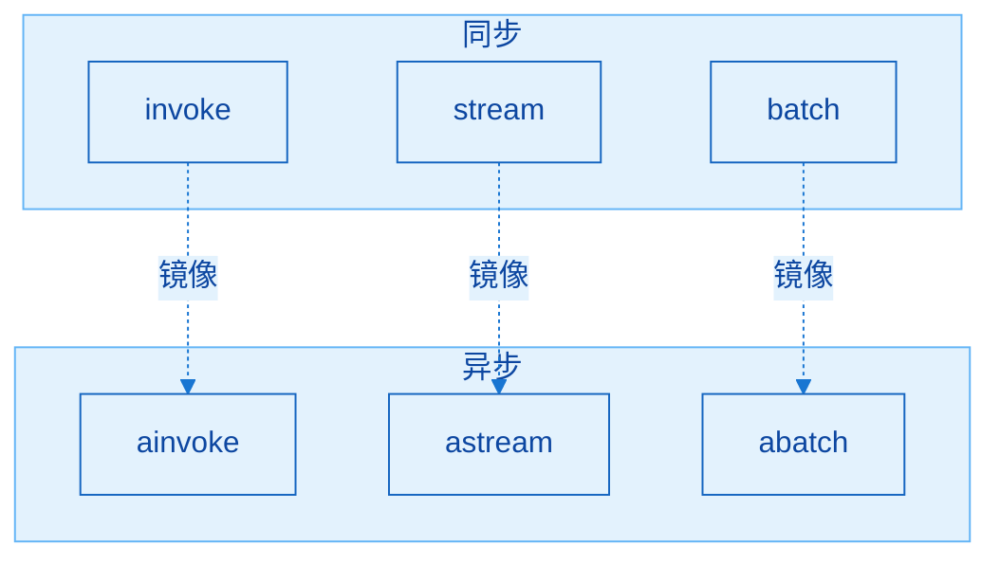

异步不是新业务语义，而是把同样三种形状放到事件循环里，避免阻塞。


### 9.2 `invoke` 的参数

主参数：

| 参数 | 是否必须 | 含义 |
|------|----------|------|
| `input` | 是 | 送给模型的内容 |
| `config` | 否 | 单次调用的高级配置（回调、元数据、可配置字段等） |

本章主体先吃透 `input`；`config` 在拓展节展开。`input` 类型很宽（字符串、序列、字典、消息、PromptValue 等），实战最常用三类见下。

### 9.3 三种常用 input

#### （1）纯文本

```python
response = model.invoke("翻译如下汉字：你好世界")
print(response.content)
```

最简单，适合单轮指令。返回仍是 `AIMessage`，业务上通常取 `.content`。

#### （2）字典列表（推荐、灵活）

```python
messages = [
    {"role": "system", "content": "你是一个专业的数学老师"},
    {"role": "user", "content": "帮我解释一下什么是斐波那契数列"},
]
response = model.invoke(messages)
```

| role | 含义 |
|------|------|
| `system` | 人设、规则、语气 |
| `user` | 用户话（建议用 `user`，与 `human` 可互通但惯例向 OpenAI） |
| `assistant` | 模型历史回复 |
| `tool` | 工具结果（Tools 章再展开） |

多轮示例：把上一轮的 user/assistant 继续 append 再 `invoke`，模型才能「记得」上下文。

#### （3）消息对象列表

```python
from langchain_core.messages import SystemMessage, HumanMessage, AIMessage

messages = [
    SystemMessage(content="你是一个专业的数学老师"),
    HumanMessage(content="帮我解释一下什么是斐波那契数列"),
]
response = model.invoke(messages)
```

与字典列表同构，只是类型更正式，后续和消息/提示词模板章无缝衔接。`HumanMessage` ↔ user，`AIMessage` ↔ assistant，`SystemMessage` ↔ system。

### 9.4 「记忆」的本质（务必搞懂）

大模型**天然跨请求无记忆**。下面两种写法天差地别：

| 写法 | 结果 |
|------|------|
| 第一次 `invoke([小明自我介绍])`，第二次重新 `invoke([我叫什么])` 且不带历史 | 第二次不知道你叫小明 |
| 把第一轮的 assistant 回复 append 进同一列表，再问「我叫什么」 | 能答小明 |

记忆 = **你在应用层维护消息列表（或外挂存储）并再次传入**，不是模型内部自动记住所有历史会话。这与第一章 Agent 公式里的 Memory 直接对应；短期记忆后面会系统化，本章先建立正确因果。

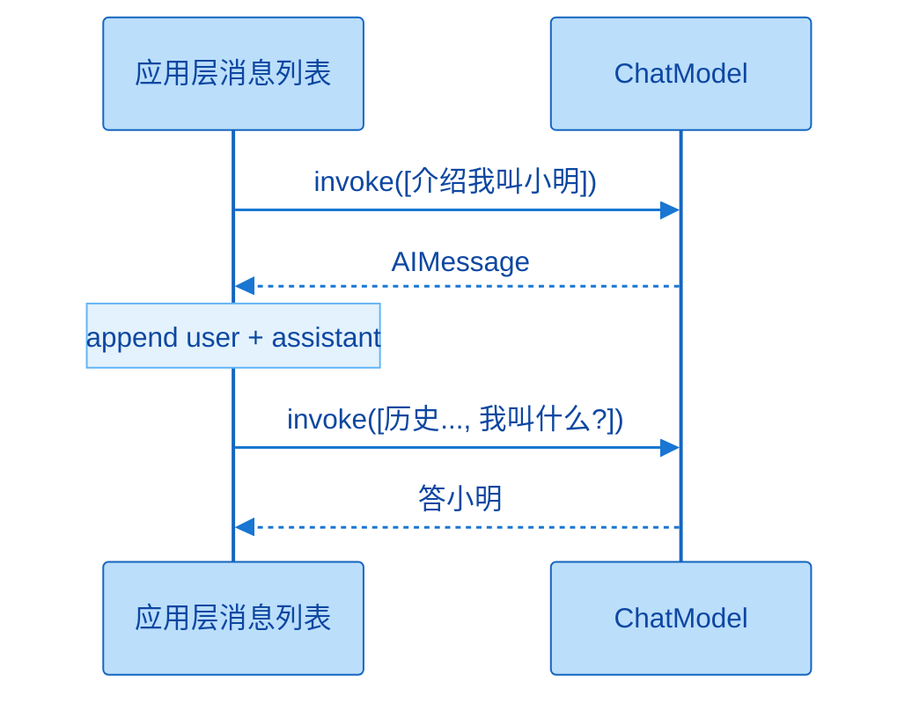

第二次能答对，是因为你把历史又传回去了；若每次只传新问题，模型天然「失忆」。

### 9.5 `invoke` 返回值：`AIMessage` 里有什么

返回类型是 `AIMessage`。建议用 `response.pretty_print()` 看正文，或用 `rich` 打印整对象。

| 区域 | 你要它做什么 |
|------|----------------|
| `content` | 用户可见回答 |
| `additional_kwargs` | 供应商额外信息；如拒绝回答相关字段 |
| `response_metadata` | 模型名、provider、`finish_reason`、延迟、token 细节等 |
| `id` | 本次 run 标识 |
| `tool_calls` / `invalid_tool_calls` | 工具调用（后续章） |
| `usage_metadata` | 输入/输出/总 token 等用量 |

`finish_reason`：`stop` 正常结束；`length` 常因 `max_tokens` 截断。Token 用量影响账单；是否命中缓存也会影响计价（视供应商）。延迟类字段（首 token 时间、token 间隔等）用于性能分析。业务代码最低限度：`response.content`；做监控与对账再解析 metadata / usage。

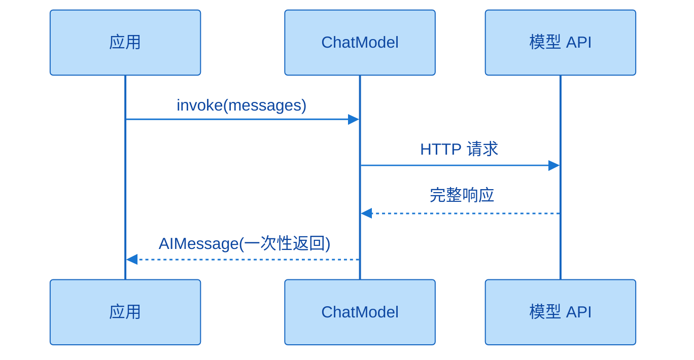

`invoke` 等整段生成结束才返回，适合脚本与测试；用户若需要「逐字出现」，应改用 `stream`。


```python
print(response.content)
print(response.response_metadata.get("finish_reason"))
# usage 字段名因版本/供应商略有差异，以实际对象为准
```

### 9.6 `stream` 流式调用

```python
for chunk in model.stream("帮我解释一下什么是人工智能"):
    print(chunk.text, end="", flush=True)
```

流式返回迭代器，按块消费即可。好处：首字更快出现、长文本不干等、推理模型「思考过程」也可边出边看（若供应商提供）。`input` 形态与 `invoke` 类似。注意：Notebook 里记得 `flush`/不换行，才能看到打字机效果。

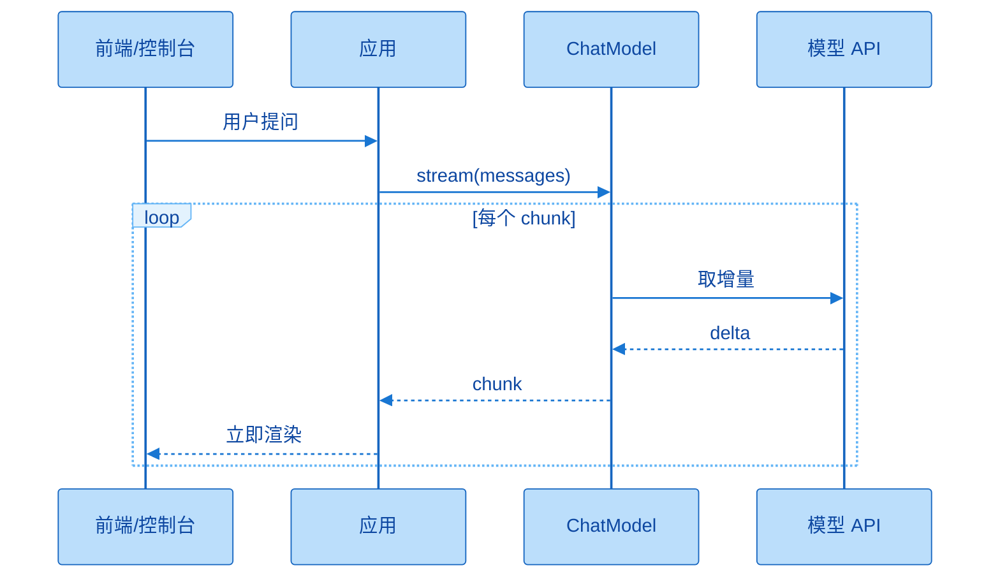

流式的关键是「增量到达就处理」，不要在循环里误当成每次都是完整答案。


### 9.7 `batch` 批量调用

```python
inputs = ["你是谁？", "中国首都在哪里？", "1+1=?"]
# 一次性拿齐结果（顺序通常对齐输入）
for out in model.batch(inputs):
    print(out.content)

# 按完成顺序（可能乱序，带原索引）
for idx, out in model.batch_as_completed(inputs):
    print(idx, out.content)
```

对比「for 里多次 `invoke`」，`batch` 减少往返与总等待，课上对比可到约一半耗时量级（视网络与模型负载波动）。适合**互相独立**的一批请求；有先后依赖的多轮对话不要硬塞进一个 batch。`batch` 还可在 `config` 里设 `max_concurrency`，避免瞬间打爆限额。

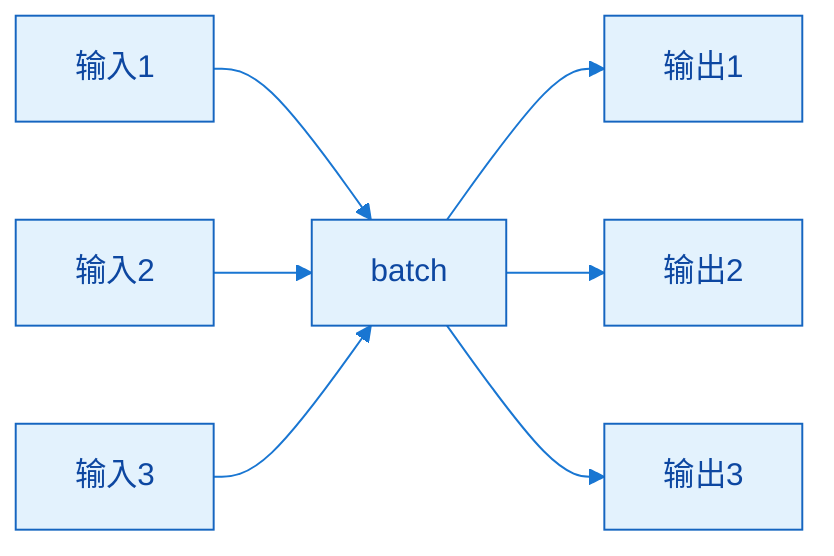

batch 是扇入扇出：多个独立输入进同一调用形态，得到与输入顺序对应的输出列表。


### 9.8 异步调用（了解级）

同步：A 调 B，A 干等到 B 完。异步：A 发起 B 后继续干自己的，稍后再取 B 结果。生活类比：等朋友收拾再出门是同步；先走去餐厅让朋友追上来是异步。前端列表滚屏时主线程排版、副线程下图片，也是异步思路。

`ainvoke` / `astream` / `abatch` 与同步版对应；课上用 `asyncio` 创建任务、主流程 `sleep` 穿插，观察总耗时不一定是「串行相加」。本章重点仍在同步三件套；异步在 Web 服务里更关键。失败时用 try/except 包一层即可。

### 补充想法：产品层如何选调用方式

| 产品形态 | 更合适的调用 |
|----------|----------------|
| 内部批处理脚本 | `batch` / `invoke` |
| 对客聊天窗口 | `stream`（+ 前端 SSE） |
| FastAPI 高并发 | `ainvoke` / `astream` |
| 带工具的 Agent | 先 `invoke`/`stream` 打通，再上 Agent 封装 |

不要在聊天 UI 里用同步 `invoke` 堵死请求线程，除非另开线程池；这是工程味很浓、但本章就能定下的原则。

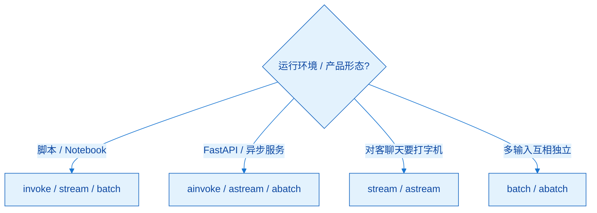

先按环境选同步或异步，再按交互选是否流式，最后才考虑是否 batch。


---

## 十、拓展内容

### 10.1 美化输出

- `response.pretty_print()`：偏友好展示 content。  
- `rich` 库的 print（常别名为 `rprint`）：更适合转储整棵 `AIMessage`。  

调试阶段多用；对客日志则应结构化打印关键字段，避免整对象刷屏。

### 10.2 `profile` 属性

LangChain 1.1+ 可通过 `model.profile` 查看能力画像（最大输入/输出、是否工具/视觉/音频/推理等）。**支持参差不齐**：有的集成/模型返回丰富字典，有的是空。同一中转平台上模型 A 有画像、模型 B 为空也常见。需要时查，没有也不阻塞开发。

### 10.3 初始化完整参数：四类记忆法

查看某类全部 Field：`ChatDeepSeek.model_fields` 或实例上相关 API（注意部分「从实例读 fields」的路径可能标废弃，更推荐从**类**查看）。分类记忆：

| 类别 | 管什么 | 例子 |
|------|--------|------|
| 客户端与连接 | 如何连上服务器 | `base_url`、`api_key`、`timeout`、`max_retries` |
| 模型推理/生成 | 内容风格与长度 | `model`、`temperature`、`max_tokens`、流式/推理相关开关 |
| 框架通用 | LangChain 内部 | name、callbacks 等（监控场景） |
| 高级透传 | 封装未直接暴露的字段 | `model_kwargs`、`extra_body` |

日常仍优先记「常用版」那一张小表；这一节的价值是：**遇到官方 API 有、LangChain 构造器没有的参数时，知道该塞进哪一个袋子。**

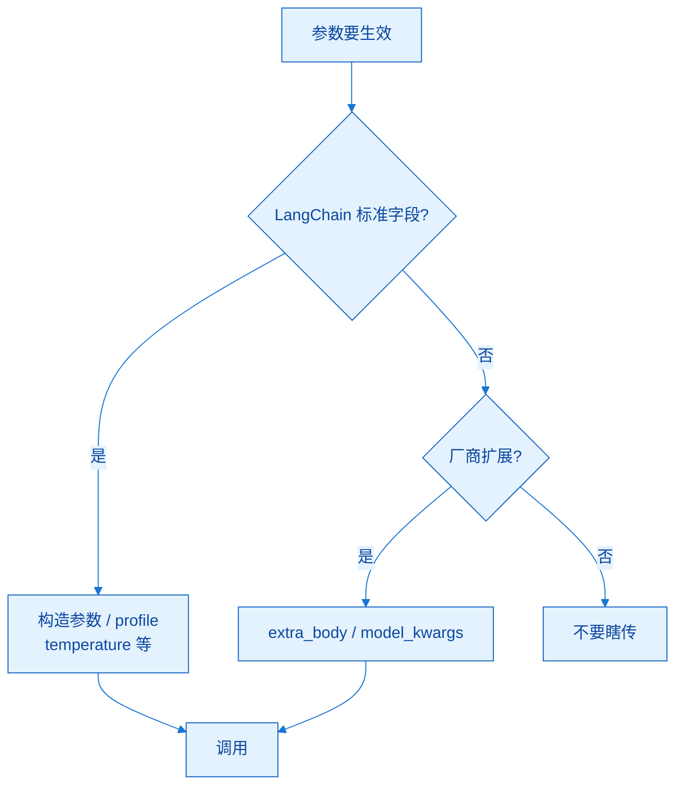

参数分层是为了可移植：标准字段随 LangChain 走，扩展字段随厂商走。


### 10.4 `model_kwargs` vs `extra_body`

| 袋子 | 典型用途 | 例子直觉 |
|------|----------|----------|
| `model_kwargs` | OpenAI 兼容协议支持、但 LangChain 没直接列出的字段 | 某些 tools 相关传参 |
| `extra_body` | 厂商在兼容协议上的**私有扩展** | DeepSeek 的 `thinking` 开关 |

`model_kwargs`：协议有、封装没暴露。`extra_body`：这家多出来的能力。课上用 tools 演示前者时，重点在「会进 tool_calls」，不必先精通 tools schema；用 `thinking: enabled/disabled` 演示后者时，可观察 `reasoning_content` 是否出现。DeepSeek 新模型是否思考可能是动态策略，以实际返回为准。

### 10.5 调用时的 `config`

`invoke(input, config=...)`（以及 stream/batch）允许**单次**动态控制：

| 常见键 | 用途直觉 |
|--------|----------|
| `run_name` / `tags` / `callbacks` | 与 LangSmith 追踪、分类、回调相关 |
| `metadata` | 如 user_id、session_id |
| `max_concurrency` | 限制 batch 类并发上限，保护配额 |
| `configurable` | 写入与初始化类似的字段，覆盖**当次** model/temperature 等 |

关键细节：想让 `configurable` 生效，初始化 `init_chat_model` 时通常要声明允许覆盖的 `configurable_fields`；否则你以为覆盖了，实际仍走默认模型。可把它理解成「全局默认枪械 + 单发瞄准镜」：没开允许字段时，瞄准镜无效。

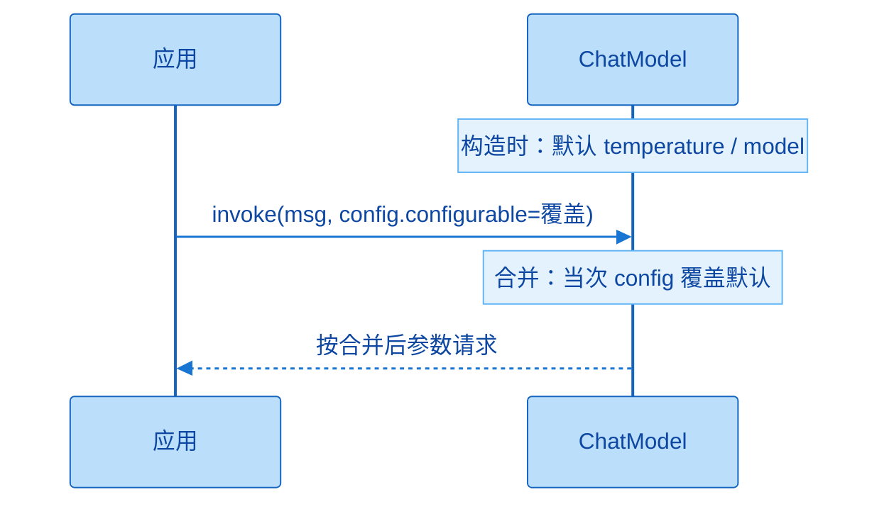

口诀：构造参数定默认，调用 `config` 做覆盖；排查时先看本次 `config`，再看初始化默认。前提是声明了 `configurable_fields`。

### 补充想法：什么时候才开拓展参数

| 需求 | 优先手段 |
|------|----------|
| 换模型/温度 | 先改初始化；多场景再用 `configurable` |
| 厂商私有能力 | `extra_body` |
| 协议字段缺失 | `model_kwargs` |
| 可观测性 | `config` + 下章 LangSmith |
| 只是想看能力列表 | `profile`（有则用，无则查厂商文档） |

拓展节不是「越用越高级」，而是「默认路径走不通时的工具箱」。评审代码时若满屏 `extra_body`，反而要问：是否选错了集成方式。

---

## 十一、本章速记卡

```text
1. 三要素：model + api_key + base_url（专用类常可省 URL）
2. 密钥进 .env；load_dotenv(override=True)；勿提交真实 Key
3. 四条路：专用类 / ChatOpenAI 兼容 / init_chat_model / Ollama
4. 通义 ChatTongyi ≠ 乱填 OpenAI 兼容 URL
5. 中转：OpenRouter 可专用或兼容；CloseAI 只兼容
6. CloseAI 上的 DeepSeek → provider 写 openai，不是 deepseek
7. Ollama → 必须 model_provider="ollama"
8. temperature 控随机；max_tokens 控输出长度；length ≠ stop
9. invoke 三种 input：字符串 / role 字典列表 / Message 列表
10. 记忆 = 应用层把历史消息再次传入
11. stream 体验；batch 吞吐；a* 不阻塞事件循环
12. model_kwargs 补协议缺口；extra_body 补厂商私有字段
13. config 做单次覆盖与追踪；需配合 configurable_fields
```

按「接电 → 选路 → 控参 → 调用 → 透传」五段背。能不看笔记画出四种入口矩阵，并解释「失忆」实验，就算本章核心过关。

---

## 十二、自检清单

- [ ] 能口述三要素，并说明 `override=True` 的意义  
- [ ] 能独立跑通：专用类、ChatOpenAI 兼容、`init_chat_model` 各至少一次  
- [ ] 能解释百炼上 `ChatTongyi` 与兼容 URL 为何冲突  
- [ ] 换 CloseAI / OpenRouter 时知道改哪些字段、provider 怎么写  
- [ ] 能按场景选择 temperature，并解释 `finish_reason=length`  
- [ ] 能手写字典列表多轮，并演示「不传历史会失忆 / 传了历史能记住」  
- [ ] 能说明 `AIMessage` 中 content、metadata、usage、tool_calls 的用途  
- [ ] 能写最小 `stream` 与 `batch` 示例，并说出何时用异步  
- [ ] 能区分 `model_kwargs` 与 `extra_body`，并说出 `config.configurable` 生效前提  
- [ ] 已选定并写好自己的「默认模型栈」注释  

建议自测方式：新开一个 Notebook，不看旧单元格，从 `.env` 到 `invoke` 默写一遍；再故意制造一个 provider 写错的错误并解释报错原因。能教给别人「为什么 CloseAI 不能写 deepseek provider」，比多背两个 API 名字更有用。
