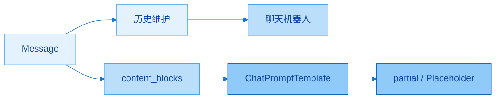
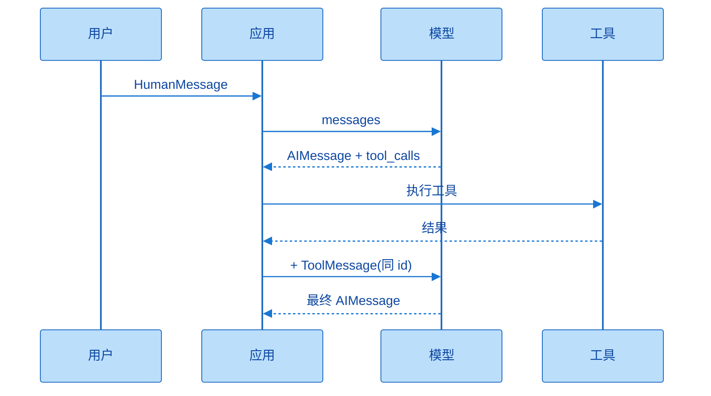
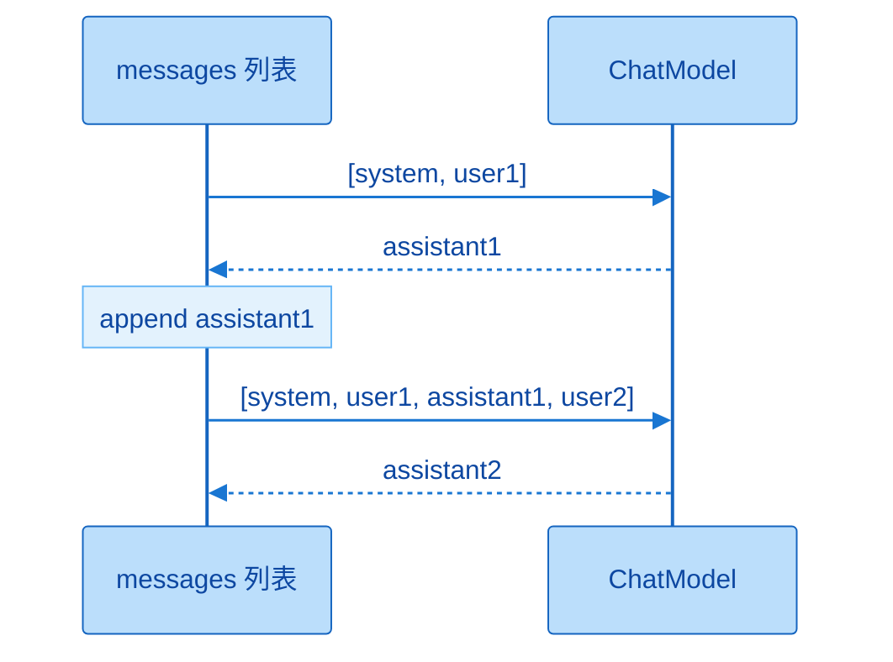
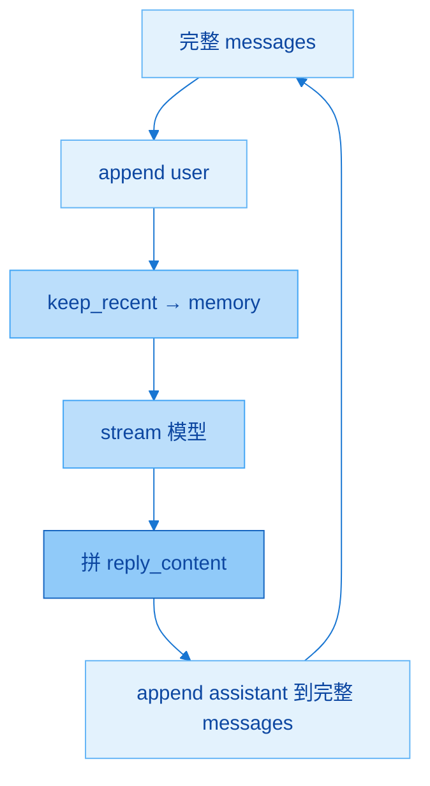
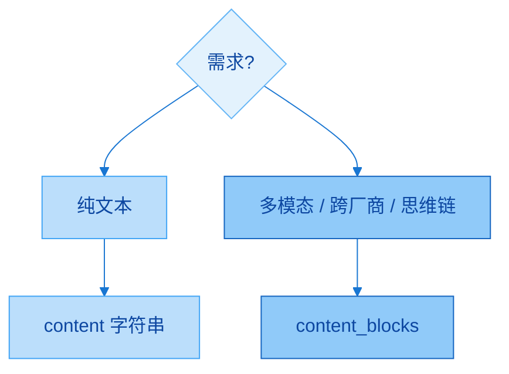
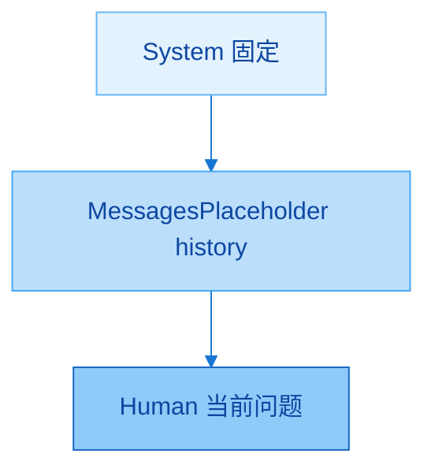

# Message 与提示词模板

> **版本**：LangChain **1.2.x**（消息标准与 `ChatPromptTemplate`）

官方文档对照（以课件与现行 API 为准）：

- Messages：https://docs.langchain.com/oss/python/langchain/messages  
- Prompt templates：https://docs.langchain.com/oss/python/langchain/prompts  

配套代码：`langchain1.2_tutorial/chapter04_messages_prompt/`（`01`～`04` 四个 Notebook）

第二章学会「怎么调模型」；本章解决「送给模型的内容长什么样、怎么复用」。主线是：**消息是交互基本单元 → 维护/裁剪历史 → 多轮机器人 → content / content_blocks → ChatPromptTemplate（含 partial 与 MessagesPlaceholder）**。后面 Tools / Agent / RAG 都会反复用到这里的列表心智。

---

## 一、本章学什么

| 板块 | 核心问题 | 你应能做到 |
|------|----------|------------|
| 消息基础 | 为何无记忆、Message 是什么 | 说清 Role / Content / Metadata |
| 四种角色 | system / user / assistant / tool | 字典格式与对象格式互译 |
| 字段细节 | Human 的 name、AI 的 tool_calls 等 | 知道「框架支持 ≠ 厂商支持」 |
| 历史 | 怎么记、怎么裁 | 正确 append；`keep_recent_messages` |
| 实战 | 多轮聊天机器人 | while + stream + 写回完整列表 |
| 多模态标准 | content vs content_blocks | 跨厂商优先 blocks |
| 提示模板 | 为何不用字符串拼接 | `from_messages` + 三种调用 |
| 高级 | 六种参数、partial、占位符 | 固定变量与动态历史分开处理 |

这一章可以记成两句话：**列表就是记忆；模板就是可复用的造列表机器。** 建议学完后固定个人习惯：日常用消息对象或 `ChatPromptTemplate`；多模态与推理链优先看 `content_blocks`；多轮务必「传裁剪副本、写回完整列表」。



从「单条消息」走到「可配置的消息流水线」：先会手写列表，再会模板化，最后用占位符接上动态历史。

### 补充想法：和第三章的关系

开启 LangSmith Tracing 后学习本章特别合适：模板 `invoke` 之后、模型调用之前，Trace 里能看到**渲染后的真实消息**。改 Prompt 时先看 Trace 再猜字符串，排错更快。

---

## 二、认识消息

### 2.1 为什么要有 Message

大模型输出只依赖**当前输入上下文**；多数 API 服务端也**不维护**会话历史，是无状态的。若应用要「记住」对话，必须在程序里维护消息列表，每轮把历史一并传入。

在 LangChain 中，**Message（消息）是模型交互的最基本单元**：既是输入，也是输出（返回多为 `AIMessage`）。每轮对话由一条或多条 Message 构成；除文字外还可带 metadata，用于表达「谁在说话、属于哪一轮」等，便于一致性和 LangSmith 追踪。

LangChain 1.0 起提供跨模型统一的 Message 标准（OpenAI / Anthropic / Gemini / 本地等对齐），好处可以概括为：

- **兼容性强**：不同模型消息格式自动对齐  
- **可扩展性高**：方便多模态与自定义字段  
- **可追踪性好**：为 LangSmith 提供一致的上下文结构  

这三点合在一起是说：你按 LangChain 的消息写法写一次，框架负责对齐各厂商；调试时结构也统一，不必为每家 API 各记一套会话对象。

### 2.2 消息内部结构

| 字段 | 含义 | 例子 |
|------|------|------|
| Role | 角色 / 类型 | `system` / `user` / `assistant` / `tool` |
| Content | 消息内容 | 文本，或更复杂的多模态结构 |
| Metadata | 可选元数据 | 消息 ID、耗时、token、标签、`name` 等 |

记法：先定「谁说的」（Role），再说「说了什么」（Content），需要区分发言者或追踪时再加 Metadata。三者里 Role + Content 是每条消息的底线。

### 2.3 四种常用消息类型

| 类型 | 字典 role | 对象类 | 用途 |
|------|-----------|--------|------|
| 系统消息 | `system` | `SystemMessage` | 角色、行为准则、背景（工作说明书） |
| 用户消息 | `user` | `HumanMessage` | 用户输入；可含多模态 |
| 助手消息 | `assistant` | `AIMessage` | 模型回复；可含 `tool_calls` |
| 工具消息 | `tool` | `ToolMessage` | 工具执行结果，回传给模型继续生成 |

为什么要分类型：明确角色、用 System 控制行为、拼出完整多轮上下文、调试时好追踪。字典里用户建议统一写 **`user`**（不要写 `human`）；助手必须是 **`assistant`**（不能写 `ai`）。对象类里用户叫 `HumanMessage`，这是类名与 role 字符串的常见「名字不完全相同」点，对照上表即可。

工具调用预习链（Tools 章再展开）：

```text
HumanMessage → AIMessage(tool_calls) → ToolMessage(tool_call_id 对齐) → AIMessage(最终回答)
```

这条链的关键是：**`ToolMessage.tool_call_id` 必须与对应 `AIMessage.tool_calls[].id` 一致**，否则模型对不上「哪次调用的结果」。



先问、再决定调不调工具、把结果塞回同一会话、再生成自然语言——Agent 章会把循环自动化，本章先认清消息形状。

### 2.4 两种消息格式

LangChain 支持两种等价写法。

**格式 1：JSON / 字典列表**

```python
messages = [
    {"role": "system", "content": "你是个善解人意的助手"},
    {"role": "user", "content": "你好啊~"},
    {"role": "assistant", "content": "我也很高兴认识你"},
    {"role": "tool", "content": "<工具输出>", "tool_call_id": "call_xxx"},
]
```

**格式 2：消息对象列表**

```python
from langchain_core.messages import SystemMessage, HumanMessage, AIMessage, ToolMessage

messages = [
    SystemMessage(content="你是个善解人意的助手"),
    HumanMessage(content="你好啊~"),
    AIMessage("我也很高兴认识你"),  # 纯文本时可省略 content=
    ToolMessage(content="<工具输出>", tool_call_id="call_xxx"),
]
```

对照记忆：字典靠 `role` 字符串；对象靠类名。工具场景里 `tool_call_id` 两边都要写。日常教学与作业两种都要会读；个人项目可固定一种，减少心智切换。

**最小对照调用（JSON）：**

```python
from langchain.chat_models import init_chat_model
from dotenv import load_dotenv
import os

load_dotenv(override=True)
model = init_chat_model(
    model="gpt-5.4-mini",  # 按你的平台可用型号调整
    model_provider="openai",
    api_key=os.getenv("CLOSEAI_API_KEY"),
    base_url=os.getenv("CLOSEAI_BASE_URL"),
)

messages = [
    {"role": "system", "content": "你是一个善于给出通俗易懂解释的AI助手"},
    {"role": "user", "content": "你好"},
    {"role": "assistant", "content": "你好！我能帮你什么？"},
    {"role": "user", "content": "什么是机器学习"},
]
print(model.invoke(messages).content)
```

对象格式只需把列表换成 `SystemMessage` / `HumanMessage` / `AIMessage`；`invoke` 用法不变。带历史的多轮示例中，中间的 assistant 条目就是「上一轮模型说过的话」——这正是记忆的载体。

---

## 三、消息对象字段说明

完整字段以官方手册 / 源码为准；此处只记课件强调的常用项。

### 3.1 SystemMessage

| 字段 | 说明 |
|------|------|
| `content` | 消息内容；纯文本时可省略字段名：`SystemMessage("…")` |

系统消息通常放在列表最前，整段对话共用一份「人设」。裁剪历史时**不要丢掉**它（见后文优化）。

### 3.2 HumanMessage

| 字段 | 说明 |
|------|------|
| `content` | 正文；纯文本可省略字段名 |
| metadata 类 | 如 `name`、`id`，用于区分同类型多条消息 |

`name` / `id` 属于元数据：多人对话里可标 Bob / Tom / audience。**LangChain 支持某字段 ≠ 模型供应商一定识别。** 课件对比：CloseAI 上的 GPT 能按 `name` 抽取发言者；同一思路经 OpenRouter 调用时可能全部变成 `unknown`；DeepSeek 文档写支持 `name`，实测也可能识别失败。结论：**以供应商实际行为为准**，重要能力要实测。

```python
HumanMessage(content="Hello!", name="alice", id="msg_123")
```

多人抽取场景：多条带 `name` 的 `HumanMessage` + 要求输出 JSON 的 System 提示；能识别 `name` 时，模型会按姓名归并观点，而不是「第一个人/第二个人」。

### 3.3 AIMessage

| 字段 / 属性 | 说明 |
|-------------|------|
| `content` | 模型输出正文；可省略字段名 |
| `response_metadata` | 厂商附加信息：token、模型名、`finish_reason` 等 |
| `tool_calls` | 决定调用工具时的列表；无调用则为 `[]` |
| `usage_metadata` | 用量汇总（输入/输出/总 token 等） |
| `additional_kwargs` | 其它附加（如部分厂商的 reasoning 等） |

`tool_calls` 中每项常见键：`name`、`args`、`id`、`type`（如 `tool_call`）。最终回答时 `content` 有文本、`tool_calls` 为空；纯工具调用时 `content` 可能为空字符串或空列表，重点在 `tool_calls`。第二章讲过的返回值字段在此落到「消息对象」语境，可用 `rprint(response)` / `response.usage_metadata` 查看。

### 3.4 ToolMessage（拓展，Tools 章再深挖）

| 字段 | 说明 |
|------|------|
| `content` | 工具返回内容 |
| `name` | 工具名称（可选按场景） |
| `tool_call_id` | **必须**与匹配的 `AIMessage.tool_calls` 中 `id` 一致 |

模拟链路（不必先实现真工具）：构造带 `tool_calls` 的 assistant 消息 + 同 id 的 tool 消息 + 用户问题，再 `invoke`，模型会把工具结果组织成自然语言，而不是原样把工具字符串扔给用户。JSON 与对象两种格式等价。

### 补充想法：字段学习优先级

先会 `content` 与四种 role；再熟悉 `AIMessage` 的 metadata / usage；`tool_calls` + `ToolMessage` 跟 Tools 章一起练；`name` 仅在多人/客服坐席等场景再较真，并做供应商实测。

---

## 四、对话历史的管理与优化

### 4.1 关键规则

**每次调用必须传递完整（到当前为止需要的）对话历史。**  
每次都在**同一个**消息列表上追加，不可每轮 `messages = [...]` 新建空列表。

正确轮次形态：

```text
第 1 轮：[system, user] → 得到 AI → 保存 assistant
第 2 轮：[system, user, assistant, user] → …
第 3 轮：[system, user, assistant, user, assistant, user] → …
```

| 错误写法 | 后果 |
|----------|------|
| 第二次 `invoke("我叫什么")` 且不带历史 | 模型不记得你叫张三 |
| 每轮重新 `conversation = [{新问题}]` | 历史被丢弃 |
| 只 append user，忘记 append `response.content` | 下一轮不知道模型刚说过什么 |

正确骨架：

```python
conversation = []
conversation.append({"role": "user", "content": "我叫张三"})
response1 = model.invoke(conversation)
conversation.append({"role": "assistant", "content": response1.content})  # 关键

conversation.append({"role": "user", "content": "我叫什么？"})
response2 = model.invoke(conversation)  # 记得
```

「记忆」不是模型内部自动跨请求保存，而是**你把历史又传回去了**——与第二章结论一致，本章把它操作化。



每一轮结束都要成对留下 user 与 assistant，下一轮才有完整上下文。

### 4.2 历史优化：`keep_recent_messages`

问题：历史无限变长 → token 与费用上升、变慢、旧话题干扰。  
策略：

1. **总是保留** system（角色设定）  
2. **只保留最近 N 轮**对话（一轮 = user + assistant 两条）  
3. 丢弃更早的对话消息  

```python
def keep_recent_messages(messages, max_pairs=3):
    """保留最近 N 轮；每轮 = user + assistant。"""
    system_msgs = [m for m in messages if m.get("role") == "system"]
    conversation_msgs = [m for m in messages if m.get("role") != "system"]
    recent_msgs = conversation_msgs[-(max_pairs * 2) :]
    return system_msgs + recent_msgs
```

`max_pairs=2` 时：system + 最近 4 条对话消息。测试时可先攒多轮，再 `optimized = keep_recent_messages(..., max_pairs=2)`，追问「我第一个问题问的是什么」——若已被裁掉，模型答不上或乱答，正好验证裁剪生效。

注意：裁剪用于**送进模型的副本**；完整日志仍可另存，便于审计（实践建议）。

---

## 五、案例：多轮对话聊天机器人

基于模型初始化、**流式**响应与消息列表拼接。课件 Notebook 结构如下。

| 配置项 | 示例直觉 |
|--------|----------|
| 模型 | 如 CloseAI + `init_chat_model` |
| `MAX_PAIRS_HISTORY` | 保留最近多少轮 |
| `EXIT_WORD` | 如 `"quit"` |
| system | 人设（如「小谷姐姐」数字员工） |

主循环要点：

1. `input` 读用户；等于退出词则 break  
2. `messages.append` 本轮 user（写在**完整**列表上）  
3. `memory_messages = keep_recent_messages(messages, max_pairs=...)`  
4. `model.stream(memory_messages)`，拼接 `reply_content` 并打印  
5. `messages.append` 本轮 assistant（仍写回**完整** `messages`，不是 `memory_messages`）  

```python
EXIT_WORD = "quit"
MAX_PAIRS_HISTORY = 10
messages = [
    {"role": "system", "content": "你是小谷姐姐，尚硅谷教育的数字员工，耐心友好的 AI 助手。"}
]

while True:
    user_input = input(f"请输入问题（{EXIT_WORD} 结束）：")
    if user_input == EXIT_WORD:
        print("对话已结束")
        break

    messages.append({"role": "user", "content": user_input})
    memory_messages = keep_recent_messages(messages, max_pairs=MAX_PAIRS_HISTORY)

    reply_content = ""
    print("小谷姐姐：", end="", flush=True)
    for chunk in model.stream(memory_messages):
        if chunk.content:
            print(chunk.content, end="", flush=True)
            reply_content += chunk.content
    print()

    messages.append({"role": "assistant", "content": reply_content})
```

最容易错的一点：**调用用裁剪后的列表，落盘/累积用完整列表。** 若误把 assistant 写进临时 `memory_messages` 且丢弃完整列表，下一轮记忆会错乱。流式必须自己拼 `reply_content`，不能只 print 不保存。



闭环是「完整列表负责记忆资产，裁剪列表负责控制成本」；二者职责不要反。

### 补充想法：从脚本到服务

Notebook 用 `input` + `print` 即可；接到 Web 时把 `messages` 按 `session_id` 存 Redis/DB，接口里仍是同一套 append / keep_recent / stream。第三章的 `metadata.session_id` 可与此处会话存储对齐。

---

## 六、拓展：content 与 content_blocks

### 6.1 content（弱类型）

`content` 可以是：

- **字符串**：纯文本；可省略参数名：`HumanMessage("你好")`  
- **字典列表**：多模态（文本 + 图片等）  

本地图片常见做法：读文件 → Base64 → `data:image/...;base64,...` Data URI，再放进字典列表。

```python
HumanMessage(
    content=[
        {"type": "text", "text": "描述这张图片"},
        {"type": "image_url", "image_url": {"url": "data:image/png;base64,..."}},
    ]
)
```

纯文本继续用字符串最省事；一旦出现图/音等多模态，就必须上列表结构。旧式 `content` 字典在**不同厂商**上兼容性并不总一致。

### 6.2 content_blocks（1.x 标准化）

在 LangChain 1.x 中，`content_blocks` 是消息对象的重要升级：把内容解析为更标准、类型更清晰的块列表（文本、图片、音频、reasoning 等），减轻「每家 API 各写一套适配」的负担。1.2 仍保留 `content` 以向前兼容。

课件对比直觉：

| 写法 | OpenAI 路径 | Anthropic 路径 |
|------|-------------|----------------|
| 旧 `content` 多模态字典 | 常可成功 | 可能读图失败 |
| `content_blocks` | 成功 | 成功 |

输出侧（如 DeepSeek 带思考过程）：`response.content` 可能只有最终回答；reasoning 可能在 `additional_kwargs`；**`response.content_blocks`** 更适合拿到统一块结构（含思维链相关块），便于按厂商要求回传。注意：`content_blocks` 多为**懒加载**，访问时才解析。

实践建议：跨厂商或多模态 / 推理链场景，**优先检查 `content_blocks`**；简单纯文本继续用 `content` 即可。



选型口诀：简单走 content；要稳、要跨厂、要块级信息走 content_blocks。

---

## 七、提示词模板：为什么与演进

### 7.1 为什么推荐模板

| 方式 | 优点 | 缺点 |
|------|------|------|
| 字符串拼接 | 上手快，适合 demo | 难维护、缺变量校验、难表达多角色结构 |
| 提示词模板 | 变量占位、结构清晰、可复用 | 多记一层 API |

正式开发 / AI 应用：**提示词模板几乎必选**。把「可变部分」变成 `{name}` / `{user_input}`，固定人设留在模板里，调用时只传变量字典。

### 7.2 机制演进

| 时代 | 组合 | 输入输出形态 |
|------|------|----------------|
| 旧 | LLM + `PromptTemplate` | 偏字符串进、字符串出（补全模型） |
| 新 | ChatModel + `ChatPromptTemplate` | **消息列表**进、消息出 |

1.x 主战场是对话模型，因此主力是 **`ChatPromptTemplate`**；旧 `PromptTemplate` 了解历史即可，新项目不要当默认。模板渲染的结果本质上仍是「造好 messages」，再交给第二章学会的 `invoke` / `stream`。

---

## 八、ChatPromptTemplate 基础用法

### 8.1 两种实例化方式

| 方式 | 写法 | 建议 |
|------|------|------|
| 推荐 | `ChatPromptTemplate.from_messages([...])` | 日常默认 |
| 等价 | `ChatPromptTemplate([...])` | 底层同样走初始化；`from_messages` 语义更清晰 |

```python
from langchain_core.prompts import ChatPromptTemplate

chat_prompt = ChatPromptTemplate.from_messages([
    ("system", "你是一个友好的AI助手，你的名字叫{name}"),
    ("user", "你好，最近怎么样"),
    ("assistant", "我很好，谢谢"),
    ("human", "{user_input}"),  # human 与 user 在模板元组里常可互通
])
```

`from_messages` 元组第一项角色一般为小写：`system` / `user` / `human` / `assistant` / `ai` 等课件允许集合；**不要写大写 `AI`**。这与 JSON `invoke` 里必须用 `assistant`、建议用 `user` 的习惯略有不同：模板层更宽，字典层更严——按场景记两套即可。

### 8.2 三种调用方式

| 方法 | 入参习惯 | 返回值 | 能否直接给模型 |
|------|----------|--------|----------------|
| `invoke({...})` | 变量字典 | `ChatPromptValue` | ✅ |
| `format(**kwargs)` | 关键字参数 | **字符串** | ✅（模型也吃字符串，但丢结构） |
| `format_messages(**kwargs)` | 关键字参数 | **消息对象列表** | ✅ |

```python
value = chat_prompt.invoke({"name": "小智", "user_input": "2+2等于多少"})
text = chat_prompt.format(name="小智", user_input="2+2等于多少")
msgs = chat_prompt.format_messages(name="小智", user_input="2+2等于多少")

response = model.invoke(value)          # 或 model.invoke(msgs)
```

三者都能最终调通模型；结构化链路优先 `invoke` → `ChatPromptValue` 或 `format_messages` → 列表。`format` 适合调试看「拼出来的纯文本长什么样」，生产多角色对话更宜保留消息结构。

### 8.3 结合 LLM

完整链路：建模板 → 填变量得到 PromptValue / messages → `model.invoke` / `stream`。可与 LangSmith 一起看渲染结果是否符合预期。


模板负责「造输入」，模型负责「生成」；中间不要再手动字符串拼接破坏角色边界。

---

## 九、from_messages 的六种参数类型

`from_messages` 的参数是**列表**，元素可由简到繁混用：

| # | 类型 | 示例直觉 | 变量 `{x}` |
|---|------|----------|------------|
| 1 | 纯字符串 | `"你好，我是{name}"` | ✅（自动当作用户消息） |
| 2 | `(role, content)` 元组 | `("system", "…{name}…")` | ✅ 最常用 |
| 3 | 字典 | `{"role": "system", "content": "…"}` | ✅ |
| 4 | 消息对象 | `SystemMessage("固定文案")` | ❌ 对象里的 `{x}` **不会**当变量 |
| 5 | `*MessagePromptTemplate` | `SystemMessagePromptTemplate.from_template("…{name}…")` | ✅ |
| 6 | 嵌套 `ChatPromptTemplate` | 外层列表里再放一个模板 | 组合复用 |

硬规则：**需要占位变量时，不要写在裸的 `HumanMessage("…{name}…")` 里**——那只是普通文本。应改用元组、字典或 `HumanMessagePromptTemplate.from_template`。

```python
from langchain_core.prompts import (
    ChatPromptTemplate,
    SystemMessagePromptTemplate,
    HumanMessagePromptTemplate,
)
from langchain_core.messages import SystemMessage

inner = ChatPromptTemplate.from_messages([("human", "补充：{extra}")])

prompt = ChatPromptTemplate.from_messages([
    SystemMessage("你是固定人设的助手"),  # 无变量，对象 OK
    SystemMessagePromptTemplate.from_template("你的称呼是{name}"),
    HumanMessagePromptTemplate.from_template("{user_input}"),
    inner,
])
```

六种类型是「乐高颗粒」：固定文案用对象或元组，可变文案用带 template 的类型，整段复用就嵌套模板。混用时先保证每个 `{变量}` 都落在会做格式化的颗粒上。

---

## 十、高级特性

### 10.1 部分变量预填充：`partial()`

场景：`role` / `audience` 等每次相同，只有 `task` 变。用 `partial` 先钉死固定变量，得到新模板。

```python
template = ChatPromptTemplate.from_messages([
    ("system", "你是一名{role}，面向{audience}讲解。"),
    ("human", "{task}"),
])

# 必须接收返回值：partial 不修改原模板
guide_template = template.partial(role="导游", audience="游客")
print(guide_template.invoke({"task": "介绍北京故宫"}))
```

可从同一 `base_template` partial 出 IT 支持版、销售顾问版等变体。口诀：**`t2 = t.partial(...)`，不要以为 `t.partial` 会原地修改 `t`。**

### 10.2 消息占位符：动态插入历史

场景：历史条数不确定，要在「固定 system」与「当前问题」之间插入整段对话。

**写法 1：元组 `"placeholder"`**

```python
ChatPromptTemplate.from_messages([
    ("system", "我是一个AI助手"),
    ("placeholder", "{conversation}"),
])
# invoke: {"conversation": [("human", "…"), ("ai", "…"), …]}
```

**写法 2：`MessagesPlaceholder`（语义更清晰，推荐）**

```python
from langchain_core.prompts import ChatPromptTemplate, MessagesPlaceholder

prompt = ChatPromptTemplate.from_messages([
    ("system", "你是一个非常友好的AI助手"),
    MessagesPlaceholder("history"),  # 或 variable_name="history"
    ("human", "{question}"),
])

prompt.invoke({
    "history": [HumanMessage("1+1=?"), AIMessage("2")],
    "question": "结果再乘以4",
})
```

占位符填的是**消息列表**（或可转为消息的结构），不是单个字符串。多轮实战模式：

```text
System（固定）
→ MessagesPlaceholder("history")
→ Human("{当前问题}")
```

这与第五节手写 append 是同一问题的「模板版」：历史仍由你维护，模板只负责插槽位置。



固定人设、动态历史、当前问题三层分开后，改人设不必动历史逻辑，改裁剪策略也不必改模板骨架。

### 10.3 可复用模板库

把常用 `ChatPromptTemplate` 集中到模块（如 `templates.py` / `PromptLibrary`：翻译、代码评审、摘要、家教等），业务侧 import 后 `format_messages` / `invoke`。便于团队统一口吻与版本管理（可与 LangSmith Prompts 云端管理对照理解，本地库更贴近代码评审）。

### 10.4 模板组合

1.x 支持模板组合 / 拼接（具体运算符以现行文档为准）；也可用「外层 `from_messages` 嵌套内层模板」达到复用。了解即可，复杂时优先嵌套与 Placeholder，避免难读的隐式拼接。

### 补充想法：模板与 Agent

Agent 章会自动往消息列表里塞 tool 相关消息；你仍可用 ChatPromptTemplate 定义 system 与用户槽位，中间历史用 MessagesPlaceholder。先把本章占位符练熟，后面少改架构。

---

## 十一、本章速记卡

```text
1. 模型无状态 → 应用维护 messages 列表 = 记忆
2. Role + Content +（可选）Metadata
3. 四类：System / Human / AI / Tool；字典 role 用 user/assistant
4. 两种格式：字典列表 ≌ 消息对象列表
5. name 等元数据：框架有 ≠ 厂商通；要实测
6. AIMessage：content / response_metadata / tool_calls / usage_metadata
7. ToolMessage.tool_call_id 必须对齐 tool_calls.id
8. 历史：同一列表 append；每轮保存 assistant
9. 优化：保留 system + 最近 N 轮（keep_recent_messages）
10. 机器人：stream 用 memory；写回用完整 messages
11. 多模态/跨厂/思维链 → content_blocks；纯文本 → content
12. 正式项目用 ChatPromptTemplate，不用字符串拼接当默认
13. from_messages 推荐；invoke / format / format_messages 三选场景
14. 六种参数：对象内不能写 {变量}
15. partial 要接返回值；MessagesPlaceholder 插历史列表
```

按「消息 → 历史 → 机器人 → blocks → 模板 → partial/占位符」口述一遍；能手写 `keep_recent_messages` 和带 `MessagesPlaceholder` 的模板，本章过关。

---

## 十二、自检清单

- [ ] 能解释为何「不传历史就失忆」，并写出正确 append 两步  
- [ ] 能默写四类消息的字典 role 与对应类名  
- [ ] 能说出 CloseAI vs OpenRouter 在 `name` 上的实测差异含义  
- [ ] 能读懂 `AIMessage.tool_calls` 与 `ToolMessage.tool_call_id` 的对齐关系  
- [ ] 能实现 `keep_recent_messages`，并说明为何保留 system  
- [ ] 能指出机器人案例中「memory 与 messages」谁负责调用、谁负责写回  
- [ ] 能对比 `content` 与 `content_blocks` 的选用场景  
- [ ] 能用 `from_messages` 建模板，并分别试用三种调用  
- [ ] 知道消息对象里写 `{var}` 无效，应改用模板类 / 元组  
- [ ] 能写 `partial` 与 `MessagesPlaceholder` 的最小例子  

建议自测：不看笔记实现一个「保留 system + 最近 2 轮」的流式命令行聊天；再用 `MessagesPlaceholder` 重写同一结构的模板版。

---

## 十三、下章预告

下一章进入 **Tools**：把「只会说」推进到「能调用函数 / API」。本章的 `tool_calls` 与 `ToolMessage` 会从预习变成主菜；消息列表仍是载体，Agent 则在列表上自动循环。建议保持 LangSmith Tracing，观察工具调用节点如何出现在链路里。
