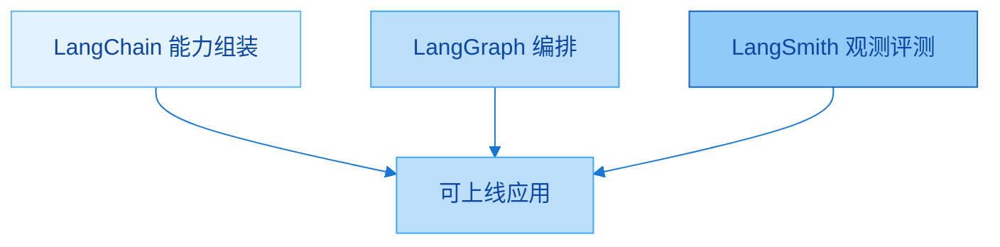
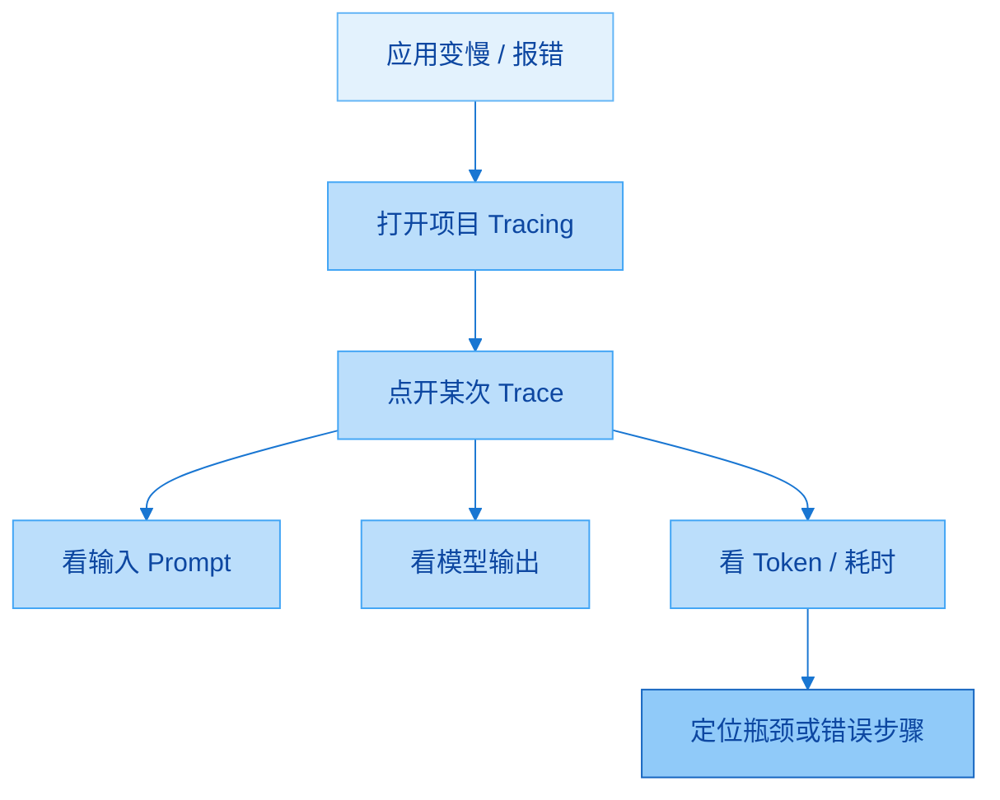
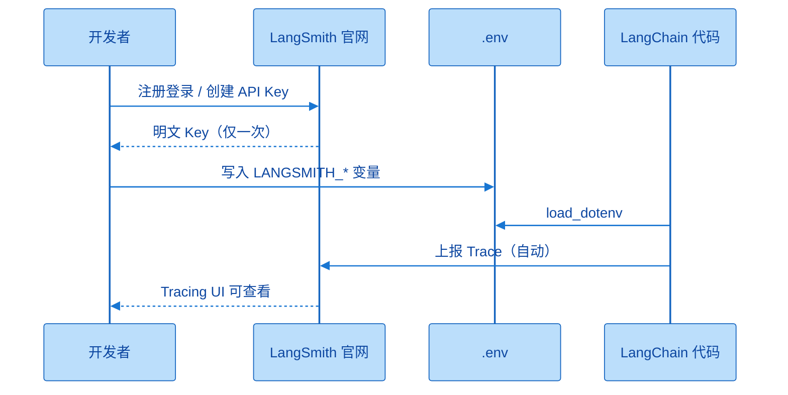
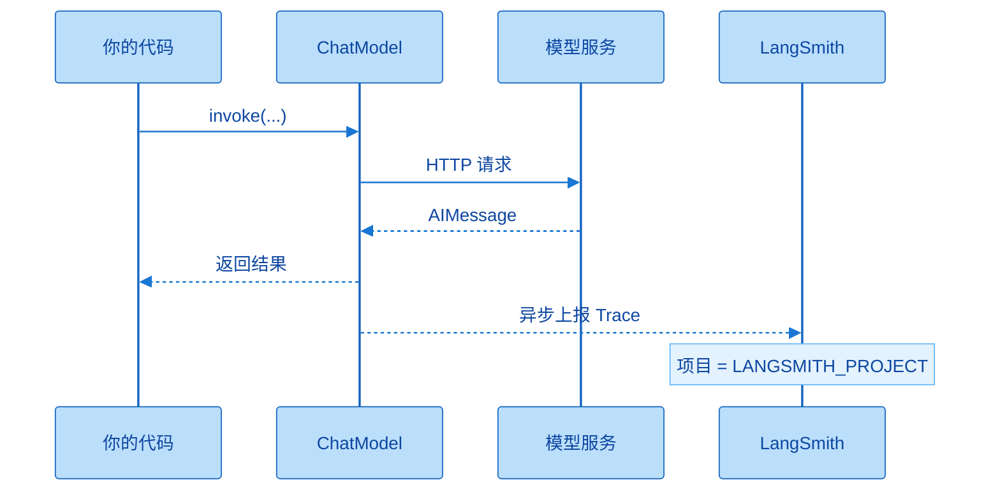
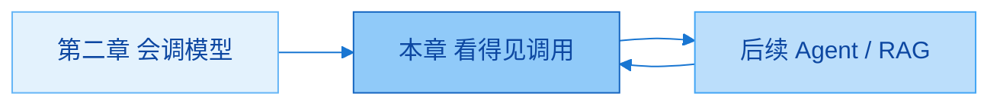

# LangSmith 的使用

> **版本**：LangChain **1.2.x** + LangSmith（观测平台）

官方入口：https://smith.langchain.com/  

第一章把 LangSmith 定位为家族四大支柱里的「看得见、评得了」；第二章调用里已经埋了 `config` 的 `run_name` / `tags` / `metadata`。本章把观测真正接上：注册、拿 Key、配 `.env`、跑几次调用，在 Web UI 里看到 Trace。内容不多，但后面 Agent / RAG 变复杂时会反复用到。

---

## 一、本章学什么

| 板块 | 核心问题 | 你应能做到 |
|------|----------|------------|
| 定位 | LangSmith 是什么、管什么 | 说清调试 / 监控 / 评估 / 管理 |
| 功能地图 | 左侧菜单三大组有哪些 | 知道现阶段优先 Tracing + Playground |
| 接入 | 账号、Key、环境变量 | `.env` 四变量配好，工程内自动上报 |
| 实操 | 跑代码 → 看 Trace | 能对照输入输出、耗时、名称与标签 |
| 衔接 | 与第二章 `config` 的关系 | 用 `run_name` / `tags` / `metadata` 丰富 Trace |

这一章可以记成一句话：**把「print 调试」升级成「全链路可观测」。** 代码仍是第二章的模型调用；变的是调用过程会被 LangSmith 记录并可视化。建议本章结束时固定：本课程工程开启 `LANGSMITH_TRACING=true`，项目名与本地工程名对齐，后续章节默认带着 Trace 开发。

```mermaid
%%{init: {
  "theme": "base",
  "themeVariables": {
    "primaryColor": "#BBDEFB",
    "primaryTextColor": "#0D47A1",
    "primaryBorderColor": "#1565C0",
    "secondaryColor": "#E3F2FD",
    "secondaryTextColor": "#0D47A1",
    "secondaryBorderColor": "#64B5F6",
    "tertiaryColor": "#E3F2FD",
    "tertiaryTextColor": "#1565C0",
    "tertiaryBorderColor": "#90CAF9",
    "lineColor": "#1976D2",
    "textColor": "#0D47A1",
    "mainBkg": "#E3F2FD",
    "nodeBorder": "#1565C0",
    "clusterBkg": "#E3F2FD",
    "clusterBorder": "#64B5F6",
    "titleColor": "#0D47A1",
    "edgeLabelBackground": "#E3F2FD",
    "actorBkg": "#BBDEFB",
    "actorBorder": "#1565C0",
    "actorTextColor": "#0D47A1",
    "signalColor": "#1976D2",
    "signalTextColor": "#0D47A1",
    "labelBoxBkgColor": "#E3F2FD",
    "labelBoxBorderColor": "#64B5F6",
    "labelTextColor": "#0D47A1",
    "loopTextColor": "#0D47A1",
    "noteBkgColor": "#E3F2FD",
    "noteTextColor": "#0D47A1",
    "noteBorderColor": "#64B5F6",
    "activationBkgColor": "#90CAF9",
    "activationBorderColor": "#1565C0",
    "sequenceNumberColor": "#FFFFFF"
  }
}}%%
flowchart LR
  App[LangChain 应用] --> Trace[LangSmith Tracing]
  Trace --> UI[Web UI 查看]
  UI --> Fix[排查慢 / 错 / 费 Token]
  classDef b1 fill:#E3F2FD,stroke:#64B5F6,color:#0D47A1
  classDef b2 fill:#BBDEFB,stroke:#42A5F5,color:#0D47A1
  classDef b3 fill:#90CAF9,stroke:#1565C0,color:#0D47A1
  class App b1
  class Trace b2
  class UI b2
  class Fix b3
```



应用照常 `invoke`；Tracing 在后台把链路同步到云端；你在 UI 里看输入输出与耗时，再决定怎么改 Prompt、换模型或减调用次数。

### 补充想法：为什么放在第三章

放在「会调模型」之后、「Messages / Tools / Agent」之前，是为了让后面每一章的实验都可回放。若等到 Agent 报错再学观测，你会同时学编排与调试，认知负担翻倍。实践建议：从本章起，本地调试优先看 Trace，而不是只盯控制台打印。

---

## 二、LangSmith 概述

### 2.1 什么是 LangSmith

LangSmith 是 LangChain 生态系统中，专门用于大模型应用 **调试、监控、评估和管理** 的平台。

| 能力 | 英文习惯 | 一句话 |
|------|----------|--------|
| 追踪 | Tracing | 记录每次 LLM / 链路上的详细信息 |
| 监控 | Monitoring | 实时/阶段性查看应用性能与成本 |
| 调试 | Debug | 排查问题、优化延迟与调用结构 |
| 评估 | Evaluate | 系统化测试输出质量（相关性、幻觉等） |

四件事不是四个独立产品，而是同一平台上的不同入口：先有 Trace 数据，才能做监控看板、人工标注和自动评估。对学习者而言，**Tracing 是入口能力**；评估与数据集等要等 RAG / Agent 有可重复用例后再深入。

### 2.2 在生态里的位置

第一章四大支柱里：LangChain 管「有什么能力」，LangGraph 管「怎么跑」，Deep Agent 管复杂自主，**LangSmith 管「看得见、评得了」**。没有它，复杂系统只能靠 `print` 和猜测；有了它，每次调用的 Prompt、返回、Token、节点耗时都能回放。



开发时 LangChain / LangGraph 负责「造出来」；LangSmith 负责「看见造得怎样」。三者常一起用，而不是三选一。

---

## 三、功能地图（左侧菜单三大组）

课件把功能分成三组。现阶段不必样样上手，但要建立「去哪找」的地图。

### 3.1 功能组一：核心应用与开发

| 功能 | 作用 | 何时用 |
|------|------|--------|
| **Tracing（追踪）** | 完整记录每次调用链路：Prompt、模型返回、Token、各节点耗时 | Agent / RAG 变慢或报错时首选入口 |
| **Monitoring（监控）** | 生产向可视化看板：调用次数、Token、工具调用、延迟、错误率、成本趋势等 | 上线后看稳定性与开销 |
| **Datasets & Experiments** | 管理测试集、跑对比实验（换 Prompt / 换模型） | 有稳定评测集之后 |
| **Evaluators（评估器）** | 规则或 LLM-as-a-judge：相关性、幻觉等自动打分 | 要对 Trace / 实验结果量化时 |
| **Annotation Queues** | 人工打分、纠正、贴标签；数据可回流微调或测试集 | 需要高质量人工反馈时 |

Tracing 是「显微镜」：点进某次运行看每一步。Monitoring 是「仪表盘」：看一段时间整体是否健康。Datasets / Evaluators / 标注队列属于「质量闭环」：先攒数据，再对比、再打分——本章示例还简单，先知道它们在菜单里即可。



排查路径很固定：进对项目 → 找对应时间的 Trace → 展开节点看输入输出与耗时 → 再改代码或 Prompt。后面链路越长，这个习惯越值钱。

### 3.2 功能组二：提示词与调试工具

| 功能 | 作用 | 直觉 |
|------|------|------|
| **Prompts** | 云端管理多版本 Prompt，类似「提示词版 GitHub」 | 从代码解耦；可按版本拉取 |
| **Playground** | 网页选模型、写 system/user、直接试 | 不写代码也能调 Prompt |
| **Studio** | 常与 **LangGraph** 深度集成，可视化图状态流转 | 复杂 Agent / 图编排时再深入 |
| **Context Hub** | 管理可复用的全局上下文 / 通用组件配置 | 多项目共用模板时 |

Playground 适合「先在网页里把说法调顺，再落回代码」。Prompts 适合团队共享与版本对比。Studio 要等你用上 LangGraph 的状态机，才会感到「暂停某节点、改状态再继续」的价值——课件明确它与 Graph 集成，不要和「随便一个聊天框」混为一谈。

### 3.3 功能组三：部署与沙盒

| 功能 | 作用 |
|------|------|
| **Deployments** | 将 LangChain / LangGraph Agent 部署为线上 API（常依托 LangGraph Cloud），含并发、队列、状态持久化等 |
| **Sandboxes** | 轻量在线运行与测试，避免污染生产环境 |

部署与沙盒属于「上线侧」能力。课程前期代码以本地 Notebook / 脚本为主，知道菜单存在即可；真正交付 API 服务时再系统学习。

### 3.4 现阶段学什么、往后补什么

课件建议：

- **现在重点**：Tracing（看调用细节）+ Playground（快速调 Prompt）  
- **应用变复杂后**：Datasets 做量化评估；Studio 做图可视化调试  
- **RAG / Agent 深水区**：再系统碰评估器、标注队列等  

上面优先级合在一起是说：先保证「每次调用看得见」，再保证「Prompt 改得快」，有评测集和复杂图之后再上实验与 Studio。不要一上来把左侧菜单全部点一遍当学会。

### 补充想法：观测成本与隐私

开启 Tracing 会把输入输出同步到 LangSmith 云端（按平台当前策略与套餐）。含隐私、密钥、客户原文的调用要谨慎：脱敏、抽样，或按组织策略关闭追踪。实践建议：开发环境默开；生产按合规配置采样率与字段过滤（以官方文档为准）。

---

## 四、准备账号与 API Key

### 4.1 注册或登录

1. 访问官网：https://smith.langchain.com/  
2. 可用 Google、GitHub 或邮箱等方式注册 / 登录  
3. 登录成功后进入主界面（默认英文；左侧为功能列表）  

首次进入会觉得菜单多，这很正常：本章只要会走到 **Settings → API Keys**，以及之后在项目里看 **Tracing**。其它入口按上一节地图「用到再点」。

### 4.2 创建并保存 API Key

| 步骤 | 操作 | 注意 |
|------|------|------|
| 1 | 左下角 **Settings** | 找设置入口 |
| 2 | **API Keys** → Create | 起名（如 `langchain-1.2`），过期可选 Never |
| 3 | **立刻 Copy** | Key **只显示一次**；关窗后无法再看明文 |
| 4 | （可选）删除旧 Key | 泄露或轮换时在列表右侧操作 |

Key 的安全习惯与模型 API Key 相同：只放进 `.env` / 密钥系统，不进 Git、不进截图、不进聊天记录。丢了就作废重建，不要指望官网再显示一次旧值。



账号与 Key 解决「有没有权限上报」；`.env` 解决「工程里是否启用、报到哪个项目」。缺任一环，UI 里都不会出现你的运行记录。

---

## 五、环境变量配置

在项目 `.env` 中增加（或对齐）以下变量；与模型 Key 放在同一文件即可。

| 变量 | 含义 | 填写要点 |
|------|------|----------|
| `LANGSMITH_TRACING` | 是否启用追踪 | 学习阶段设为 `true` |
| `LANGSMITH_ENDPOINT` | API 地址 | 一般用 `https://api.smith.langchain.com`，勿乱改 |
| `LANGSMITH_API_KEY` | 你的 Key | 替换为刚复制的值 |
| `LANGSMITH_PROJECT` | 项目显示名 | 自定义；UI 里按此名找记录 |

课件示例项目名可能是随机生成串；口述里常用与工程相关的名字（如 `langchain1.2_tutorial`）。**同一工程统一一个项目名**，避免 Trace 散落在多个项目里不好找。

```text
LANGSMITH_TRACING=true
LANGSMITH_ENDPOINT=https://api.smith.langchain.com
LANGSMITH_API_KEY=<YOUR_API_KEY>
LANGSMITH_PROJECT="langchain1.2_tutorial"
```

这四行合在一起的含义是：打开追踪、指向官方 Endpoint、用你的 Key 鉴权、把本工程运行归到指定项目名下。代码侧继续 `load_dotenv(override=True)` 即可；**不必**在每个 `invoke` 里再手写「开始监控」——环境变量生效后，LangChain 集成会自动上报。

### 补充想法：工程级开关

环境变量配在「当前工程」的 `.env`，意味着该工程下相关运行都会进你指定的 LangSmith 项目。换电脑或换仓库时，记得同步 `.env.example`（占位符）与真实 Key 的管理方式。临时关掉观测：把 `LANGSMITH_TRACING` 设为 `false` 或注释掉即可，无需改业务代码。

---

## 六、查看监控指标（Tracing 实操）

配置完成后：运行任意会调用模型的 LangChain 代码 → 打开官网对应项目 → 在 Tracing 中刷新查看。

### 6.1 整体数据流



业务路径仍是「代码 → 模型 → 回答」；旁路多了一条上报到 LangSmith。UI 里看到的 name 往往对应当前底层类（如 `ChatDeepSeek`、`ChatOpenAI`），即使用的是 `init_chat_model`，展示名也可能是路由后的具体实现类。

### 6.2 举例 1：专用类 `ChatDeepSeek`

```python
import os
from dotenv import load_dotenv
from langchain_deepseek import ChatDeepSeek

load_dotenv(override=True)

model = ChatDeepSeek(
    api_key=os.getenv("DEEPSEEK_API_KEY"),
    api_base=os.getenv("DEEPSEEK_BASE_URL"),
    model_name="deepseek-v4-flash",  # 以控制台可用型号为准
)
print(model.invoke("你好"))
```

这段与第二章专用类写法一致，没有新增「LangSmith SDK 调用」。跑通后到 Web UI 刷新，应出现 `LANGSMITH_PROJECT` 对应项目；打开 Tracing，能看到本次输入「你好」与模型输出，以及 metadata 等。名称侧常见 `ChatDeepSeek`。

### 6.3 举例 2：`init_chat_model` + 兼容中转

```python
from langchain.chat_models import init_chat_model
from dotenv import load_dotenv
import os

load_dotenv(override=True)

model = init_chat_model(
    model="deepseek-v4-flash",
    model_provider="openai",
    api_key=os.getenv("CLOSEAI_API_KEY"),
    base_url=os.getenv("CLOSEAI_BASE_URL"),
)
print(model.invoke("你好，用一句话回答"))
```

统一接口底层仍可能落到 `ChatOpenAI` 一类实现，故 Trace 列表里名称可能显示为 `ChatOpenAI`，即使你代码写的是 `init_chat_model`。多跑几次后列表会按时间堆叠；可对比错误状态、耗时、输入输出是否符合预期。

### 6.4 举例 3：`invoke(..., config=...)` 丰富 Trace

第二章已介绍 `run_name` / `tags` / `metadata` / `configurable`。配上 LangSmith 后，这些字段会呈现在 Trace 详情里，便于检索与归因。

```python
from langchain.chat_models import init_chat_model
from dotenv import load_dotenv
import os
from rich import print as rprint

load_dotenv(override=True)

model = init_chat_model(
    model="deepseek-v4-flash",
    model_provider="deepseek",
    api_key=os.getenv("DEEPSEEK_API_KEY"),
    base_url=os.getenv("DEEPSEEK_BASE_URL"),
    temperature=0.2,
    max_tokens=500,
    configurable_fields=("model", "model_provider", "temperature", "max_tokens"),
)

config = {
    "run_name": "joke_generation",
    "tags": ["my_tag1", "my_tag2"],
    "metadata": {
        "user_id": "shkstart",
        "session_id": "sess_123",
    },
    "configurable": {
        "model": "deepseek-v4-pro",
        "model_provider": "openai",
        "temperature": 0.7,
        "max_tokens": 1000,
    },
}

response = model.invoke("1 + 2 = ？", config=config)
rprint(response)
```

在 UI 中通常能核对：

| 你在 config 里写的 | Trace 里常见呈现 |
|--------------------|------------------|
| `run_name` | 本次运行显示名（如 `joke_generation`） |
| `tags` | 标签列表，便于过滤 |
| `metadata.user_id` / `session_id` | 详情中的用户与会话信息 |
| `configurable` | 当次实际模型/温度等（需声明 `configurable_fields`） |

把「给运行起名、打标签、带上用户/会话」当成可观测性的基本礼仪：Agent 步骤一多，没有 `run_name` 和 `tags` 的 Trace 列表会迅速不可读。按 `session_id` 过滤，还能把同一次会话的多次调用归到一起看。

### 6.5 在 Web UI 里怎么看

| 步骤 | 做什么 |
|------|--------|
| 1 | 运行上述任一例 |
| 2 | 打开 LangSmith → 找到 `LANGSMITH_PROJECT` 同名项目 |
| 3 | 进入 **Tracing**，刷新列表 |
| 4 | 点击某条进入详情：输入、输出、耗时、metadata 等 |
| 5 | 按需切换报表标签，看调用量、Token 等汇总（自行探索） |

列表看「有没有、成没成功、多久」；详情看「当时究竟送了什么、模型回了什么」。报表偏 Monitoring 视角，适合看趋势而不是单次排错。界面文案会随产品迭代微调，以你账号里实际菜单为准，但 Tracing 主路径长期稳定。

### 补充想法：Trace 命名规范（实践建议）

建议团队约定：`run_name` 用「场景_动作」（如 `rag_retrieve`、`agent_plan`）；`tags` 含环境（`dev`/`prod`）与功能模块；`metadata` 至少带 `user_id` 或业务单号。这不是课件硬性规定，但能显著降低后期翻 Trace 的成本。

---

## 七、与前后章如何衔接

| 章节 | 和 LangSmith 的关系 |
|------|---------------------|
| 第一章 | 支柱定位：观测 / 评测层 |
| 第二章 | `config` 字段为 Trace 提供名称、标签、元数据与当次覆盖 |
| 本章 | 真正接通上报与 UI |
| 后续 Messages / Tools / Agent / RAG | 链路变长后，用 Tracing 定位「卡在哪一步」；再用 Datasets / Evaluators 做质量对比 |

没有本章，后面复杂示例仍然能跑，但排错会退回盲猜。有了本章，建议默认：**先复现问题调用 → 打开对应 Trace → 再改代码**。



第二章解决「接上电」；本章解决「接上仪表」；后续章节在仪表开着的状态下堆能力，形成正向循环。

---

## 八、本章速记卡

```text
1. LangSmith = 调试 + 监控 + 评估 + 管理（生态观测层）
2. 现在优先：Tracing + Playground；复杂后再 Datasets / Studio
3. Key 只显示一次 → 立刻写入 .env
4. 四变量：TRACING / ENDPOINT / API_KEY / PROJECT
5. load_dotenv 后照常 invoke → 自动上报
6. UI：按 PROJECT 找项目 → Tracing → 点开看输入输出耗时
7. config：run_name / tags / metadata 会进 Trace；便于过滤与归因
8. init_chat_model 的 Trace 名可能显示为底层 ChatOpenAI 等
9. Studio ↔ LangGraph；Deployments / Sandboxes 偏上线侧
10. 排错口诀：复现 → 打开 Trace → 再改代码
```

按「是什么 → 菜单地图 → Key 与四变量 → 三例代码 → UI 怎么看」口述一遍；能独立完成「跑一次调用并在网站找到对应 Trace」，本章即过关。

---

## 九、自检清单

- [ ] 能口述 LangSmith 在生态中的职责（观测 / 评测，而非替代模型）  
- [ ] 能说出三大功能组，并指出现阶段优先 Tracing 与 Playground  
- [ ] 已注册账号，创建过 API Key，并理解「只显示一次」  
- [ ] `.env` 中四变量正确，`LANGSMITH_TRACING=true`  
- [ ] 跑通至少一例：`ChatDeepSeek` 或 `init_chat_model`，UI 中可见记录  
- [ ] 能用 `run_name` / `tags` / `metadata` 在详情里对上号  
- [ ] 知道 Studio 主要服务 LangGraph 可视化，而非普通聊天框  
- [ ] 知道 Datasets / Evaluators / 标注队列「以后评测再用」  

建议自测：合上笔记，从零写出四行环境变量，再写一段带 `config` 的 `invoke`，打开官网找到该次运行并指出 tags 与 session 在哪。

---

## 十、下章预告

下一章进入 **Messages 与提示词模板**：消息角色、`content_blocks`、`ChatPromptTemplate` 等。继续保持 LangSmith Tracing 开启，你会更早看到「模板渲染后的真实 Prompt」长什么样——这比只在代码里猜字符串更直观。
