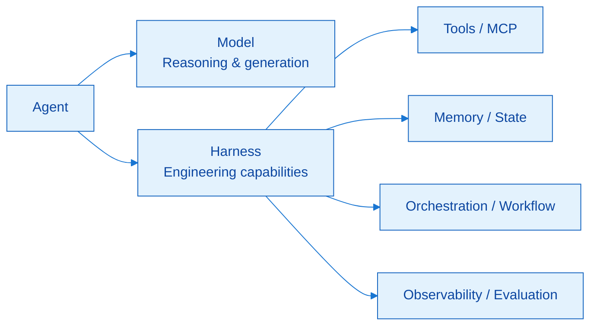
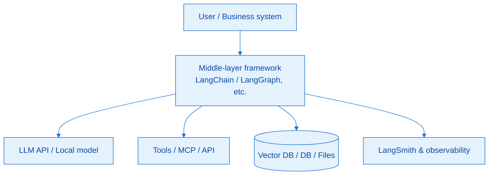
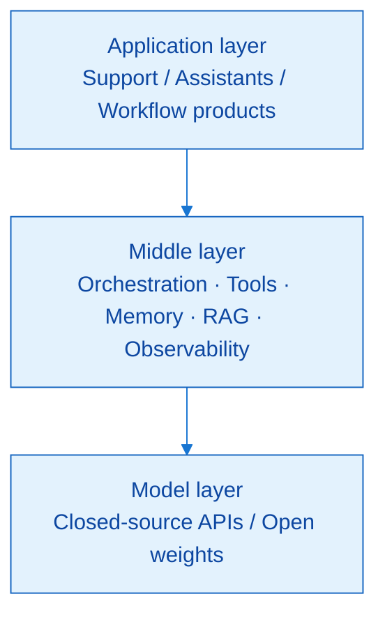
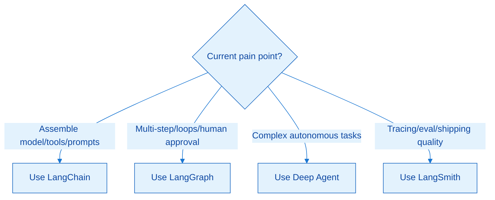
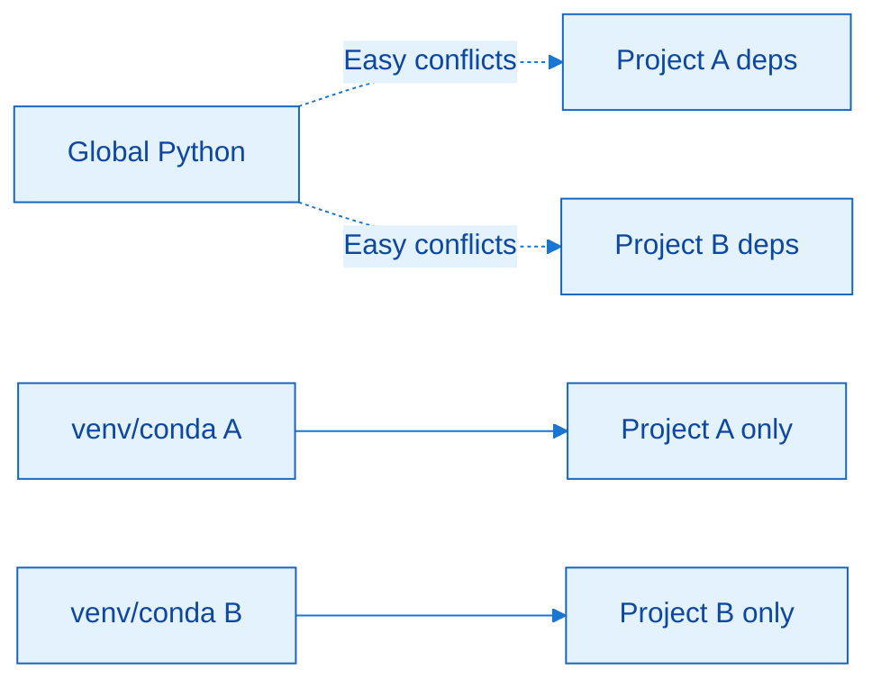
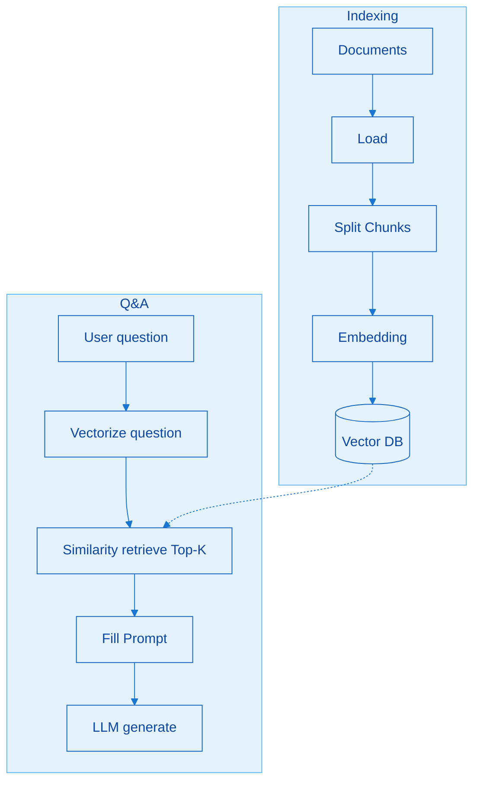
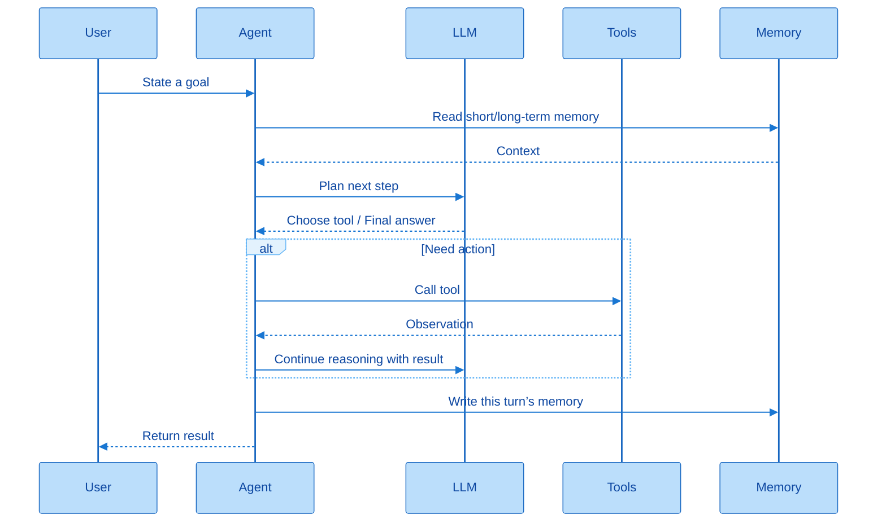
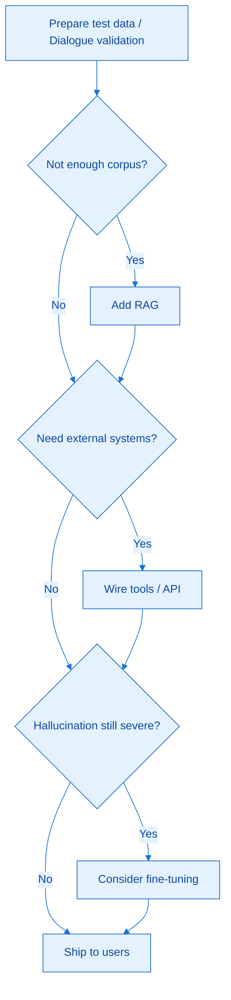

# LangChain Overview

> **Version**: LangChain **1.2.12** (Python ≥ 3.10)

This chapter builds the worldview for the whole course: why you need a framework, what LangChain is, the four pillars of the ecosystem, how to set up the environment, and the ladders of RAG / Agent / technology selection. The goal is to be able to teach Chapter 1 clearly without the video—not just memorize a few slogans.

---

## 1. What You Will Learn in This Chapter

Build an LLM-application worldview with **Why → What → How (environment) → How (scenarios)**:

| Order | Topic | You Should Be Able To |
|------|------|------------|
| Why | Era context, model limits, job map | Explain why learn a framework, and where you stand |
| What | Naming, evolution, modules, four pillars | Tell apart narrow/broad senses, 0.3 vs 1.x, pillar roles |
| How | conda, packages, IDE | Reproducible env, version locked to 1.2.12 |
| Scenarios | RAG, Agent, four ladders | Sketch flows from memory; pick tech by pain points |

This chapter barely writes business code, yet it decides whether later learning goes off track: if you only chase hot buzzwords like MCP, Skills, or trendy Agent-product nicknames, you will forever spin at the application surface; if you first master the middle-layer framework and then revisit the hype, you can tell “capability” from “product packaging.”

**Core formula (runs through the whole course)**

```text
Agent = Model + Harness (engineering capabilities)
```

An agent is not “swap in a stronger LLM.” The Model does reasoning; the Harness connects tools, manages memory, handles orchestration and observability, and turns capability into a shippable system. LangChain (and its family) is one of the most common Harness / middle layers today. Learning it is essentially learning “how to give a brain hands, feet, and workflows.”



In the diagram, Model is “thinking”; Harness is “doing.” Product differentiation increasingly lands on Harness: the same model with a different middle layer can behave very differently.


### Extra Thought: How Chapters 1 and 2 Connect

Chapter 1 answers “why a middle layer”; Chapter 2 starts “how to plug a specific model into that middle layer.” After Chapter 1, set your personal target role (application development / algorithms / other), and accept “this course’s default stack = Python + LangChain 1.2.x”—you can swap models later, but do not swap frameworks every chapter.

---

## 2. Course Positioning and Era Context

### 2.1 Timeline of the Era

| Time | Event | Industry Focus |
|------|------|----------|
| 2022.11 | ChatGPT goes global | Conversational LLMs enter public awareness |
| 2023 | China’s “hundred-model war” | Competing on base models and corpora |
| 2024 | Catch-up race | Still mostly a model-capability contest |
| 2025.01 | DeepSeek R1 and others accelerate adoption | Models reach broader audiences |
| H2 2025 | Scenario apps / Agent era | **From base-model contests → shipping** |
| H1 2026 | Harness and mass AI adoption wave | Engineering and Agent shells in focus |

Strung together: earlier years compared “whose model is stronger”; after H2 2025, the contest is “who can work stably in customer support, knowledge bases, and process automation.” The competitive focus shifts from model capability to **Harness engineering**—exactly why a framework course exists.

```mermaid
%%{init: {
  "theme": "base",
  "themeVariables": {
    "primaryColor": "#BBDEFB",
    "primaryTextColor": "#0D47A1",
    "primaryBorderColor": "#1565C0",
    "secondaryColor": "#E3F2FD",
    "secondaryTextColor": "#0D47A1",
    "secondaryBorderColor": "#64B5F6",
    "tertiaryColor": "#E3F2FD",
    "tertiaryTextColor": "#1565C0",
    "tertiaryBorderColor": "#90CAF9",
    "lineColor": "#1976D2",
    "textColor": "#0D47A1",
    "mainBkg": "#E3F2FD",
    "nodeBorder": "#1565C0",
    "clusterBkg": "#E3F2FD",
    "clusterBorder": "#64B5F6",
    "titleColor": "#0D47A1",
    "edgeLabelBackground": "#E3F2FD",
    "actorBkg": "#BBDEFB",
    "actorBorder": "#1565C0",
    "actorTextColor": "#0D47A1",
    "signalColor": "#1976D2",
    "signalTextColor": "#0D47A1",
    "labelBoxBkgColor": "#E3F2FD",
    "labelBoxBorderColor": "#64B5F6",
    "labelTextColor": "#0D47A1",
    "loopTextColor": "#0D47A1",
    "noteBkgColor": "#E3F2FD",
    "noteTextColor": "#0D47A1",
    "noteBorderColor": "#64B5F6",
    "activationBkgColor": "#90CAF9",
    "activationBorderColor": "#1565C0",
    "sequenceNumberColor": "#FFFFFF"
  }
}}%%
flowchart LR
  subgraph T["LLM Application Focus Shift (course timeline)"]
    direction LR
    Y22["2022<br/>ChatGPT breaks out"]:::b1
    Y23["2023<br/>Hundred-model war / Prompt boom"]:::b2
    Y24["2024<br/>Still mostly base-model contests"]:::b3
    Y25["H2 2025<br/>Scenario shipping / Agent era"]:::b4
    Y26["2026<br/>Harness & engineering in focus"]:::b5
    Y22 --> Y23 --> Y24 --> Y25 --> Y26
  end
  classDef b1 fill:#E3F2FD,stroke:#90CAF9,color:#0D47A1
  classDef b2 fill:#BBDEFB,stroke:#64B5F6,color:#0D47A1
  classDef b3 fill:#90CAF9,stroke:#42A5F5,color:#0D47A1
  classDef b4 fill:#BBDEFB,stroke:#1976D2,color:#0D47A1
  classDef b5 fill:#90CAF9,stroke:#1565C0,color:#0D47A1
```



You need not memorize the years; grasp the trend: from “whose model is stronger” to “who can ship stably.”


### 2.2 Why Learn a Framework (Not Just Play with Doubao)

- Knowing Python / using Doubao still leaves “an ocean” in between → the framework is the bridge  
- On GitHub and in hiring JDs, LangChain shows up often  
- Learning a framework clarifies Agent **capability boundaries**, so hot buzzwords do not drag you around  

Three points are really one: using a chat product ≠ building shippable apps. What is missing is the engineering skill to assemble model, tools, memory, and orchestration. Through framework design, you see “what the model should do vs. what the system should do,” and stay clear-headed among MCP, Skills, and various Agent products.

### 2.3 Course Content and Three Projects

| Project Landing | Roughly Maps To |
|----------|----------------|
| Multi-turn chatbot | Prompts / messages / multi-turn |
| Multi-capability smart assistant | Agent + tools, etc. |
| AI customer-support knowledge-base Assistant | RAG + Agent combined |

The course locks **1.2.12** and deliberately covers 1.x priorities: structured output, middleware, short/long-term memory, RAG, and more—avoiding “install the latest but only teach 0.3 patterns.” Slides, code, and helpers are ready; treat official docs as the dictionary, and this course as explanation plus roadmap.

### Extra Thought: How to Put Chapter 1 Outcomes on a Resume

Chapter 1 itself is hard to put on a resume, but you can write a learning goal: “Build Agent / RAG apps on LangChain 1.2; understand Model+Harness.” What is truly showable is the three later projects; Chapter 1’s value is picking the right track so you do not waste time on base-model training fantasies or pure hype-chasing.

---

## 3. Why LangChain Is Needed

### 3.1 Three Questions for Learning Anything New

1. **Why** — why is it needed  
2. **What** — what it is  
3. **How** — how to use it  

Any new tech can be learned with these three. This chapter focuses on Why / What; How starts with environment setup and unfolds across the next eleven chapters. If you skip Why and only copy code, you will lack judgment when asking “do we need RAG / do we need fine-tuning?”

### 3.2 Three Natural Limits of LLMs

| # | Limit | Meaning | Common Misconception |
|---|------|----------|----------|
| 1 | Knowledge limited by training data | There is a cutoff date; later events may be unknown | “Doubao can look up news” = the product is online, not bare-model capability |
| 2 | Cannot natively connect to the outside world | No web, Web API, or DB access by itself | A strategist with no soldiers or intelligence posts |
| 3 | Stateless / no context memory | Said “I’m Xiaoming” and may forget next turn | Poor multi-turn UX; history must be kept at the app layer |

A bare model is like “a strategist with only a brain”: good at ideas, no limbs or senses, and cannot remember who you are. To turn a model into a practical app, you must combine **model + external tools + data sources + memory**—exactly why middle layers like LangChain exist.



Without a middle layer, business code scatters calls to LLMs, tools, and storage; with one, these cross-cutting capabilities become reusable, swappable, and observable.


### 3.3 Framework Positioning: Three-Layer Cake

```text
Application layer: Doubao, Yuanbao, Taobao support, your Agent…
Middle layer: LangChain (one of the preferred shipping frameworks)
Model layer: GPT / DeepSeek / Tongyi…
```

The bottom “thinks,” the top “serves users,” the middle “connects ideas to the real world.” LangChain does not replace the model and is not the final App; it is the engineering layer linking the two.



The three layers are a responsibility split on one call chain: requirements come from the app layer, capability from the model layer, and engineering lands in the middle.


**Three middle-layer duties (from the slides)**

1. Connect LLMs to external resources (DBs, search, APIs, file systems)  
2. Encapsulate tool calling, memory, etc., to lower Agent development difficulty  
3. Support multi-agent collaboration (via LangGraph and the like)  

First “connect,” then “encapsulate to save work,” then “collaborate and scale.” Most glue code you write in business eventually falls into these three duties.

### 3.4 Typical Application Scenarios (Six Types)

| Scenario | Pain Point | How the Framework Helps |
|------|------|----------------|
| RAG | Stale knowledge, hallucination | External knowledge base; retrieve then generate |
| Agent | Model can only talk, not act | Planning + tools + action loop |
| Dialogue systems | Multi-turn amnesia | Memory management + private data |
| Multimodal | Text alone is not enough | Combined image/audio/video reasoning |
| Content generation | Unstable formats | Templates + parsing / structured output |
| Data connection | Unstructured data hard to use | Load docs, NL2SQL, etc. |

Public discourse often equates “LLM apps ≈ Agents,” and Agents often embed RAG. Learning mindset: master the framework’s mainline capabilities first, then revisit specific products (including MCP, Skills, etc.), and avoid treating “one viral app” as the only tech stack.

### Extra Thought: Why a “Middle Layer” Beats “Learning Yet Another Model API”

Vendor APIs change; models get swapped. A middle layer turns “swap model” into a config change, and “wire tools/memory” into composable modules. Over a career you may change primary models three times—but you do not want to change application architecture three times. That is the rationale for betting on a framework rather than a single model brand.

---

## 4. LLM-Related Job Roles

Bottom-up (pyramid):

| Layer | Role | Traits |
|------|------|------|
| Bottom | Ops / Infer engineer | GPU/TPU deploy & optimize; hardware-heavy; demand concentrated in big labs |
| Lower-mid | Data development & cleaning | Corpus cleaning/labeling; training “fuel”; not glamorous but essential |
| Mid | Base-model R&D & optimization | Very high education bar (often PhD); few seats, potentially extreme pay |
| Upper-mid | Fine-tuning / Algorithm engineer | Industry post-training, multimodal, etc.; solid bachelor’s+ may consider |
| **Top** | **LLM / Agent application developer** | **This course’s target; most openings; applications win** |

When reading the table, hold the dichotomy: **build models** vs **use models**. Lower = more building, harder, fewer people; upper = more using, closer to business, larger demand. This course clearly stands in upper application development—using LangChain to efficiently build Agent / RAG products.

Key points:

- Application development is the direction most general learners should watch  
- Even fine-tuning work benefits from understanding apps, or targets drift  
- LangChain = high-frequency app-layer tool, not a substitute for the “alchemy furnace”  

Even on the algorithm track, without knowing “what the app needs,” fine-tuning easily becomes a lab score game. Conversely, app developers who understand model limits can align expectations with algorithm colleagues.

### Extra Thought: How to Pick Your Layer Against Your Background

| Background | More Realistic Entry |
|------|----------------|
| Backend / Full-stack | Top application development (this course) |
| Data engineering | Lower-mid data + top RAG data pipelines |
| Grad-student algorithms | Upper-mid fine-tuning, while filling in apps |
| Ops / Infrastructure | Bottom Infer + app-side deploy |

Do not treat “million-yuan base-model jobs” as the default goal; ask which layer’s outcomes you can deliver within three years.

---

## 5. What LangChain Is

### 5.1 Definition and Naming

| Item | Content |
|----|------|
| Created | 2022.10, Harrison Chase |
| Naming | Language (for LLMs) + Chain (chained composition) |
| Idea | Link LLMs with compute, data, and components to build AI apps |

The name is the design: oriented to language models, composing capabilities with “chains.” It predates ChatGPT’s public release slightly—an early bet on the application layer. Narrowly, “learning LangChain” usually means the development framework; broadly, it means the whole family ecosystem (Graph, Smith, Deep Agent, etc.).

### 5.2 Five Development Stages

| Stage | Time | Keywords |
|------|------|--------|
| Birth | 2022.10 | Open-source start |
| Exploration | 2022Q4–2023Q1 | PromptTemplate, LLMChain; Stars explode |
| Systematization | 2023 | Tool, Agent, Retrieval; Hub, LangSmith |
| Platformization | 2024–H1 2025 | LangGraph, LangServe |
| Deep agents | H2 2025–now | Deep Agent (Agent Harness); **1.0 GA** |

From “small chain modules” to “agent platform + Harness,” the 1.2 you learn now sits on the stable base of stage five—not the turbulent 0.x period.

### 5.3 Two Important Versions: 0.3 vs 1.x

| Dimension | v0.3 | v1.x / 1.2 |
|------|------|------------|
| Feel | Love-hate; “version money shredder” | Production-grade stable; new paradigm |
| Design | Chain-centric | From chains → **agent framework** |
| Agent | `initialize_agent`, etc. | Prefer `create_agent`; LangGraph underneath |
| Tools | Weaker type safety | Pydantic Schema |
| Structured output | Mostly Parser / regex | Structured Output as first-class |
| Output shape | Mostly plain text then parse | Standardized `content_blocks`, etc. |
| Extension | Lacked systemic extension | **Middleware** |
| Multimodal | Incomplete | Clearly stronger |
| Async | Average | Improved narrative |
| Package layout | Messy, high coupling | Clear core / classic / community |
| Python | ≥ 3.9 | **≥ 3.10** |
| Use | Maintain legacy only | **Preferred for new projects** |

In the 0.3 era: APIs changed fast, heavy abstraction, lagging docs; meanwhile GPT-4 natively gained tool calling and more, so some felt “frameworks are redundant,” and the community partly drifted away. Around **2025-10-20**, 1.0 shipped (with LangGraph 1.0); official commitment of no breaking changes before 2.0, plus major funding. New learning paths should go straight to 1.2—do not treat 0.3 pipe `|` tutorials as the default bible. Some joke that 1.x “feels like LangGraph 2.0”—meaning orchestration focus is already on Agent / Graph, not only Chain.

### Extra Thought: What to Do When You See 0.3 Tutorials

| What You See | Suggestion |
|----------|------|
| `LLMChain` + pipe `|` | Historical context only; prefer Agent / new APIs in new code |
| `initialize_agent` | Find `create_agent` equivalents in docs |
| Old import paths | Check whether they moved to `langchain-classic` |

Treat 0.3 materials as “archaeology,” not “construction blueprints.”

---

## 6. Main Modules and API Docs

### 6.1 Package Structure

| Package | Contents | Attitude |
|----|------|----------|
| `langchain-core` | Core APIs like Runnable, BaseMessage | **Prefer; peace of mind** |
| `langchain-classic` | 0.x old APIs, discouraged patterns | Compat for legacy code |
| `langchain-community` + vendor packages | openai / anthropic, etc. | Install as needed; avoid bloat |
| `langgraph` | Graph orchestration, loops, complex tasks | Deeply integrated; later focus |

Three shelves + an orchestration engine: core is standard-library mindset; classic is the attic; community/vendor packages are plugins; langgraph is the complex-flow engine. Prefer core in new code; do not habitually dig deprecated APIs from classic.

### 6.2 Doc Entrances and Learning Principles

| Purpose | Link |
|------|------|
| Website | https://www.langchain.com/ |
| GitHub | https://github.com/langchain-ai |
| English Docs | https://docs.langchain.com/oss/python/langchain/overview |
| Chinese Docs | https://docs.langchain.org.cn/oss/python/langchain/overview |
| API Reference | https://reference.langchain.com/python/langchain/ |
| Module overview | https://reference.langchain.com/python/langchain/overview |

Slide golden line:

> Do not try to learn every API. Grasp core logic and core modules; look things up when needed. Treat it as a **toolbox**, not a textbook.

Browse Products / Docs / Learn on the site for the big picture; when actually coding, use Reference for parameters. This course’s eleven chapters cover Agents, Models, Messages, Tools, Streaming, Structured Output, Middleware, memory, RAG, MCP, human-in-the-loop, and more—highly aligned with the docs’ “core components.”

### Extra Thought: Fastest Way to Use the Docs

First use these notes to locate “what class of problem am I solving,” then enter Reference with keywords (e.g. `init_chat_model`, `BaseMessage`). Do not read the left nav from page one to the end—that is the authors’ view, not the learner’s.

---

## 7. Four Pillars of the Family

As of roughly 2025.11, the ecosystem’s four pillars:

| Pillar | Layer Role | One-Liner | Selection Mantra |
|------|----------|--------|----------|
| **LangChain** | Foundation capability | Models / messages / tools / Agent / middleware, etc. | Solves “**fast**”; simple Agents → **main body of this course** |
| **LangGraph** | Runtime orchestration | Directed graph: Node / Edge / State | Solves “**stable**”; complex workflows |
| **Deep Agent** | Agent abstraction / Harness | Planning, sub-agents, long-term memory, virtual FS, etc. | Solves “**complex tasks**”; don’t build big jobs from scratch |
| **LangSmith** | Monitoring & evaluation | Full-chain tracing, debugging, eval, collaboration | Don’t rely on print alone; quality closed loop |

**LangChain value expanded:** unified model abstraction, modularity (Message/Tool/Agent/Middleware), rich integrations—like an agent “OS kernel.” Conclusion: when you do not need complex orchestration, LangChain alone is enough.

**LangGraph expanded:** when tasks become multi-step and stateful, describe flow with a graph. Node = function/decision point, Edge = path conditions, State = shared and persistent context. Official emphasis: start fast with Chain; use Graph for complex control; they work together.

**Deep Agent expanded:** officially positioned as Agent Harness, built on Chain + Graph; core capabilities include explicit planning, virtual filesystem, sub-agents, long-term memory, extensible middleware. For deep agents when you “don’t want to write complex control logic from scratch.”

**LangSmith expanded:** trace model calls, prompts, outputs, tools; debug, evaluate, share test sets as a team. Once systems get complex, print is not enough.

Relationship mantra:

```text
LangChain  = what capabilities you have
LangGraph  = how they run (orchestration)
Deep Agent = stronger autonomy / multi-agent
LangSmith  = see it, evaluate it
```

They are not mutually exclusive: validate quickly with Chain, harden production with Graph, strengthen autonomy with Deep Agent, and watch quality with Smith throughout.



Selection is not exclusive: a common combo is LangChain + LangGraph for development, LangSmith for observability; bring Deep Agent when tasks get complex.


### Extra Thought: Don’t Invert the Learning Order

First run through this course’s LangChain mainline (models, messages, tools, Agent, RAG, memory, middleware), then add Graph / Deep Agent as needed. Jumping straight into multi-agent graph orchestration often yields “seen everything, can write nothing.” Smith can be woven in early after Chapter 2, because observability speeds up all debugging.

---

## 8. Prep Before Development (Environment)

### 8.1 Prerequisites

**Python:** variables, control flow, functions & args, classes & objects, decorators; list/tuple/set/dict; JSON; exceptions; modules & package management; threads/coroutines are a plus.

**LLM basics:** know LLM, Token, Prompt, Embedding; have used products like Doubao / Qwen / DeepSeek; know providers such as OpenAI, Anthropic, Bailian.

LangChain has Python / JS; **Python is the most complete, fastest-updating, most active community**—this course uses Python only. Other languages (Java/C#, etc.) have ecosystems, but not this course’s path.

### 8.2 Why Virtual Environments

A global env is like every project sharing one spice rack: project A needs package 1.x, project B needs 2.x—conflict is inevitable. Virtual environments give each project its own interpreter and dependency set.



Isolation’s essence is “one interpreter + package set per project,” so `langchain==1.2.12` actually locks.

### 8.3 Three Options Compared

| Tool | Manages Interpreter | Manages Python Packages | Manages Non-Python Deps | Best For |
|------|----------|--------------|------------------|------|
| **conda** (this course) | ✅ | ✅ | ✅ (CUDA, etc.) | AI / deep learning / complex deps |
| uv | ✅ | ✅ | ❌ | Pure Python, modern package mgmt |
| venv | Based on existing interpreter | ✅ | ❌ | Lightweight, teaching |

conda is not just a pip substitute—it can manage CUDA, system libs, etc.; prefer it for AI engineering. uv is fast for pure Python. venv ships with Python and does not install new interpreters. This course’s deps are mostly pure Python, so all three work; we standardize on **conda** to reduce environment variance among classmates. You can use pip inside conda, but prefer: conda for lower layers first, pip when Python packages are missing—avoid mindless switching that messes up the dependency tree.

### 8.4 Miniconda and Recommended Commands

Install **Miniconda** (lighter than Anaconda; the course does not need hundreds of preinstalled science packages). Install path: **no Chinese characters or spaces**.

```bash
# Create env (pin versions to reduce pitfalls)
conda create --name langchain1.2 python=3.13.12
conda env list
conda init          # then reopen the terminal
conda activate langchain1.2
python -V

# Exit / delete (when needed)
conda deactivate
conda remove --name langchain1.2 --all
```

LangChain 1.2 requires Python **≥ 3.10**; slide examples use a concrete patch like 3.13.12—align with the course materials; avoid “chasing the newest patch” unless you are willing to handle compatibility.

### 8.5 Installing LangChain 1.2.12

```bash
# Method 1: conda (try first)
conda install langchain==1.2.12
# or specify channel
conda install -c conda-forge langchain==1.2.12

# Method 2: pip (common when conda can’t find the version or constraints are too tight)
pip install langchain==1.2.12
# China mirror example
pip install langchain==1.2.12 -i https://pypi.tuna.tsinghua.edu.cn/simple

conda list   # or pip show langchain
```

**Always pin the version**—do not bare `pip install langchain` chasing latest. Class demos showed: conda channels may not find the pinned version, or conflict with the current Python patch; then pip is more lenient—that is normal troubleshooting, not “conda is useless.”

In the IDE (PyCharm / VS Code), point the new project’s interpreter at this conda env and run:

```python
import langchain
print(langchain.__version__)  # expect 1.2.12
```

When the correct version appears, Chapter 1’s environment goal is met.

### Extra Thought: Environment Checklist Template

Keep a one-page “env card”: `OS / Miniconda path / env name / Python version / langchain version / IDE interpreter path`. Reproduce from the card when swapping machines or reinstalling—more reliable than digging chat history. From Chapter 2 on you will add `.env` and platform Keys; keep a separate “secrets card” and never commit it to Git.

---

## 9. Application Scenario 1: RAG

### 9.1 Industry Feel and Problems to Solve

A common take on LLM apps: **low floor, high ceiling**—Cherry Studio, Dify, etc. can build toys in minutes; shipping with low hallucination is as hard as a full backend.

| Problem | Manifestation |
|------|------|
| Knowledge freeze | Model does not know knowledge after the training cutoff |
| Hallucination | Confident fabrication when domain corpus is thin |

RAG exists to let the model take an “open-book exam”: turn private/latest materials into a retrievable plugin.

### 9.2 Definition

**RAG = Retrieval-Augmented Generation**

| Word | Meaning |
|----|------|
| Retrieval | Find relevant snippets from a knowledge base |
| Augmented | Inject snippets into the prompt |
| Generation | Model generates answers from the augmented context |

Analogy: **closed-book exam** (bare model) vs **open-book exam** (with a knowledge base). Accuracy shifts from “by impression” to “evidence-backed.”

### 9.3 Mainstream Flow (Indexing + Q&A)

```text
【Indexing】
Multi-format docs (PDF/Word/MD/HTML…)
  → Load as text
  → Split into Chunks
  → Embedding vectorization
  → Write to vector database

【Q&A】
User question
  → Vectorize the question
  → Similarity retrieve Top-K chunks
  → Fill Prompt template
  → LLM generates a more reliable answer
```

Indexing solves “where knowledge lives and how it is represented”; Q&A solves “which pages this question should look at.” The vector DB stores high-dimensional numeric representations and finds “semantically close” snippets by similarity—not simple keyword match (algorithms come later).



Indexing turns knowledge into a retrievable representation; Q&A each time pulls only relevant chunks then generates—that is the engineering form of an “open-book exam.”


### 9.4 Engineering Hard Parts Preview (Expanded in Chapter 10)

| Hard Part | Why Hard |
|------|----------|
| File parsing | Many formats; same PDF may mix text/figures/tables |
| Chunking strategy | Too long overflows context; too fine loses semantics; char/token/semantic/recursive strategies |
| Retrieval | Algorithms and recall quality set the ceiling |
| Re-ranker | Can use for high-precision; trade off for low-latency |

The point is not memorizing the three letters “RAG,” but admitting: **retrieval quality ≈ answer quality**. In the Agent chapter you will see RAG can also be part of long-term memory / knowledge plugins.

### Extra Thought: When Not to Add RAG Yet

For open chat with no private-knowledge dependency, you need not force a vector DB. In validation you may even “stuff materials into a long context” as a prototype, then engineer RAG once the business case holds—consistent with later “validate with dialogue first, then add RAG.”

---

## 10. Application Scenario 2: Agent

### 10.1 Definition and Translation

Fully leverage the LLM’s **reasoning and decision** ability to build an **Agent** that can think independently and complete goals step by step. “Proxy” can sound like mere request forwarding; **intelligent agent** fits better.

### 10.2 Formula and Five Elements

```text
Agent = LLM + Planning & Decision + Tool Calling + Memory + Action
```

| Element | Meaning | Analogy: Trip to Tibet |
|------|------|----------------|
| LLM | Brain | You planning the itinerary |
| Planning | Decompose complex goals | Where to fly first, where to stay |
| Tools | Hands/feet / senses | Didi, Ctrip, Meituan |
| Memory | Short-term session + long-term preferences | Don’t book a Xinjiang hotel by mistake |
| Action | Actually execute | Just go |

The hunter analogy also works: sense (see a deer) → decide (use spear) → act (throw) → remember (where water and fish are). Modern Agent architecture from OpenAI veterans is widely accepted; elements are isomorphic to the table. Without tools you only talk; without memory plans drift; without action you stay on paper.



An Agent is not “one Q, one A,” but a loop of sense → decide → act → remember; the middle layer keeps that loop stable.


### 10.3 Practical Notes

| Note | Explanation |
|--------|------|
| Not always the strongest model | Agents may call the model many times; always using the strongest is costly and slow (“burn money overnight” cautionary tale) |
| Short-term memory | Current session window; limited by context length (mainstream windows are already large) |
| Long-term memory | Cross-session preferences and instructions; often combined with knowledge/vector DBs; dedicated chapter later |

Simple subtasks can use smaller models; planning can use stronger ones—this is the basic lever of cost vs UX; Chapter 2’s multi-model stack goes deeper.

### Extra Thought: Boundary Between Agents and “Automation Scripts”

Traditional scripts: humans hard-code branches. Agents: the model picks tools in a loop, reads observations, decides again. Scripts are more deterministic; Agents are flexible but harder to test. In production often “Agent for orchestration decisions + critical writes still go through deterministic APIs / human confirmation (human-in-the-loop)”—middleware chapters will touch such capabilities.

---

## 11. Four Progressive Scenarios and Selection

### 11.1 Capability Ladder

| Ladder | Capability | Notes |
|------|------|------|
| ① | Pure Prompt | One Q one A; no state |
| ② | + Memory | Remembers prior context → starts feeling agent-like |
| ③ | + Tools / Function Calling | Weather lookup etc.; from “say” to “do” |
| ④ | + RAG | Private knowledge base; can be part of long-term memory |
| (Later) | Fine-tuning | Important but expensive way to fight hallucination |

The ladder’s value is “don’t skip grades”: get dialogue working first, then stack memory, tools, RAG. Fine-tuning is expensive in people and data, with risk of making things worse—usually after engineering combinations. In smart support: dialogue memory stores user issues; product corpus goes into RAG—both often appear together.

### 11.2 Selection Flow (Simplified)

```text
Prepare test data → Validate feasibility with a dialogue app
    ↓ Not enough corpus?
Add RAG
    ↓ Still need external systems?
Wire tools (Web / API)
    ↓ Hallucination still severe?
Consider model fine-tuning
    ↓
Ship to users
```

Principle: **engineering combinations first (RAG + tools), then touch the model (fine-tuning).** Real projects have far more than three means, but this is the main axis for building intuition. Facing “support invents product specs,” prioritize a product knowledge base (RAG) and order-lookup tools—not hiring a fine-tuning team first.



Principle remains: engineering combinations first (RAG + tools), then the model (fine-tuning). The ladder diagram is worth pinning beside your monitor.


### Extra Thought: Write a One-Pager Tech Plan with the Ladder

At project kickoff, force clarity: which ladder step you are on, what the next step adds, what success metrics are (accuracy/latency/cost). Avoid drawing a “multi-agent + fine-tuning + custom vector DB” pie chart on day one. Chapter 1’s ladder diagram deserves a spot next to your screen.

---

## 12. Chapter Cheat Sheet

```text
1. Agent = Model + Harness; LangChain ≈ middle layer / Harness
2. Model’s three shortfalls: knowledge cutoff | no limbs | no memory
3. Three layers: model / middle / application
4. Jobs: applications win → this course builds Agent / RAG apps
5. Language + Chain; narrow framework vs broad family
6. 1.x: Chain paradigm → Agent framework; don’t default to 0.3 for new projects
7. Prefer Core | Classic for compat | Community as needed | Graph for orchestration
8. Four pillars: Chain(fast) / Graph(stable) / DeepAgent(complex) / Smith(observe)
9. conda + Python≥3.10 + langchain==1.2.12 (pin the version)
10. RAG = retrieval-augmented generation = open-book exam; indexing + Q&A
11. Agent = brain + planning + tools + memory + action
12. Selection: Prompt → memory → tools → RAG → (last) fine-tuning
```

Narrate once by “formula → limits → positioning → ecosystem → environment → scenarios → selection”; if a non-technical friend can follow, Chapter 1 has truly landed.

---

## 13. Self-Check List

- [ ] Can orally explain `Agent = Model + Harness`, and give one Harness duty example  
- [ ] Can state the three limits, and explain why “Doubao can go online” does not refute bare-model limits  
- [ ] Can sketch the three-layer cake and job pyramid by hand, and mark your target layer  
- [ ] Can contrast 0.3 vs 1.x on at least four key differences  
- [ ] Can state attitudes toward core / classic / community / langgraph  
- [ ] Can map “fast / stable / complex / visible” to the four pillars  
- [ ] Virtual env is ready; `langchain.__version__` is 1.2.12  
- [ ] Can sketch RAG indexing and Q&A flows from memory, and list at least two engineering hard parts  
- [ ] Can write the Agent’s five elements, and explain why not always the strongest model  
- [ ] Facing hallucination, can say the first two steps from the selection flow  

Suggested self-test: close the notes, record 5 minutes on your phone explaining “what LangChain is and why learn it”; on replay, check whether you attributed Doubao capabilities to bare models, and whether you put fine-tuning before RAG.
