# Model Initialization and Invocation

> **Version**: LangChain **1.2.x** (chat models as the default; Python ≥ 3.10)

Official docs for reference:

- English: https://docs.langchain.com/oss/python/langchain/models
- Chinese: https://docs.langchain.org.cn/oss/python/langchain/models
- Parameters: https://docs.langchain.org.cn/oss/python/langchain/models#parameters

The official docs are authoritative but fairly short. This chapter's notes follow the slide structure and try to be as complete as possible: preparation → three online initialization paths → common parameters → local Ollama → six invocation entry points → extended parameters. Companion code directory: `langchain1.2_tutorial/chapter02_model`.

---

## 1. What You Will Learn in This Chapter

| Section | Core Question | You Should Be Able To |
|------|----------|------------|
| Preparation | Who to connect to, where to put keys, how to install deps | Set up `.env` + virtual-env dependencies |
| Dedicated classes | How each vendor does its own `new` | Run `invoke` with DeepSeek / Zhipu / Tongyi dedicated classes |
| Compatibility | What to do when there's no dedicated class | Use `ChatOpenAI` + `base_url` to plug into any OpenAI-compatible endpoint |
| Relay | How to reach foreign models indirectly | Configure OpenRouter / CloseAI |
| Unified interface | How 1.x lets you memorize fewer patterns | Be fluent with `init_chat_model`, and distinguish `model_provider` |
| Parameters | How to control temperature and length | Choose `temperature` / `max_tokens` by scenario |
| Local | How to run models on your own machine | Install Ollama, call it via `ChatOllama` or the unified interface |
| Invocation | How to ask, how to "hear" the answer | Master the 3 input forms of `invoke`, the return-value fields, and `stream`/`batch`/async |
| Extension | Special fields and single-call overrides | Use `model_kwargs`, `extra_body`, `config` |

This chapter boils down to two sentences: **first "plug the model into power," then learn "how to ask, how to listen."** Plugging in power is about the provider, the Key, the URL, and the initialization syntax; how to ask is about the shape of the input and the six invocation entry points; how to listen is about which fields in `AIMessage` are actually useful. The suggested learning order matches the slides: don't skip "compatible vs. dedicated" or "which provider name to use on a relay platform" — these are the foundation for calling models in every chapter that follows.


Chapter 2 unfolds along this line: first plug in power, then learn the three invocation modes, then add async, and finally separate "default configuration" from "single-call override."

### Extra Thought: Where This Chapter Sits in the Whole Course

Every later Agent, Tool, and RAG chapter requires "having a model object in hand" first. If this chapter only aims to "print one reply," you'll keep hitting the same pitfalls later when swapping models, controlling cost, building streaming UIs, or running batch evaluations. It's worth fixing on a **personal default stack** by the end of this chapter (e.g., CloseAI + `init_chat_model` + `.env`), and not switching your initialization setup every section unless a comparison specifically calls for it.

---

## 2. Preparing to Call a Model

### 2.1 An Old Diagram: Prompt → Model → Parse

Back in the 0.x era, the official site often used the Model I/O three-step diagram:

| Step | English Habit | Corresponding Component |
|------|----------|------|
| Format the input | Format | Prompt Template |
| Call the model | Predict | Model |
| Parse the output | Parse | Output Parser |

Chaining the three steps together: you first fill the user's intent into a template, then send it to the model, and finally parse the free text into something the program can use (a string, JSON, an object, etc.). **This chapter only dives into the middle piece — model initialization and invocation**; prompt templates and structured output are unfolded in later chapters. The 1.x docs de-emphasize this old diagram, but the mental model still holds — it's just that once chat models became the default, the "completion model" branch was dropped.


Chained together: fill the template first, then call the model, then parse into a program-usable structure. This chapter only dives into the middle piece — the "model."

### 2.2 Why This Chapter Only Covers Chat Models

| Era | Model Shape | Framework's Role |
|------|----------|----------|
| Mostly GPT-3 | Completion (like word association), unstable | Many dialogue/tool/structured-output needs relied on LangChain's high-level wrappers |
| Since GPT-3.5 | Chat models became mainstream, stronger instruction-following | Many capabilities became native to the model |
| Currently | Chat models are the default | Coursework and practice only initialize Chat Models |

Historically, "non-chat / completion" and "chat" coexisted as parallel tracks; nowadays, even if you only pass a plain string, it's still routed through the chat/message path under the hood. In development, standardize on Chat Models and avoid maintaining a separate mental model for a Completion API.

### 2.3 Classifying Initialization: One Sentence, Three Angles

> **Whose API you use, how you create it, and where the large model you're calling actually lives.**

| Angle | Options | Recommendation |
|------|------|------|
| Whose API | ① Provider-specific library (`ChatDeepSeek`, etc.) ② LangChain's unified approach (`init_chat_model`, recommended as the habit for new code) | Learn both; lean unified for new projects |
| Where params go | ① `.env` config file (recommended) ② Hardcoded in code | Use `.env` for both production and assignments |
| Where the model lives | ① Online API ② Local deployment (Ollama, etc.) | Default to online for learning/projects; local for experiments |

This sentence is short, but it decides the skeleton of every example that follows: first pick the entry point (dedicated / compatible / unified / local), then pick how the key is stored, then confirm whether the model is in the cloud or on your own machine. LangChain **hosts no LLM weights of its own** — it only does integration and orchestration; without a third-party service or a local inference process, the framework itself "can't drive a model."

### 2.4 Online LLM Service Platforms

| Platform | Site Direction | Notes |
|------|----------|------|
| OpenRouter | openrouter.ai | Mainstream global aggregator, includes foreign models |
| CloseAI | closeai-asia / related console | Asia-facing relay, includes foreign models; relatively convenient to use within China |
| Alibaba Cloud Bailian | bailian.console.aliyun.com | Enterprise-friendly, often has free Token/image quotas |
| SiliconFlow | siliconflow.cn | Good value; small-parameter models lean toward learning use |
| Baidu Qianfan | Baidu AI Cloud Qianfan | Baidu ecosystem |
| Volcano Engine | volcengine ark | ByteDance's multimodal ecosystem |

A "platform" is not the same as a "single vendor's official site": platforms usually let you choose among multiple vendors' models, while an official site usually only sells its own models. If you want top-tier foreign closed-source models, look at OpenRouter / CloseAI first; if you only need domestic models, Bailian or SiliconFlow are enough. Whichever you pick, keep three things in mind before calling: **model name, API Key, Base URL** (some dedicated classes have a built-in default URL, so you can skip passing it explicitly). OpenRouter top-ups have minimum-amount and tax rules, and some models may have regional restrictions; CloseAI is friendlier to domestic networks. Later course demos often use CloseAI + a domestic DeepSeek model or a foreign GPT-style model as examples — pick either based on your budget and network; you don't need to activate all of them.

### 2.5 Install Dependencies Ahead of Time

```bash
conda activate langchain1.2
pip install -r requirements.txt
```

Put `requirements.txt` at the project root and install everything at once, with the main packages' **versions pinned**, to avoid "dependencies updated since the video was recorded and now nothing is compatible." If a subsection lists a few extra dependencies, they're generally already included in the master file — **no need to reinstall**; they're just listed to flag this chapter's core libraries (e.g. `langchain-deepseek`, `langchain-openai`, `python-dotenv`, `dashscope`, `langchain-ollama`, etc.).

### Extra Thought: Keys and Multiple Environments

The same machine might simultaneously have several sets of keys — "course CloseAI," "company Bailian," "local DeepSeek official site," etc. It's worth prefixing them in `.env` (e.g. `CLOSEAI_`, `DEEPSEEK_`, `DASHSCOPE_`) and reading them with `getenv` per scenario in code, rather than sharing one vaguely-named `API_KEY` — that's the easiest way to mix up keys when switching platforms. For team collaboration, only commit `.env.example` (with placeholders); keep the real `.env` in `.gitignore`.

---

## 3. Dedicated APIs: Vendor Model Classes

### 3.1 Overall Pattern

```text
Import ChatXxx
→ load_dotenv(override=True)
→ (optional) explicit getenv
→ ChatXxx(model=..., api_key=..., api_base/base_url=...)
→ model.invoke("...")
```

Dedicated classes are the most direct, and feel most like "each vendor's own SDK." Check the official integration list and Reference docs for which Chat classes exist. Note: **parameter names differ by class** — DeepSeek commonly uses `api_base`, while OpenAI-compatible classes commonly use `base_url`; go by that class's Field definitions, not by memory.

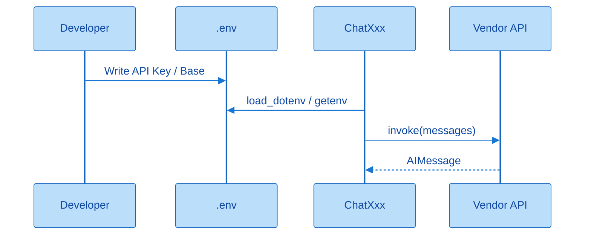

The dedicated-class path: environment variables supply the key, the class handles the default endpoint and parameter names; you mainly care about `model=` and a single `invoke`.

### 3.2 DeepSeek Official Site

**Dependencies (if not already in requirements):** `langchain-deepseek` (which pulls in some OpenAI-related capability), `python-dotenv`.

**Example `.env`:**

```text
DEEPSEEK_API_KEY=<Your API Key>
DEEPSEEK_BASE_URL=https://api.deepseek.com
```

The official docs often give both an OpenAI-compatible and an Anthropic-compatible form; in general practice, prefer the OpenAI-compatible address. Use whatever model name is currently available in the console (the slides used a newer "flash" model number; for learning, just pick something cheap and still online).

**Three approaches compared:**

| Approach | What You Do | When to Use |
|------|------|--------|
| Explicit read | `getenv`, then pass `api_key` / `api_base` | Want to see the data flow clearly, or your variable name doesn't match the library's default |
| Rely on defaults | Only pass `model=`; the Key happens to be named `DEEPSEEK_API_KEY` | Recommended for everyday use; the URL often has a default |
| Hardcoded | Key written directly in `.py` / a notebook cell | Only for a quick one-off test; risks leaking or accidentally committing the key |

All three approaches work. In the source code, `api_key` is often injected via something like `secret_from_env("DEEPSEEK_API_KEY")`; `api_base` can come from an environment variable or default to something like `https://api.deepseek.com/v1`. The variable name must match the library's convention — renaming it to `API_KEY_1` means it won't be picked up automatically. After a hardcoding demo, immediately revoke or delete that key.

**Minimal skeleton (explicit version):**

```python
from langchain_deepseek import ChatDeepSeek
from dotenv import load_dotenv
import os

load_dotenv(override=True)
llm = ChatDeepSeek(
    api_key=os.getenv("DEEPSEEK_API_KEY"),
    api_base=os.getenv("DEEPSEEK_BASE_URL"),  # note: the parameter name is api_base
    model="deepseek-v4-flash",  # adjust to whatever model is actually available in your console
)
print(llm.invoke("Please introduce yourself"))
```

`override=True` means: even if the system/terminal already has an environment variable of the same name, the `.env` file takes precedence — avoiding the "ghost config" problem where you edit the file but it doesn't take effect.

### 3.3 Zhipu AI

- Apply for a Key in the official console; related dependencies include `langchain-community`, `pyjwt`, etc.
- Common environment-variable name: `ZHIPUAI_API_KEY`; the Base can be the address given in the official docs, and can often be omitted when using the dedicated class.
- Class name: `ChatZhipuAI`; for `model`, pick a text model from the console (newer usually means pricier).

The experience is similar to DeepSeek: follow the variable-naming convention suggested by the class's docs; often just passing `model=` is enough to run. Dedicated vendor classes generally don't require you to write out the URL by hand every time, because the vendor has already "pinned" the default endpoint.

### 3.4 Tongyi Qianwen (Alibaba Cloud Bailian)

- Class: `ChatTongyi`; dependencies commonly involve `dashscope`.
- `.env` mainly configures `DASHSCOPE_API_KEY`.
- **Important pitfall:** don't casually add the OpenAI-compatible-mode `DASHSCOPE_BASE_URL` to `ChatTongyi`. Bailian offers both a "dedicated SDK" and an "OpenAI-compatible interface" at the same time; `ChatTongyi` goes through the dedicated SDK, and forcing in a compatible-mode URL can cause errors like a reset connection. If you insist on using the compatible URL, switch to `ChatOpenAI` / `init_chat_model` + the compatible-mode address, rather than `ChatTongyi`.

Pick the model name from Bailian's "Model Plaza → Text Generation" (e.g. the slides used `qwen-plus`). New users often get a free quota; it's still worth keeping a small balance on the account so a quota-policy change doesn't interrupt your debugging.

### Extra Thought: The Learning Value of Dedicated Classes

Even if you ultimately plan to only use `init_chat_model`, it's worth manually running at least one dedicated class end to end: only by seeing details like `api_base` vs. `base_url`, automatic reads from environment variables, and default URLs can you understand why the unified interface's "auto-select the driver class" logic sometimes errors out underneath. Dedicated classes are the "microscope"; the unified interface is the "remote control."

---

## 4. Compatible Usage: `ChatOpenAI`

### 4.1 Motivation

| Reason | Explanation |
|------|------|
| Coverage gaps | Not every vendor has a LangChain dedicated Chat class |
| Configuration hassle | Dedicated parameter naming is inconsistent; some also require an APP_ID plus multiple keys |
| Industry reality | Most platforms provide an OpenAI-compatible HTTP API |

ChatGPT drove the "OpenAI API shape" into a de facto standard, and many subsequent vendors chose to be compatible with it. As a result, you can use the **same** `ChatOpenAI(api_key=..., base_url=..., model=...)` to reach DeepSeek, Zhipu, Bailian-compatible endpoints, and more. Import from the current path, `from langchain_openai import ChatOpenAI`, not from an already-deprecated legacy path.

### 4.2 Key Points and a Zhipu Pitfall

Under the compatible approach, **all three key values usually need to be explicitly correct** — the `base_url` in particular must be the **OpenAI-compatible / general-purpose endpoint** documented by the vendor; you can't assume it's the same as the dedicated class's internal default. A classic pitfall from class: the Zhipu dedicated class works even without writing a URL; after switching to `ChatOpenAI` while still using the old Base, you get a Not Found error; going to the official "Quick Start / API Docs" and copying the new compatible address fixes it. If you go through Tongyi's compatible route, use the `compatible-mode` style URL, and keep it mentally separate from the `ChatTongyi` path.

```python
from langchain_openai import ChatOpenAI
from dotenv import load_dotenv
import os

load_dotenv(override=True)
llm = ChatOpenAI(
    api_key=os.getenv("DEEPSEEK_API_KEY"),
    base_url=os.getenv("DEEPSEEK_BASE_URL"),
    model="deepseek-v4-flash",
)
print(llm.invoke("1 + 1 = ?"))
```

In this skeleton, switching platforms = swapping the (key, base_url, model string) triple; the class name doesn't have to change. That's the product value of the compatible approach.

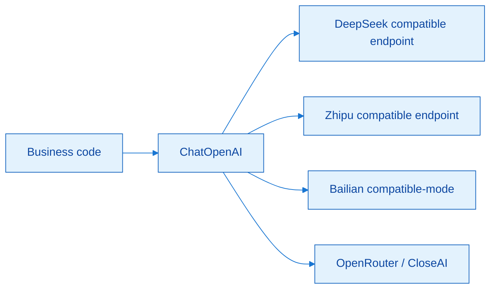

The value of the compatible layer: when switching vendors, the business side still uses the same class and `invoke`; only the triple changes.

### Extra Thought: The Cost of the Compatible Layer

A compatible layer smooths over differences — but it can also smooth away vendor-specific features (reasoning toggles, special headers, etc.). This is exactly why `extra_body` / `model_kwargs` exist later — an escape hatch for "still needing vendor-specific behavior after going compatible." The architectural rule of thumb: **default to compatible, pass through the exception cases.**

---

## 5. Relay Platforms: OpenRouter and CloseAI

### 5.1 What Relay Platforms Are

Relay / aggregator platforms forward each vendor's API, letting you access many models through a unified bill and (usually) an OpenAI-compatible interface, charging an intermediary fee. Compared to domestic "model supermarkets" like Bailian, OpenRouter / CloseAI are more commonly used to reach **OpenAI / Claude / Gemini** and other foreign closed-source models.

| Platform | Dedicated Integration | Compatible `ChatOpenAI` | Usage Intuition |
|------|----------|-------------------|----------|
| OpenRouter | Has `ChatOpenRouter` (`langchain-openrouter`) | Works | Huge model catalog; international; may have network friction |
| CloseAI | **No** dedicated Chat class | **Must** go compatible | Chinese-language console; friendlier domestically; commonly used later in the course |

Both require creating a Key in the console, copying the Base URL, and copying the **exact model name** from the pricing/model list. OpenRouter model names often carry a vendor prefix (e.g. `deepseek/deepseek-v4-flash`); CloseAI uses whatever string appears in its own price sheet. Top-up and trial-quota rules follow each platform's current policy; top up for long-term use, and use trial credit for short demos.

### 5.2 OpenRouter Example Highlights

Typical `.env`:

```text
OPENROUTER_API_KEY=...
OPENROUTER_API_BASE=https://openrouter.ai/api/v1
```

You can use `ChatOpenRouter(model=..., api_key=...)` (the Base often defaults sensibly), or equivalently use `ChatOpenAI` with the same key/base. Once your variable names align with the library's `secret_from_env` convention, you can also skip passing the key explicitly.

### 5.3 CloseAI Example Highlights

There is no `ChatCloseAI`-style API; the fixed mindset is:

```python
ChatOpenAI(
    model="deepseek-v4-flash",  # or a gpt-series model name from the platform
    api_key=os.getenv("CLOSEAI_API_KEY"),
    base_url=os.getenv("CLOSEAI_BASE_URL"),
)
```

With the same key/base, you can switch between "domestic DeepSeek" and "foreign GPT" just by changing the `model` string. That's exactly why the latter half of the course defaults to this demo stack: one compatible pipe, testing two sets of models.

### 5.4 Quick Self-Check Questions

Can OpenRouter also be used with `ChatOpenAI`? **Yes.** Can CloseAI be used with a "ChatCloseAI"? **No — compatible mode only.** If you can answer both instantly, you've cleared this section on relay platforms.

### Extra Thought: How to Choose Your Personal Default Stack

| Your Situation | A More Stable Default |
|----------|------------|
| No stable international network | CloseAI (or purely domestic Bailian/official sites) |
| Frequently comparing foreign models | OpenRouter |
| Only need the Tongyi ecosystem | Bailian + `ChatTongyi` or compatible mode |
| Only need DeepSeek's official pricing | `ChatDeepSeek` / direct compatible connection |

Once you've picked one, write it into your own `.env.example` comments, so you don't switch entry points every chapter and end up with "it ran yesterday but not today" notebooks.

---

## 6. `init_chat_model`: The 1.x Unified Interface

### 6.1 What It Is

```python
from langchain.chat_models import init_chat_model

model = init_chat_model(
    "provider:model_name",  # or split into model= and model_provider=
    api_key="...",          # optional, usually read from an environment variable
    temperature=0.7,
    max_tokens=1000,
    # **kwargs
)
```

This is the **unified initialization function** introduced in LangChain 1.x: based on the model identifier / `model_provider`, it automatically picks the underlying `ChatXxx`. Import from the current path, and avoid the same-named symbol already deprecated in `classic`.

### 6.2 How It Differs from Using `ChatXxx` Directly

| Dimension | Dedicated / ChatOpenAI | `init_chat_model` |
|------|-------------------|-------------------|
| Mental model | You must know which class to instantiate | You mainly care about the provider + model string |
| Switching models | May require changing the class / import | Usually just change the string and the key |
| Nature | A direct instance | **A wrapper and router around the former** |

The unified interface doesn't retire the old patterns — compatible `ChatOpenAI` and dedicated classes remain valid when maintaining legacy code. What it solves is "too much boilerplate when an agent system needs to swap models frequently."

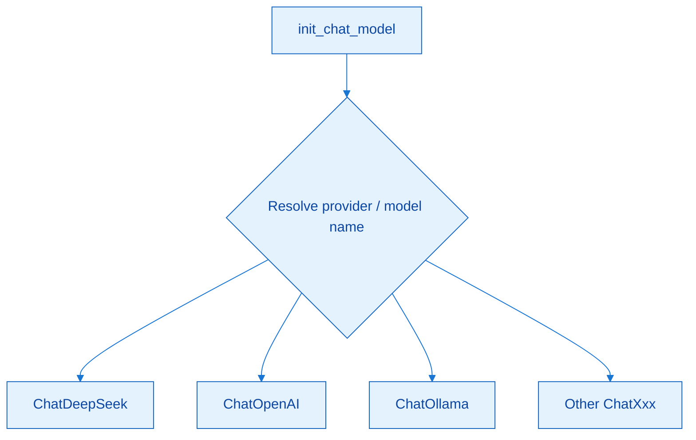

`init_chat_model` is a router: you write the string, and it picks the underlying driver class. Switching models is usually just changing the string and the key.

### 6.3 Flexibility in Syntax and Common Mistakes

| Syntax | Example Intuition |
|------|----------|
| Combined string | `model="deepseek:deepseek-v4-flash"` |
| Split apart | `model="deepseek-v4-flash", model_provider="deepseek"` |
| `model` only | Sometimes auto-inference succeeds, but it's **not guaranteed to cover every case** |

**A common mistake:** when calling "DeepSeek's capability" through CloseAI, writing `model_provider="deepseek"`. That routes to `ChatDeepSeek` (i.e., direct-connect semantics for the official site), which doesn't match CloseAI's key/base. The correct intuition: the CloseAI pipe is OpenAI-compatible, so **provider should be `openai`**, with the model name taken from CloseAI's price sheet string.

**Another common mistake:** the local Ollama model name contains the word "deepseek," and without explicitly writing `model_provider="ollama"`, auto-inference misjudges it and routes to cloud DeepSeek. Locally, `ollama` must be set explicitly.

**A note on Tongyi:** if the official `model_provider` list hasn't yet included a dedicated dashscope/qwen value, when calling a Bailian-compatible endpoint through the unified interface, it's common in practice to write `openai` + a compatible Base URL, rather than inventing an unlisted provider name. Go by the provider list in the docs for the LangChain version you actually installed.

### 6.4 The Call Matrix: Four Entry Points for the Same "DeepSeek"

| Where the Model Lives | Available Approaches (slide summary) |
|--------------|----------------------|
| DeepSeek official site | `ChatDeepSeek`, `ChatOpenAI`, `init_chat_model` |
| DeepSeek on Alibaba Cloud Bailian | `ChatTongyi` (change the model), `ChatOpenAI`, `init_chat_model` |
| DeepSeek on OpenRouter | `ChatOpenRouter`, `ChatOpenAI`, `init_chat_model` |
| DeepSeek on CloseAI | `ChatOpenAI`, `init_chat_model` (no CloseAI dedicated class) |

This table specifically cures the anxiety of "did I learn so many syntaxes for nothing": the underlying capability is the same DeepSeek, but **the mounting entry point differs, so the set of usable classes differs**. For new code, converge on: `.env` + (`init_chat_model` or `ChatOpenAI`); keep dedicated classes around as a troubleshooting and learning tool.

### Extra Thought: Managing Multiple Models in an Agent

Production agents often need "a strong model for planning + a weak model for execution." With the unified interface, you can maintain a small dictionary like `{"planner": "openai:gpt-...", "worker": "openai:deepseek-..."}` and swap the key at runtime. Combined with `config.configurable` from later sections, you can even override the model at the level of a single call — this is the basis for cost control and degradation strategies, and you don't need to wait until finishing the Agent chapter to come back and learn it.

---

## 7. Common Parameters for Model Initialization

### 7.1 Parameter Table (Common Version)

| Parameter | Type | Description | Default |
|------|------|------|------|
| `model` | str | Model name (required), e.g. `openai:gpt-4o` or a bare model number | none |
| `model_provider` | str | Provider, determines the underlying driver class | none |
| `api_key` | str | Key; can be omitted and read from an environment variable | None |
| `base_url` | str | API address | None |
| `temperature` | float | Randomness, roughly 0.0–2.0 | 0.7 |
| `max_tokens` | int | Caps the maximum number of **output** tokens | None |
| `timeout` | float | Timeout in seconds | None |
| `max_retries` | int | Max retries on failure | 6 |

These are the common knowledge shared by Model Classes and `init_chat_model`. Some vendor-platform docs describe temperature as 0–1, while LangChain-side descriptions commonly say 0.0–2.0 — go by whatever wrapper's docs you're actually using. Connection-type parameters (key/url/timeout/retries) determine "whether the connection is stable"; generation-type parameters (model/temperature/max_tokens) determine "how good, how long, and how costly the answer is."

### 7.2 Temperature Scenario Table

| Range | Scenario |
|------|------|
| 0.0–0.3 | Math, data extraction, classification, code — need stability and reproducibility |
| 0.5–0.7 | Chat, Q&A — balanced |
| 0.8–1.5 | Copywriting, brainstorming — need creativity |
| 1.5–2.0 | Poetry, stories — highly random; too high risks gibberish |

Temperature is not an IQ dial. Structured JSON extraction should stay close to 0; ad copy can go 1.0–1.5. You can run the same prompt 3 times and observe: at low temperature, the outputs converge more at the start; at high temperature, divergence is more noticeable (the exact feel varies by model, but the direction holds).

### 7.3 Tokens and `max_tokens`

- Token: the basic unit after tokenization, and also the basis for billing; there's even a colloquial Chinese translation for it as "word元" (word-unit) in some official Chinese media.
- Different models use different tokenizers, so **the same piece of Chinese text can have a different token count** depending on the model; you can compare intuitions using official counters from OpenAI, Baidu, etc.
- Rough rule of thumb: Chinese is about 1–1.8 characters/token; English is about 3–4 characters/token.
- A hard limit like `max_tokens=10` will truncate the answer; the metadata's `finish_reason` is often `length` in that case; a normal completion is usually `stop`.

Input also consumes tokens, but the `max_tokens` parameter governs the **generation ceiling**. Truncation doesn't mean the model "can't answer" — it means you didn't let it finish answering.

### Extra Thought: Parameters and Product Metrics

Managing temperature and max_tokens as "scenario config files" in a config center (e.g., `extract.json` with low temperature and short output, `chat.json` with medium temperature and medium output) is far more maintainable than magic numbers scattered across notebooks. Once you later hook up LangSmith evaluation, this lets you compare "same prompt, different decoding parameters" results, instead of conflating model capability with randomness.

---

## 8. Local Models: Ollama

### 8.1 Positioning

Ollama: an open-source framework on GitHub for integrating local LLMs — download, launch, and run local inference. LangChain also supports vLLM and others; enterprise production is more commonly Linux + Docker + vLLM, while the course uses Ollama on Windows **to demonstrate the underlying principles**. Small local models save money, but hallucinations are usually more noticeable; for serious coursework, still default to cloud models.

Mental model: both online-platform models and local Ollama models are called through the LangChain application — the framework doesn't care where the weight files live, only whether the chat interface is available.

### 8.2 Installation and Pulling Models (Highlights)

| Step | Note |
|------|------|
| Download the installer | Fairly large; you may skip bundling it into course materials |
| Specify the install directory | On Windows, the installer supports pointing to a non-C drive directory |
| Change the model storage path | Point it to a large disk in settings, to avoid filling up the C drive |
| Choose model size | Personal computers should be cautious with very large parameter counts; small models are fine for demos |
| CLI | `ollama run <model>`, `ollama list`, `ollama --version`, etc. |

The client's New Chat can also pull models, but the list is usually not as complete as the official model page. If cloud inference goes through Ollama's paid channel, that's a different thing from "purely local." The first `run` pulls the weights; once done, you can chat; `bye` exits.

### 8.3 Calling from LangChain

**Approach 1: `ChatOllama`**

```python
from langchain_ollama import ChatOllama

ollama_llm = ChatOllama(
    model="deepseek-r1:1.5b",  # use whatever you see from `ollama list`
    # base_url="http://localhost:11434",  # can often be omitted for the local default
)
print(ollama_llm.invoke("Hello, please introduce yourself."))
```

**Approach 2: `init_chat_model`**

```python
from langchain.chat_models import init_chat_model

ollama_llm = init_chat_model(
    model="deepseek-r1:1.5b",
    model_provider="ollama",  # must be set, to avoid misjudgment
)
```

The default local port is **11434**. For Ollama running on another machine on the LAN, set `base_url` to `http://<IP>:11434`. When using the unified interface, forgetting `model_provider="ollama"` can mistakenly route to cloud DeepSeek — this is the most critical pitfall in the local-model section.

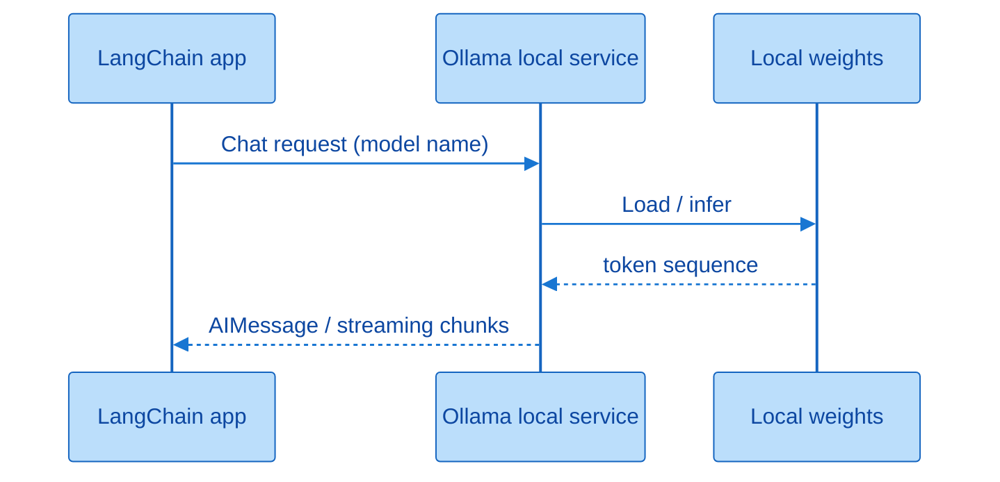

Ollama packages "download the model + run a local HTTP service" for you; LangChain simply treats it as one more ChatModel backend.

### Extra Thought: Dividing Labor Between Local and Cloud

Local is a good fit for: sensitive data that must not leave the machine, offline demos, and free-form trials of an API's shape. Cloud is a better fit for: quality, speed, tool calling, and long context. You can adopt a two-stage flow — "smoke-test locally with a small model during dev, deploy to cloud for staging/production" — but don't assume a local 1.5B model behaves like a large cloud model; build separate evaluation sets for each.

---

## 9. Invoking the Model

### 9.1 Overview of Six Methods

| Method | Mode | Typical Scenario |
|------|------|----------|
| `invoke` | Blocking, returns the full text at once | Scripts, background jobs, no need for a typewriter effect |
| `stream` | Streaming iteration over chunks | Chat UIs, long text, reducing "is it stuck?" anxiety |
| `batch` | Parallel over multiple inputs (throughput-focused) | A batch of independent questions |
| `ainvoke` | Async invoke | High-concurrency web services, cooperating with an event loop |
| `astream` | Async stream | Streaming on an async stack |
| `abatch` | Async batch | Batch processing on an async stack |

During `invoke`, you can't do anything else but wait — that's what "blocking" means. `stream` is like the "characters popping up one by one" effect you see in chat products; under the hood it's an iterator. `batch` bundles multiple requests together, cutting down on "ask one, wait one" round trips. The async trio = the sync trio with an `a` prefix, avoiding blocking the event loop. Streaming depends on whether the vendor supports it; very old models may support neither streaming nor tool calling.

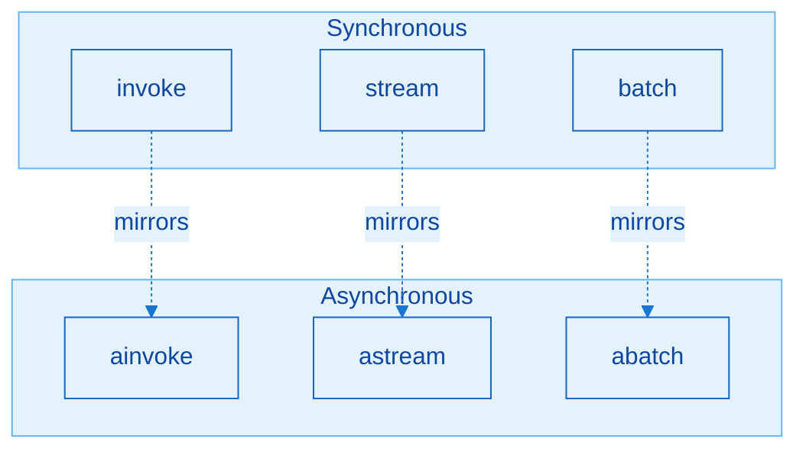

Async isn't new business semantics — it's the same three shapes placed onto an event loop to avoid blocking.

### 9.2 The Parameters of `invoke`

Main parameters:

| Parameter | Required? | Meaning |
|------|----------|------|
| `input` | Yes | The content sent to the model |
| `config` | No | Advanced per-call configuration (callbacks, metadata, configurable fields, etc.) |

The main body of this chapter first fully digests `input`; `config` is unfolded in the extension section. `input`'s type is quite broad (string, sequence, dict, message, PromptValue, etc.); the three most commonly used in practice are below.

### 9.3 Three Common Input Forms

#### (1) Plain Text

```python
response = model.invoke("Translate the following Chinese text: 你好世界")
print(response.content)
```

The simplest form, good for single-turn instructions. The return is still an `AIMessage`; in practice you usually take `.content`.

#### (2) A List of Dicts (Recommended, Flexible)

```python
messages = [
    {"role": "system", "content": "You are a professional math teacher"},
    {"role": "user", "content": "Please explain what the Fibonacci sequence is"},
]
response = model.invoke(messages)
```

| role | Meaning |
|------|------|
| `system` | Persona, rules, tone |
| `user` | The user's words (prefer `user`; interoperable with `human`, but convention leans toward OpenAI) |
| `assistant` | The model's prior reply |
| `tool` | Tool result (expanded in the Tools chapter) |

Multi-turn example: append the previous turn's user/assistant messages and `invoke` again, so the model can "remember" the context.

#### (3) A List of Message Objects

```python
from langchain_core.messages import SystemMessage, HumanMessage, AIMessage

messages = [
    SystemMessage(content="You are a professional math teacher"),
    HumanMessage(content="Please explain what the Fibonacci sequence is"),
]
response = model.invoke(messages)
```

Isomorphic to the list-of-dicts form, just with a more formal type; it connects seamlessly with the later Messages / Prompt Template chapters. `HumanMessage` ↔ user, `AIMessage` ↔ assistant, `SystemMessage` ↔ system.

### 9.4 The Nature of "Memory" (Make Sure You Understand This)

LLMs **naturally have no memory across requests**. The two approaches below are worlds apart:

| Approach | Result |
|------|------|
| First `invoke([introduce yourself as Xiaoming])`, then a fresh `invoke([what's my name])` without any history | The second call has no idea you're Xiaoming |
| Append the first turn's assistant reply into the same list, then ask "what's my name" | It can answer Xiaoming |

Memory = **you maintain the message list at the application layer (or in external storage) and pass it in again**; it's not the model automatically remembering all past conversations internally. This directly matches the Memory element in the Chapter 1 Agent formula; short-term memory will be systematized later, but this chapter establishes the correct cause-and-effect first.

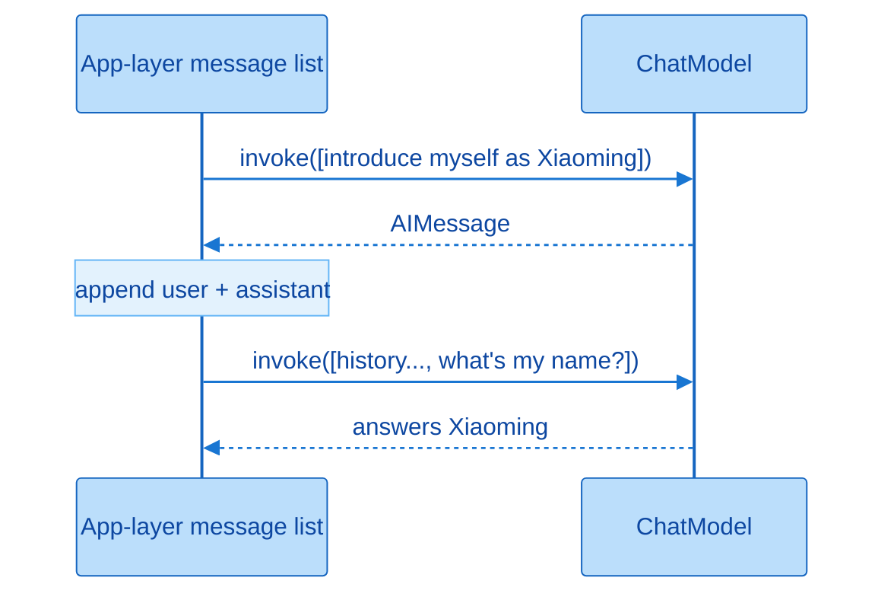

It answers correctly the second time only because you passed the history back in; if every call only carries the new question, the model is naturally "amnesiac."

### 9.5 The `invoke` Return Value: What's Inside `AIMessage`

The return type is `AIMessage`. It's recommended to use `response.pretty_print()` to view the body text, or use `rich` to print the whole object.

| Field | What It's Good For |
|------|----------------|
| `content` | The user-facing answer |
| `additional_kwargs` | Extra vendor-specific info; e.g. fields related to refusals |
| `response_metadata` | Model name, provider, `finish_reason`, latency, token details, etc. |
| `id` | This run's identifier |
| `tool_calls` / `invalid_tool_calls` | Tool calls (covered in a later chapter) |
| `usage_metadata` | Input/output/total token usage, etc. |

`finish_reason`: `stop` means a normal completion; `length` is usually due to a `max_tokens` truncation. Token usage affects billing; whether a cache hit occurred can also affect pricing (depending on the vendor). Latency-related fields (time-to-first-token, inter-token gaps, etc.) are used for performance analysis. The bare minimum for business code is `response.content`; parse metadata / usage only when you need monitoring or reconciliation.

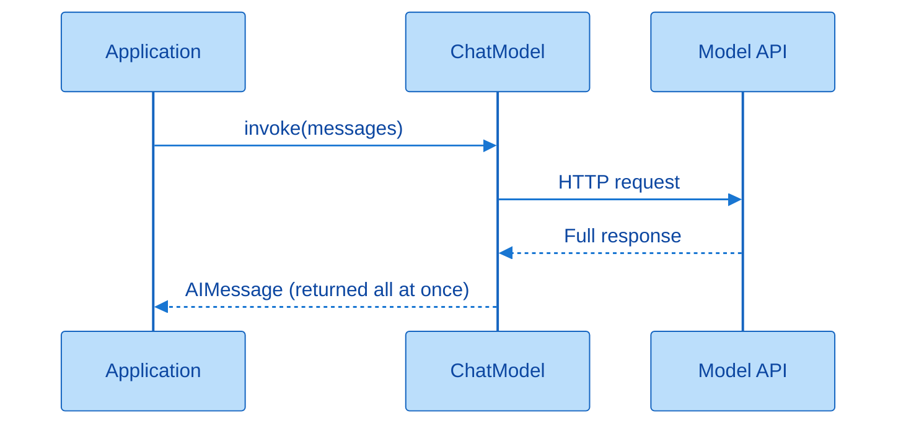

`invoke` doesn't return until the whole generation is complete — good for scripts and testing; if users need "characters appearing one by one," switch to `stream` instead.

```python
print(response.content)
print(response.response_metadata.get("finish_reason"))
# usage field names vary slightly by version/vendor; check the actual object
```

### 9.6 `stream` Streaming Invocation

```python
for chunk in model.stream("Please explain what artificial intelligence is"):
    print(chunk.text, end="", flush=True)
```

Streaming returns an iterator; just consume it chunk by chunk. Benefits: the first character appears faster, you're not staring at a blank screen for long text, and even a reasoning model's "thinking process" can be shown as it streams (if the vendor provides it). The `input` shape is similar to `invoke`. Note: in a notebook, remember to `flush`/avoid line breaks so you can actually see the typewriter effect.

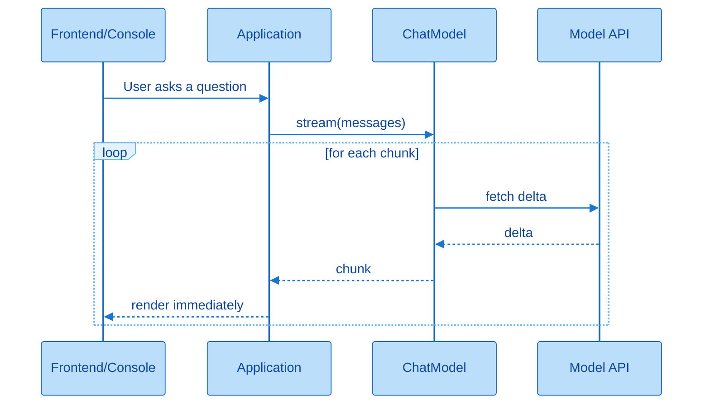

The key to streaming is "process each chunk as it arrives" — don't mistake every chunk in the loop for a complete answer.

### 9.7 `batch` Bulk Invocation

```python
inputs = ["Who are you?", "Where is China's capital?", "1+1=?"]
# Get all results at once (order usually matches the inputs)
for out in model.batch(inputs):
    print(out.content)

# In completion order (may be out of order, with the original index)
for idx, out in model.batch_as_completed(inputs):
    print(idx, out.content)
```

Compared with calling `invoke` repeatedly in a `for` loop, `batch` cuts down on round trips and total wait time — in-class comparisons showed roughly half the time (varying with network and model load). Good for a batch of **mutually independent** requests; don't force a multi-turn conversation with ordering dependencies into a single batch. `batch` can also set `max_concurrency` in `config`, to avoid blowing through your rate limit all at once.

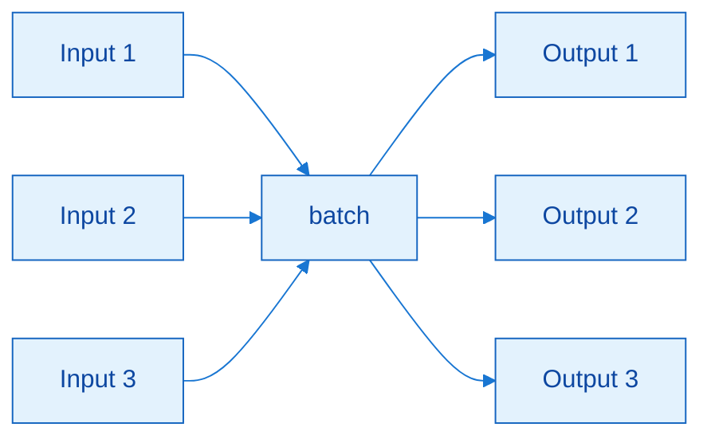

`batch` is a fan-in/fan-out: multiple independent inputs go into one invocation call, and you get back a list of outputs aligned with the input order.

### 9.8 Async Invocation (Know-It-Level)

Synchronous: A calls B and waits idle until B is done. Asynchronous: A kicks off B and keeps doing its own thing, coming back for B's result later. A life analogy: waiting for a friend to get ready before leaving is synchronous; walking to the restaurant first and letting the friend catch up is asynchronous. When a front-end list scrolls, the main thread does layout while a background thread loads images — same idea.

`ainvoke` / `astream` / `abatch` mirror their sync counterparts; in class, `asyncio` is used to create tasks with `sleep` interleaved in the main flow, observing that total time isn't simply additive as in serial execution. This chapter's focus remains on the synchronous trio; async matters more in web services. Wrap failures with try/except just as you would elsewhere.

### Extra Thought: Choosing an Invocation Style at the Product Layer

| Product Shape | Better-Suited Invocation |
|----------|----------------|
| Internal batch-processing script | `batch` / `invoke` |
| Customer-facing chat window | `stream` (+ frontend SSE) |
| High-concurrency FastAPI service | `ainvoke` / `astream` |
| Tool-equipped Agent | First get `invoke`/`stream` working, then layer on Agent wrapping |

Don't block a request thread with synchronous `invoke` in a chat UI unless you're running a separate thread pool — this is a very engineering-flavored principle, but one you can already settle on in this chapter.

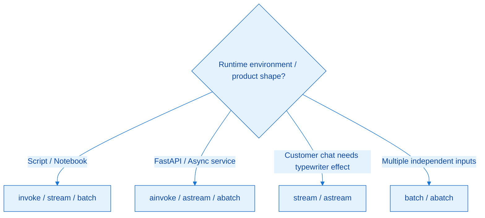

First choose sync or async based on the runtime environment, then decide whether to stream based on the interaction, and only then consider whether to batch.

---

## 10. Extended Content

### 10.1 Prettifying Output

- `response.pretty_print()`: friendlier for displaying content.
- The `rich` library's print (commonly aliased `rprint`): better for dumping the whole `AIMessage`.

Use these liberally during debugging; for customer-facing logs, print structured key fields instead of flooding the log with the entire object.

### 10.2 The `profile` Attribute

LangChain 1.1+ lets you inspect a capability profile via `model.profile` (max input/output, whether tools/vision/audio/reasoning are supported, etc.). **Support is uneven**: some integrations/models return a rich dict, others an empty one. It's common for model A on a relay platform to have a profile while model B on the same platform has none. Check it when needed; don't let its absence block development.

### 10.3 The Full Set of Initialization Parameters: A Four-Category Mnemonic

To see all Fields for a class: `ChatDeepSeek.model_fields`, or a related API on the instance (note: some "read fields from an instance" paths may be marked deprecated — it's more recommended to look them up from the **class**). Categorized for memory:

| Category | What It Governs | Examples |
|------|--------|------|
| Client & connection | How to connect to the server | `base_url`, `api_key`, `timeout`, `max_retries` |
| Model inference/generation | Content style and length | `model`, `temperature`, `max_tokens`, streaming/reasoning-related switches |
| Framework-general | LangChain internals | name, callbacks, etc. (used for monitoring scenarios) |
| Advanced passthrough | Fields the wrapper doesn't directly expose | `model_kwargs`, `extra_body` |

Day to day, still prioritize memorizing the "common version" table from earlier; the value of this section is: **when you hit a parameter that exists in the official API but not in the LangChain constructor, you know which bucket to put it in.**

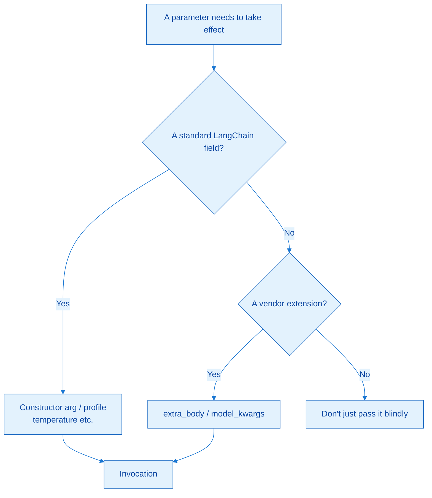

Layering parameters this way keeps things portable: standard fields travel with LangChain, extension fields travel with the vendor.

### 10.4 `model_kwargs` vs. `extra_body`

| Bucket | Typical Use | Example Intuition |
|------|----------|----------|
| `model_kwargs` | A field the OpenAI-compatible protocol supports but that LangChain hasn't directly listed | Some tools-related parameters |
| `extra_body` | A vendor's **private extension** on top of the compatible protocol | DeepSeek's `thinking` toggle |

`model_kwargs`: the protocol has it, but the wrapper doesn't expose it. `extra_body`: this vendor's extra capability beyond the protocol. When demonstrating the former with tools in class, the focus is on "it flows into `tool_calls`" — you don't need to master the tools schema first; when demonstrating the latter with `thinking: enabled/disabled`, you can observe whether `reasoning_content` appears. Whether a new DeepSeek model thinks by default may be a dynamic policy — check the actual response.

### 10.5 The Per-Call `config`

`invoke(input, config=...)` (and similarly for stream/batch) allows **single-call** dynamic control:

| Common Key | Use Intuition |
|--------|----------|
| `run_name` / `tags` / `callbacks` | Related to LangSmith tracing, categorization, callbacks |
| `metadata` | e.g. user_id, session_id |
| `max_concurrency` | Caps concurrency for batch-style calls, protecting your quota |
| `configurable` | Writes fields similar to initialization, overriding model/temperature etc. for **this call only** |

A key detail: for `configurable` to take effect, when initializing `init_chat_model` you typically need to declare which `configurable_fields` are allowed to be overridden; otherwise you may think you've overridden something, but it's still using the default model. Think of it as "a default weapon loadout + a single-shot scope": if the allowed fields weren't turned on, the scope does nothing.

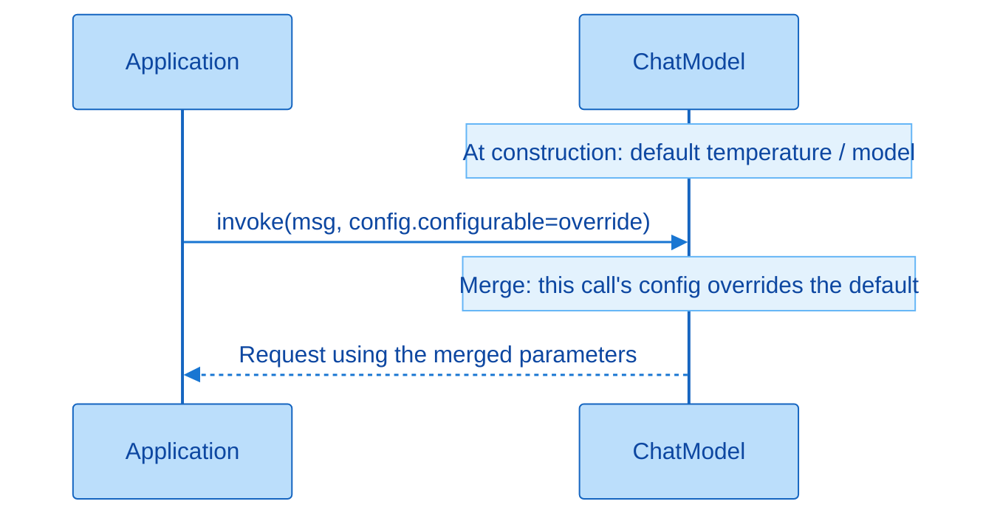

Mnemonic: constructor parameters set the defaults; the per-call `config` overrides them. When debugging, check this call's `config` first, then the initialization defaults — provided `configurable_fields` was declared in the first place.

### Extra Thought: When to Reach for Extended Parameters

| Need | Preferred Tool |
|------|----------|
| Change model/temperature | Change initialization first; use `configurable` if there are multiple scenarios |
| Vendor-private capability | `extra_body` |
| Missing protocol field | `model_kwargs` |
| Observability | `config` + the next chapter's LangSmith |
| Just want to see the capability list | `profile` (if available; otherwise check vendor docs) |

The extension section isn't "the more you use it, the more advanced you are" — it's "the toolbox for when the default path doesn't work." If a code review is full of `extra_body`, that's actually a sign to ask: did we pick the wrong integration approach.

---

## 11. Chapter Cheat Sheet

```text
1. Three essentials: model + api_key + base_url (dedicated classes can often skip the URL)
2. Keys go in .env; load_dotenv(override=True); never commit a real Key
3. Four paths: dedicated class / ChatOpenAI compatible / init_chat_model / Ollama
4. ChatTongyi != casually filling in an OpenAI-compatible URL
5. Relay: OpenRouter can be dedicated or compatible; CloseAI is compatible-only
6. DeepSeek on CloseAI -> provider should be openai, not deepseek
7. Ollama -> must set model_provider="ollama"
8. temperature controls randomness; max_tokens controls output length; length != stop
9. invoke's 3 input forms: string / role dict list / Message list
10. Memory = the app layer passing history messages back in again
11. stream for experience; batch for throughput; a* avoids blocking the event loop
12. model_kwargs fills protocol gaps; extra_body fills vendor-private fields
13. config does per-call overrides and tracing; requires configurable_fields
```

Memorize it in five stages: "power on → pick a path → tune parameters → invoke → pass through." If you can draw the four-entry-point matrix from memory and explain the "amnesia" experiment, you've cleared the core of this chapter.

---

## 12. Self-Check List

- [ ] Can recite the three essentials, and explain the meaning of `override=True`
- [ ] Can independently run: a dedicated class, compatible `ChatOpenAI`, and `init_chat_model` — at least once each
- [ ] Can explain why `ChatTongyi` on Bailian conflicts with a compatible URL
- [ ] Knows which fields to change and how to write the provider when switching to CloseAI / OpenRouter
- [ ] Can choose temperature by scenario, and explain `finish_reason=length`
- [ ] Can hand-write a multi-turn dict-list example, and demonstrate "no history passed = amnesia / history passed = remembers"
- [ ] Can explain the purpose of content, metadata, usage, and tool_calls in `AIMessage`
- [ ] Can write minimal `stream` and `batch` examples, and say when to use async
- [ ] Can distinguish `model_kwargs` from `extra_body`, and state the prerequisite for `config.configurable` to take effect
- [ ] Has picked and commented their own "default model stack"

Suggested self-test: open a new notebook, without looking at old cells, and write from `.env` to `invoke` from memory; then deliberately introduce a wrong provider and explain why it errors. Being able to teach someone else "why CloseAI can't use the deepseek provider" is more useful than memorizing two more API names.
