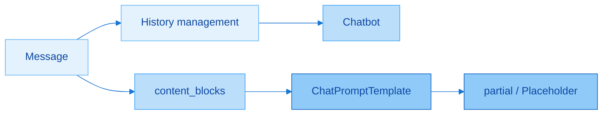
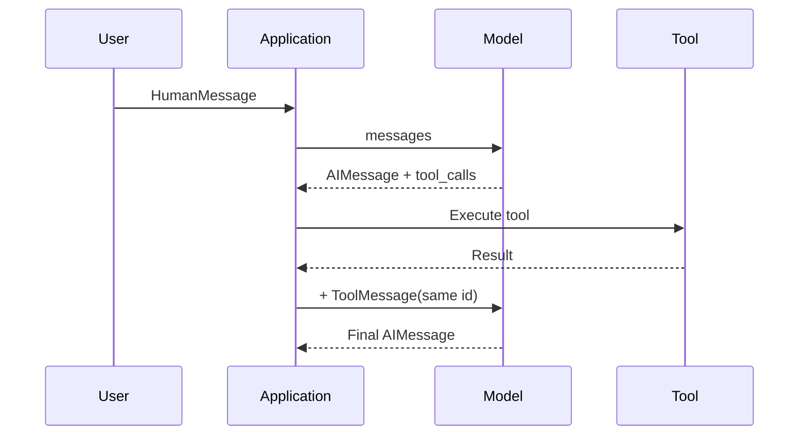
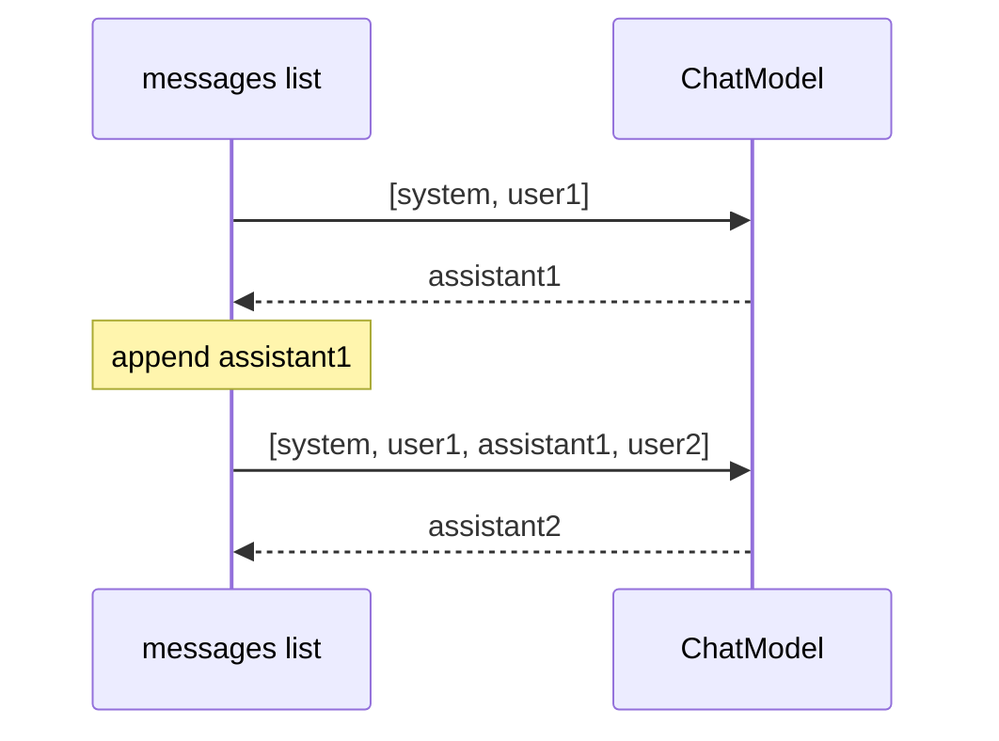
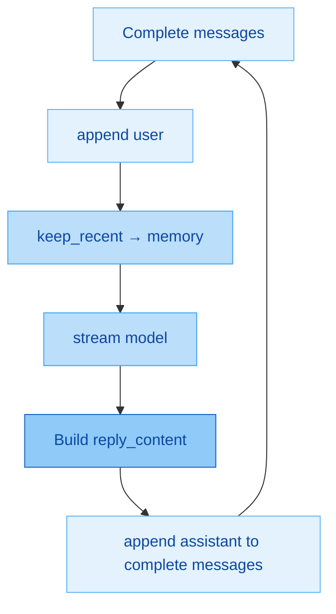
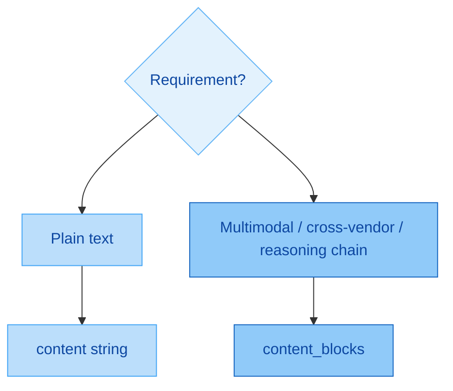
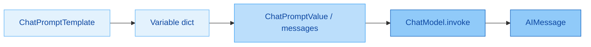
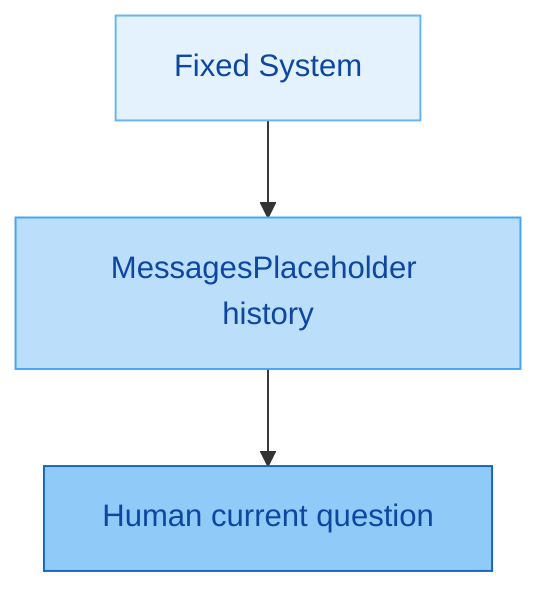

# Messages and Prompt Templates

> **Version**: LangChain **1.2.x** (message standard and `ChatPromptTemplate`)

Official documentation (follow the slides and current APIs):

- Messages: https://docs.langchain.com/oss/python/langchain/messages
- Prompt templates: https://docs.langchain.com/oss/python/langchain/prompts

Companion code: `langchain1.2_tutorial/chapter04_messages_prompt/` (four notebooks, `01`–`04`).

Chapter 2 covered how to call a model; this chapter covers what you send to it and how to reuse it. The main line is: **Messages are the basic interaction unit → maintain / trim history → build a multi-turn chatbot → use content / content_blocks → use ChatPromptTemplate (including partial and MessagesPlaceholder).** Tools / Agents / RAG all repeatedly rely on the message-list mental model introduced here.

---

## 1. What You Will Learn in This Chapter

| Section | Core Question | You Should Be Able To |
|------|----------|------------|
| Message basics | Why models lack memory; what a Message is | Explain Role / Content / Metadata |
| Four roles | system / user / assistant / tool | Convert between dictionary and object forms |
| Field details | Human `name`, AI `tool_calls`, and more | Know that “framework support ≠ vendor support” |
| History | How to store and trim it | Append correctly; use `keep_recent_messages` |
| Practice | A multi-turn chatbot | Use while + stream + write back to the complete list |
| Multimodal standard | content vs `content_blocks` | Prefer blocks across vendors |
| Prompt templates | Why not concatenate strings | Use `from_messages` and three invocation forms |
| Advanced use | Six argument types, partial, placeholders | Handle fixed variables and dynamic history separately |

Remember the chapter in two sentences: **the list is memory; a template is a reusable machine for making lists.** By the end, make these personal defaults: use message objects or `ChatPromptTemplate` in daily work; inspect `content_blocks` first for multimodal and reasoning chains; for multi-turn chat, always “send a trimmed copy, write back to the complete list.”



The path moves from a single message to a configurable message pipeline: first write lists manually, then template them, then insert dynamic history through a placeholder.

### Extra Thought: Its Relationship to Chapter 3

This chapter is especially suitable after enabling LangSmith Tracing: after a template `invoke` and before a model call, a Trace shows the **actual rendered messages**. When changing a Prompt, inspect the Trace before guessing at strings; debugging becomes faster.

---

## 2. Understanding Messages

### 2.1 Why Messages Exist

An LLM's output depends only on its **current input context**; most API servers also **do not keep** conversation history, so they are stateless. If an application needs to “remember” a conversation, it must maintain a message list and submit history with every turn.

In LangChain, a **Message** is the most basic unit for model interaction. It is both input and output (which is usually an `AIMessage`). A turn can contain one or more Messages; besides text, messages can carry metadata that expresses “who is speaking” and “which turn this belongs to,” supporting consistency and LangSmith tracing.

Since LangChain 1.0, a unified Message standard aligns models such as OpenAI, Anthropic, Gemini, and local models:

- **Strong compatibility**: the framework aligns different vendor message formats.
- **High extensibility**: multimodal content and custom fields are easier to support.
- **Good traceability**: LangSmith receives a consistent context structure.

In short: write once in LangChain's message form, and the framework aligns vendors for you; debugging also uses one structure instead of a separate conversation object for every API.

### 2.2 Message Structure

| Field | Meaning | Example |
|------|----------|------|
| Role | Speaker / type | `system` / `user` / `assistant` / `tool` |
| Content | Message body | Text or a more complex multimodal structure |
| Metadata | Optional metadata | Message ID, latency, tokens, tags, `name`, and more |

Mnemonic: first decide **who speaks** (Role), then **what is said** (Content), then add Metadata only when you need to distinguish speakers or trace the message. Role + Content are the minimum for every message.

### 2.3 Four Common Message Types

| Type | Dictionary role | Object class | Purpose |
|------|-----------|--------|------|
| System message | `system` | `SystemMessage` | Persona, behavioral rules, context (a job description) |
| User message | `user` | `HumanMessage` | User input; may include multimodal content |
| Assistant message | `assistant` | `AIMessage` | Model reply; may contain `tool_calls` |
| Tool message | `tool` | `ToolMessage` | A tool execution result returned to the model for continued generation |

Why separate types: they make roles explicit, let System control behavior, compose complete multi-turn context, and improve traceability while debugging. In dictionaries, consistently write users as **`user`** (not `human`); assistants must be **`assistant`** (not `ai`). In object classes, the user class is called `HumanMessage`; this is the common point where the class name and role string do not exactly match.

Tool-calling preview (expanded in the Tools chapter):

```text
HumanMessage → AIMessage(tool_calls) → ToolMessage(tool_call_id matches) → AIMessage(final answer)
```

The key rule is: **`ToolMessage.tool_call_id` must match the corresponding `AIMessage.tool_calls[].id`**, or the model cannot associate a result with its tool call.



The flow is: ask, decide whether a tool is needed, put its result back into the same conversation, then generate natural language. The Agent chapter automates this loop; for now, recognize the message shapes.

### 2.4 Two Message Formats

LangChain supports two equivalent forms.

**Format 1: JSON / dictionary list**

```python
messages = [
    {"role": "system", "content": "You are an empathetic assistant"},
    {"role": "user", "content": "Hello!"},
    {"role": "assistant", "content": "Nice to meet you too"},
    {"role": "tool", "content": "<tool output>", "tool_call_id": "call_xxx"},
]
```

**Format 2: message object list**

```python
from langchain_core.messages import SystemMessage, HumanMessage, AIMessage, ToolMessage

messages = [
    SystemMessage(content="You are an empathetic assistant"),
    HumanMessage(content="Hello!"),
    AIMessage("Nice to meet you too"),  # for plain text, content= may be omitted
    ToolMessage(content="<tool output>", tool_call_id="call_xxx"),
]
```

For comparison: dictionaries rely on the `role` string; objects rely on class names. In tool scenarios, write `tool_call_id` on both sides. You should be able to read both forms in teaching materials and assignments; in a personal project, standardize on one to reduce mental switching.

**Minimal comparison invocation (JSON):**

```python
from langchain.chat_models import init_chat_model
from dotenv import load_dotenv
import os

load_dotenv(override=True)
model = init_chat_model(
    model="gpt-5.4-mini",  # adjust for a model available on your platform
    model_provider="openai",
    api_key=os.getenv("CLOSEAI_API_KEY"),
    base_url=os.getenv("CLOSEAI_BASE_URL"),
)

messages = [
    {"role": "system", "content": "You are an AI assistant who gives clear, accessible explanations"},
    {"role": "user", "content": "Hello"},
    {"role": "assistant", "content": "Hello! How can I help?"},
    {"role": "user", "content": "What is machine learning?"},
]
print(model.invoke(messages).content)
```

For objects, only replace the list with `SystemMessage` / `HumanMessage` / `AIMessage`; `invoke` remains unchanged. In multi-turn history, the assistant entry in the middle is “what the model said in the previous turn,” which is exactly the carrier of memory.

---

## 3. Message Object Fields

For complete fields, consult official documentation / source code. This section keeps only the common fields emphasized by the slides.

### 3.1 SystemMessage

| Field | Description |
|------|------|
| `content` | Message content; for plain text, the field name may be omitted: `SystemMessage("…")` |

System messages normally go at the front of a list and provide a shared “persona” for the whole conversation. **Do not drop them** while trimming history.

### 3.2 HumanMessage

| Field | Description |
|------|------|
| `content` | Body; for plain text, the field name may be omitted |
| Metadata-like fields | Such as `name` and `id`, used to distinguish multiple messages of the same type |

`name` / `id` are metadata. In multi-person conversations they can identify Bob / Tom / audience. **A field supported by LangChain does not mean a model provider necessarily recognizes it.** The slides compare cases: GPT on CloseAI may extract speakers using `name`; the same idea through OpenRouter may turn everyone into `unknown`; DeepSeek documents `name` support, yet tests can still fail to recognize it. The conclusion is: **follow real provider behavior**, and test important capabilities.

```python
HumanMessage(content="Hello!", name="alice", id="msg_123")
```

For multi-person extraction, use several named `HumanMessage` objects plus a System instruction to output JSON. When `name` works, the model groups views by name rather than as “the first person / the second person.”

### 3.3 AIMessage

| Field / property | Description |
|-------------|------|
| `content` | Model response text; the field name may be omitted |
| `response_metadata` | Provider extras: tokens, model name, `finish_reason`, and more |
| `tool_calls` | List of requested tool calls; `[]` if there are none |
| `usage_metadata` | Usage summary, such as input / output / total tokens |
| `additional_kwargs` | Other extras, such as reasoning from some providers |

Each `tool_calls` item commonly has `name`, `args`, `id`, and `type` (for example, `tool_call`). A final answer has text in `content` and an empty `tool_calls`; a pure tool request may have an empty string or empty list as `content`, with the important data in `tool_calls`. The return-value fields from Chapter 2 here become properties on a message object; inspect them with `rprint(response)` / `response.usage_metadata`.

### 3.4 ToolMessage (Extension; Explore Further in the Tools Chapter)

| Field | Description |
|------|------|
| `content` | Tool result content |
| `name` | Tool name, optionally used by scenario |
| `tool_call_id` | **Must** match an `id` in the matching `AIMessage.tool_calls` |

To simulate the chain before implementing a real tool, construct an assistant message with `tool_calls`, a tool message with the same id, and a user question, then call `invoke`. The model organizes the tool result into natural language instead of simply returning the raw tool string. JSON and object forms are equivalent.

### Extra Thought: Field Learning Priority

First master `content` and the four roles; then learn an `AIMessage`'s metadata / usage; practice `tool_calls` + `ToolMessage` together with the Tools chapter; only worry about `name` for multi-person or customer-service-agent scenarios, and test it against the actual provider.

---

## 4. Managing and Optimizing Conversation History

### 4.1 Core Rules

**Every call must receive the complete conversation history needed up to that point.**  
Append to the **same** message list every turn; do not make a fresh empty `messages = [...]` list for each turn.

Correct turn shape:

```text
Turn 1: [system, user] → receive AI → save assistant
Turn 2: [system, user, assistant, user] → …
Turn 3: [system, user, assistant, user, assistant, user] → …
```

| Incorrect Pattern | Consequence |
|----------|------|
| Call `invoke("What is my name?")` the second time without history | The model does not remember you are Zhang San |
| Recreate `conversation = [{new question}]` every turn | History is discarded |
| Append only user messages and forget `response.content` | The next turn does not know what the model just said |

Correct skeleton:

```python
conversation = []
conversation.append({"role": "user", "content": "My name is Zhang San"})
response1 = model.invoke(conversation)
conversation.append({"role": "assistant", "content": response1.content})  # critical

conversation.append({"role": "user", "content": "What is my name?"})
response2 = model.invoke(conversation)  # remembers
```

“Memory” is not automatically stored inside the model across requests; **you sent the history back again**. This is the same conclusion as Chapter 2, operationalized here.



At the end of every turn, preserve the user and assistant as a pair so the next turn receives complete context.

### 4.2 History Optimization: `keep_recent_messages`

Problem: unlimited history grows Tokens and cost, slows calls, and lets old topics interfere.  
Strategy:

1. **Always keep** the system message (persona).
2. Keep only the most recent **N conversation turns** (one turn = user + assistant).
3. Drop older conversation messages.

```python
def keep_recent_messages(messages, max_pairs=3):
    """Keep the most recent N turns; one turn = user + assistant."""
    system_msgs = [m for m in messages if m.get("role") == "system"]
    conversation_msgs = [m for m in messages if m.get("role") != "system"]
    recent_msgs = conversation_msgs[-(max_pairs * 2) :]
    return system_msgs + recent_msgs
```

With `max_pairs=2`, the result is the system message plus the latest four conversation messages. For testing, collect several turns, then call `optimized = keep_recent_messages(..., max_pairs=2)` and ask “What was my first question?” If it was trimmed, the model cannot answer or hallucinates, which verifies that trimming took effect.

Use trimming on the **copy sent to the model**; preserve a complete log elsewhere for auditing as a practical recommendation.

---

## 5. Example: A Multi-Turn Chatbot

This combines model initialization, **streaming** responses, and message-list assembly. The slide notebook has this structure.

| Setting | Example Intuition |
|--------|----------|
| Model | For example, CloseAI + `init_chat_model` |
| `MAX_PAIRS_HISTORY` | How many recent turns to preserve |
| `EXIT_WORD` | For example, `"quit"` |
| system | Persona, such as the “Sister Xiaogu” digital employee |

Main-loop essentials:

1. Read user input with `input`; break on the exit word.
2. `messages.append` this turn's user message to the **complete** list.
3. Build `memory_messages = keep_recent_messages(messages, max_pairs=...)`.
4. Call `model.stream(memory_messages)`, concatenate and print `reply_content`.
5. Append this turn's assistant reply to **complete** `messages`, not `memory_messages`.

```python
EXIT_WORD = "quit"
MAX_PAIRS_HISTORY = 10
messages = [
    {"role": "system", "content": "You are Sister Xiaogu, Shang Silicon Valley Education's digital employee and a patient, friendly AI assistant."}
]

while True:
    user_input = input(f"Enter a question ({EXIT_WORD} to exit): ")
    if user_input == EXIT_WORD:
        print("Conversation ended")
        break

    messages.append({"role": "user", "content": user_input})
    memory_messages = keep_recent_messages(messages, max_pairs=MAX_PAIRS_HISTORY)

    reply_content = ""
    print("Sister Xiaogu: ", end="", flush=True)
    for chunk in model.stream(memory_messages):
        if chunk.content:
            print(chunk.content, end="", flush=True)
            reply_content += chunk.content
    print()

    messages.append({"role": "assistant", "content": reply_content})
```

The easiest mistake is: **call with the trimmed list, but persist / accumulate with the complete list.** If you write the assistant into temporary `memory_messages` and discard the complete list, the next turn's memory becomes confused. Streaming requires you to concatenate `reply_content`; printing without saving it is insufficient.



The closed loop is “the complete list owns the memory asset; the trimmed list controls cost.” Do not reverse their responsibilities.

### Extra Thought: From a Script to a Service

A notebook can use `input` + `print`; for the web, store `messages` in Redis / a database by `session_id`. The endpoint still follows the same append / keep_recent / stream flow. Chapter 3's `metadata.session_id` can align with this session storage.

---

## 6. Extension: content and content_blocks

### 6.1 `content` (Weakly Typed)

`content` can be:

- A **string** for plain text; the argument name may be omitted: `HumanMessage("Hello")`.
- A **list of dictionaries** for multimodal content, such as text + an image.

For local images, a common approach is: read the file → Base64 encode it → make a `data:image/...;base64,...` Data URI → put it in the dictionary list.

```python
HumanMessage(
    content=[
        {"type": "text", "text": "Describe this image"},
        {"type": "image_url", "image_url": {"url": "data:image/png;base64,..."}},
    ]
)
```

For plain text, strings remain simplest. Once images, audio, or other modalities appear, use a list structure. Legacy `content` dictionaries are not always compatible across vendors.

### 6.2 `content_blocks` (The 1.x Standard)

In LangChain 1.x, `content_blocks` is an important message-object upgrade: it parses content into a more standardized, clearly typed block list (text, image, audio, reasoning, and more), reducing the need to write vendor-specific adaptations. Version 1.2 still retains `content` for backward compatibility.

The slide comparison:

| Form | OpenAI path | Anthropic path |
|------|-------------|----------------|
| Legacy `content` multimodal dictionary | Often works | May fail to read images |
| `content_blocks` | Works | Works |

On the output side, for example with DeepSeek reasoning: `response.content` may contain only the final answer; reasoning may live in `additional_kwargs`; **`response.content_blocks`** is better suited to retrieving a unified block structure, including reasoning-related blocks, and returning them according to vendor requirements. Note that `content_blocks` is commonly **lazily loaded** and parsed only on access.

Practical recommendation: for cross-vendor, multimodal, or reasoning-chain scenarios, **check `content_blocks` first**; use `content` for simple plain text.



Selection mantra: use `content` for simple work; use `content_blocks` when you need reliability, cross-provider support, or block-level information.

---

## 7. Prompt Templates: Why and How They Evolved

### 7.1 Why Templates Are Recommended

| Method | Strength | Weakness |
|------|------|------|
| String concatenation | Fast to start; suitable for demos | Hard to maintain, lacks variable validation, and poorly expresses multi-role structure |
| Prompt templates | Variable placeholders, clear structure, reusable | Requires learning one more API layer |

For formal development / AI applications, **Prompt templates are nearly mandatory**. Turn variable parts into `{name}` / `{user_input}`, keep the fixed persona in the template, and pass only a variable dictionary at call time.

### 7.2 Evolution of the Mechanism

| Era | Composition | Input / Output Shape |
|------|------|----------------|
| Old | LLM + `PromptTemplate` | Mainly string in, string out (completion models) |
| New | ChatModel + `ChatPromptTemplate` | **Message list** in, messages out |

The main 1.x path is chat models, so **`ChatPromptTemplate`** is the primary tool. Treat the older `PromptTemplate` as historical knowledge rather than the default for new projects. Rendering a template still fundamentally “makes messages,” which are then passed to the `invoke` / `stream` you learned in Chapter 2.

---

## 8. Basic `ChatPromptTemplate` Usage

### 8.1 Two Instantiation Forms

| Form | Syntax | Recommendation |
|------|------|------|
| Recommended | `ChatPromptTemplate.from_messages([...])` | Daily default |
| Equivalent | `ChatPromptTemplate([...])` | Uses the same initialization underneath; `from_messages` is clearer semantically |

```python
from langchain_core.prompts import ChatPromptTemplate

chat_prompt = ChatPromptTemplate.from_messages([
    ("system", "You are a friendly AI assistant. Your name is {name}."),
    ("user", "Hello, how have you been recently?"),
    ("assistant", "I am doing well, thank you."),
    ("human", "{user_input}"),  # human and user are commonly interchangeable in template tuples
])
```

In `from_messages`, the first tuple item is generally lowercase: `system` / `user` / `human` / `assistant` / `ai`, and other forms allowed by the slides. **Do not write uppercase `AI`.** This differs slightly from JSON passed to `invoke`, where you must use `assistant` and should use `user`: the template layer is broader and the dictionary layer stricter.

### 8.2 Three Invocation Forms

| Method | Input Style | Return Value | Can Go Directly to a Model? |
|------|----------|------|----------------|
| `invoke({...})` | Variable dictionary | `ChatPromptValue` | ✅ |
| `format(**kwargs)` | Keyword arguments | **String** | ✅, but loses structure |
| `format_messages(**kwargs)` | Keyword arguments | **Message object list** | ✅ |

```python
value = chat_prompt.invoke({"name": "Xiaozhi", "user_input": "What is 2 + 2?"})
text = chat_prompt.format(name="Xiaozhi", user_input="What is 2 + 2?")
msgs = chat_prompt.format_messages(name="Xiaozhi", user_input="What is 2 + 2?")

response = model.invoke(value)          # or model.invoke(msgs)
```

All three can eventually call a model. For structured chains, prefer `invoke` → `ChatPromptValue` or `format_messages` → list. Use `format` to inspect the joined plain text while debugging; production multi-role chat should preserve the message structure.

### 8.3 Combining It with an LLM

The full chain is: create template → fill variables into PromptValue / messages → `model.invoke` / `stream`. Use LangSmith to confirm that rendering matches expectations.



The template makes input; the model generates output. Do not manually concatenate strings in the middle and destroy role boundaries.

---

## 9. Six Argument Types for `from_messages`

The argument to `from_messages` is a **list** whose elements can be mixed from simple to complex:

| # | Type | Example Intuition | `{x}` Variable |
|---|------|----------|------------|
| 1 | Plain string | `"Hello, I am {name}"` | ✅, automatically treated as a user message |
| 2 | `(role, content)` tuple | `("system", "…{name}…")` | ✅, most common |
| 3 | Dictionary | `{"role": "system", "content": "…"}` | ✅ |
| 4 | Message object | `SystemMessage("fixed copy")` | ❌, `{x}` in an object is **not** a variable |
| 5 | `*MessagePromptTemplate` | `SystemMessagePromptTemplate.from_template("…{name}…")` | ✅ |
| 6 | Nested `ChatPromptTemplate` | Put one template inside the outer list | Composition / reuse |

Hard rule: **when you need a placeholder, do not put it in a bare `HumanMessage("…{name}…")`**—that is ordinary text. Use a tuple, dictionary, or `HumanMessagePromptTemplate.from_template` instead.

```python
from langchain_core.prompts import (
    ChatPromptTemplate,
    SystemMessagePromptTemplate,
    HumanMessagePromptTemplate,
)
from langchain_core.messages import SystemMessage

inner = ChatPromptTemplate.from_messages([("human", "Additional context: {extra}")])

prompt = ChatPromptTemplate.from_messages([
    SystemMessage("You are an assistant with a fixed persona"),  # no variable: object is fine
    SystemMessagePromptTemplate.from_template("Your form of address is {name}"),
    HumanMessagePromptTemplate.from_template("{user_input}"),
    inner,
])
```

Think of the six types as Lego bricks: use objects or tuples for fixed copy, template-capable types for variable copy, and nested templates for complete reusable sections. When mixing, first ensure every `{variable}` belongs to a brick that actually formats it.

---

## 10. Advanced Features

### 10.1 Partially Fill Variables: `partial()`

When `role` / `audience` stay the same and only `task` varies, use `partial` to pin fixed variables and return a new template.

```python
template = ChatPromptTemplate.from_messages([
    ("system", "You are a {role}, explaining to {audience}."),
    ("human", "{task}"),
])

# You must receive the return value: partial does not modify the original template
guide_template = template.partial(role="tour guide", audience="tourists")
print(guide_template.invoke({"task": "Introduce the Forbidden City in Beijing"}))
```

From the same `base_template`, create IT-support, sales-advisor, and other variants. Mnemonic: **`t2 = t.partial(...)`**; do not assume `t.partial` mutates `t` in place.

### 10.2 Message Placeholders: Dynamically Insert History

Use this when history has an unknown number of entries and must go between a fixed system message and the current question.

**Form 1: the `"placeholder"` tuple**

```python
ChatPromptTemplate.from_messages([
    ("system", "I am an AI assistant"),
    ("placeholder", "{conversation}"),
])
# invoke: {"conversation": [("human", "…"), ("ai", "…"), …]}
```

**Form 2: `MessagesPlaceholder` (clearer semantics; recommended)**

```python
from langchain_core.prompts import ChatPromptTemplate, MessagesPlaceholder

prompt = ChatPromptTemplate.from_messages([
    ("system", "You are a very friendly AI assistant"),
    MessagesPlaceholder("history"),  # or variable_name="history"
    ("human", "{question}"),
])

prompt.invoke({
    "history": [HumanMessage("What is 1 + 1?"), AIMessage("2")],
    "question": "Then multiply the result by 4",
})
```

A placeholder receives a **message list** (or a structure convertible to messages), not one string. The multi-turn pattern is:

```text
System (fixed)
→ MessagesPlaceholder("history")
→ Human("{current question}")
```

This is the template form of the manual append problem in Section 5: you still maintain history; the template only controls where it is inserted.



After separating fixed persona, dynamic history, and the current question, changing the persona does not touch history logic, and changing the trimming strategy does not touch the template skeleton.

### 10.3 Reusable Template Libraries

Centralize common `ChatPromptTemplate` objects in a module such as `templates.py` / `PromptLibrary` for translation, code review, summarization, tutoring, and more. Business code imports them and calls `format_messages` / `invoke`. This supports consistent team voice and version management; compare it with LangSmith Prompts cloud management, while a local library remains closer to code review.

### 10.4 Template Composition

Version 1.x supports template composition / concatenation (consult current docs for exact operators), and putting an inner template in an outer `from_messages` list also enables reuse. This is enough to know for now: for complex work, prefer nesting and Placeholders to hard-to-read implicit concatenation.

### Extra Thought: Templates and Agents

The Agent chapter automatically inserts tool-related messages into a message list. You can still use `ChatPromptTemplate` for system and user slots and place history in `MessagesPlaceholder`. Practice placeholders now to avoid architectural changes later.

---

## 11. Chapter Cheat Sheet

```text
1. Models are stateless → an app-maintained messages list = memory
2. Role + Content + optional Metadata
3. Four types: System / Human / AI / Tool; dictionary roles use user/assistant
4. Two forms: dictionary list ≌ message object list
5. Metadata such as name: framework support ≠ vendor support; test it
6. AIMessage: content / response_metadata / tool_calls / usage_metadata
7. ToolMessage.tool_call_id must match tool_calls.id
8. History: append to one list; save assistant every turn
9. Optimization: keep system + latest N turns (keep_recent_messages)
10. Chatbot: stream using memory; write back using complete messages
11. Multimodal/cross-vendor/reasoning chain → content_blocks; plain text → content
12. Formal projects use ChatPromptTemplate; do not default to string concatenation
13. Prefer from_messages; choose among invoke / format / format_messages by scenario
14. Six argument types: variables in objects do not work
15. partial requires receiving its return value; MessagesPlaceholder inserts a history list
```

Explain it once as “messages → history → chatbot → blocks → templates → partial/placeholders.” If you can write `keep_recent_messages` and a template with `MessagesPlaceholder`, you have passed this chapter.

---

## 12. Self-Check List

- [ ] Can explain why “no history passed means amnesia,” and write the two correct append steps
- [ ] Can write the dictionary roles and corresponding classes for all four message types
- [ ] Can explain the meaning of observed differences in `name` support between CloseAI and OpenRouter
- [ ] Can read the matching relationship between `AIMessage.tool_calls` and `ToolMessage.tool_call_id`
- [ ] Can implement `keep_recent_messages` and explain why system messages are preserved
- [ ] Can identify which of `memory` and `messages` handles calls and which handles write-back in the chatbot example
- [ ] Can compare when to choose `content` and `content_blocks`
- [ ] Can build a template with `from_messages` and try all three invocation forms
- [ ] Knows that `{var}` inside a message object is ineffective and should use a template class / tuple instead
- [ ] Can write minimal `partial` and `MessagesPlaceholder` examples

Suggested self-test: without notes, implement a streaming command-line chat that preserves the system message plus the latest two turns; then rewrite the same structure as a template version using `MessagesPlaceholder`.

---

## 13. Next Chapter Preview

The next chapter covers **Tools**: moving from “only able to talk” to “able to call functions / APIs.” This chapter's `tool_calls` and `ToolMessage` move from preview to the main course; the message list remains the carrier, while an Agent automatically runs the loop on that list. Keep LangSmith Tracing enabled and observe how tool-call nodes appear in the chain.
