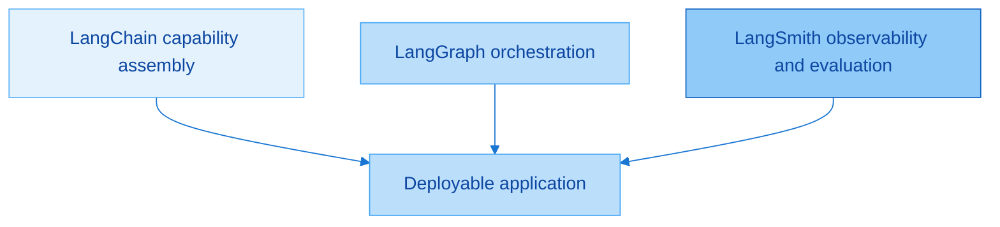
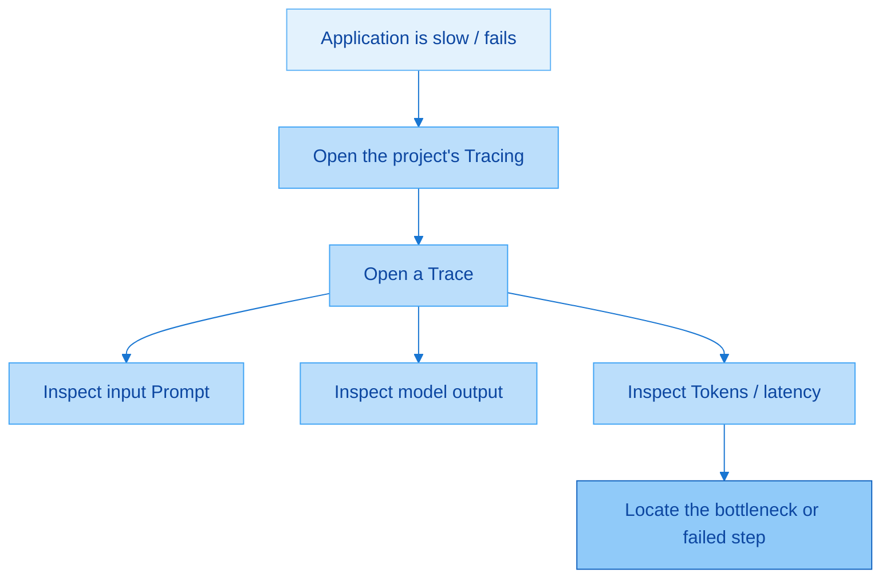
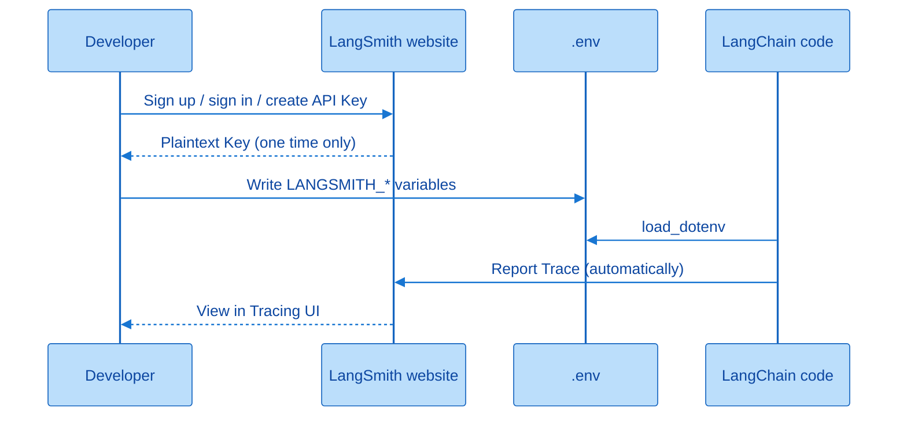
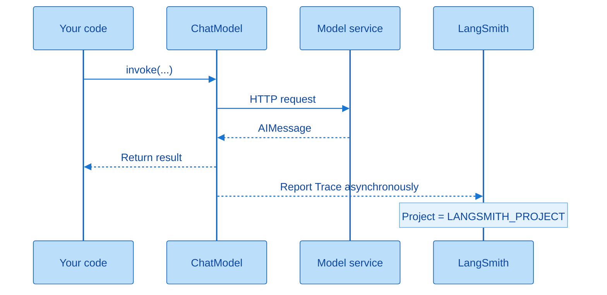
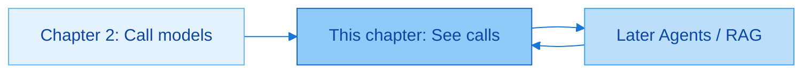

# Using LangSmith

> **Version**: LangChain **1.2.x** + LangSmith (observability platform)

Official site: https://smith.langchain.com/

Chapter 1 positioned LangSmith as the “visible and evaluable” pillar of the ecosystem; Chapter 2 already introduced `run_name`, `tags`, and `metadata` in `config`. This chapter connects observability for real: create an account, get a Key, configure `.env`, run a few calls, and inspect Traces in the Web UI. The chapter is short, but you will keep using these ideas as Agents and RAG systems become more complex.

---

## 1. What You Will Learn in This Chapter

| Section | Core Question | You Should Be Able To |
|------|----------|------------|
| Positioning | What LangSmith is and what it manages | Explain debugging / monitoring / evaluation / management |
| Feature map | What the three groups in the left menu contain | Know that Tracing + Playground are the current priorities |
| Setup | Account, Key, environment variables | Configure the four `.env` variables and report automatically from a project |
| Practice | Run code → inspect a Trace | Compare inputs, outputs, latency, names, and tags |
| Connection | Its relationship with Chapter 2's `config` | Enrich Traces with `run_name` / `tags` / `metadata` |

This chapter can be summarized in one sentence: **upgrade “print debugging” into “end-to-end observability.”** The code is still the model invocation from Chapter 2; what changes is that LangSmith records and visualizes the call. By the end of the chapter, make this a default: enable `LANGSMITH_TRACING=true` for this course project, align the project name with the local project, and develop later chapters with Traces enabled by default.

```mermaid
%%{init: {
  "theme": "base",
  "themeVariables": {
    "primaryColor": "#BBDEFB",
    "primaryTextColor": "#0D47A1",
    "primaryBorderColor": "#1565C0",
    "secondaryColor": "#E3F2FD",
    "secondaryTextColor": "#0D47A1",
    "secondaryBorderColor": "#64B5F6",
    "tertiaryColor": "#E3F2FD",
    "tertiaryTextColor": "#1565C0",
    "tertiaryBorderColor": "#90CAF9",
    "lineColor": "#1976D2",
    "textColor": "#0D47A1",
    "mainBkg": "#E3F2FD",
    "nodeBorder": "#1565C0",
    "clusterBkg": "#E3F2FD",
    "clusterBorder": "#64B5F6",
    "titleColor": "#0D47A1",
    "edgeLabelBackground": "#E3F2FD",
    "actorBkg": "#BBDEFB",
    "actorBorder": "#1565C0",
    "actorTextColor": "#0D47A1",
    "signalColor": "#1976D2",
    "signalTextColor": "#0D47A1",
    "labelBoxBkgColor": "#E3F2FD",
    "labelBoxBorderColor": "#64B5F6",
    "labelTextColor": "#0D47A1",
    "loopTextColor": "#0D47A1",
    "noteBkgColor": "#E3F2FD",
    "noteTextColor": "#0D47A1",
    "noteBorderColor": "#64B5F6",
    "activationBkgColor": "#90CAF9",
    "activationBorderColor": "#1565C0",
    "sequenceNumberColor": "#FFFFFF"
  }
}}%%
flowchart LR
  App[LangChain application] --> Trace[LangSmith Tracing]
  Trace --> UI[Inspect in Web UI]
  UI --> Fix[Investigate slow / failed / token-expensive calls]
  classDef b1 fill:#E3F2FD,stroke:#64B5F6,color:#0D47A1
  classDef b2 fill:#BBDEFB,stroke:#42A5F5,color:#0D47A1
  classDef b3 fill:#90CAF9,stroke:#1565C0,color:#0D47A1
  class App b1
  class Trace b2
  class UI b2
  class Fix b3
```



The application still uses `invoke` normally. Tracing synchronizes the call chain to the cloud in the background; you inspect inputs, outputs, and latency in the UI, then decide whether to adjust the Prompt, switch models, or reduce the number of calls.

### Extra Thought: Why This Is Chapter 3

It comes after “being able to call a model” and before Messages / Tools / Agents so that experiments in every later chapter can be replayed. If you wait to learn observability until an Agent fails, you must learn orchestration and debugging at the same time, doubling the cognitive load. From this chapter onward, prefer inspecting a Trace during local debugging instead of staring only at console output.

---

## 2. LangSmith Overview

### 2.1 What Is LangSmith?

LangSmith is the platform in the LangChain ecosystem dedicated to **debugging, monitoring, evaluating, and managing** LLM applications.

| Capability | Common English Name | In One Sentence |
|------|----------|------------|
| Tracing | Tracing | Records details of every LLM call and chain |
| Monitoring | Monitoring | Views application performance and cost in real time or over time |
| Debugging | Debug | Finds issues and optimizes latency and call structure |
| Evaluation | Evaluate | Systematically tests output quality, such as relevance and hallucination |

These are not four isolated products. They are different entry points on one platform: monitoring dashboards, human annotation, and automated evaluation all need Trace data first. For learners, **Tracing is the entry capability**; go deeper into evaluation and datasets only after RAG / Agent systems have repeatable cases.

### 2.2 Its Place in the Ecosystem

Of the four pillars from Chapter 1: LangChain manages “what capabilities are available,” LangGraph manages “how they run,” Deep Agent handles complex autonomy, and **LangSmith manages “what you can see and evaluate.”** Without it, a complex system relies on `print` and guesses; with it, you can replay each call's Prompt, response, Tokens, and node latency.



During development, LangChain / LangGraph build the application; LangSmith shows how well it was built. The three are commonly used together, not selected as alternatives.

---

## 3. Feature Map: Three Groups in the Left Menu

The slides divide features into three groups. You do not need to use every feature now, but you should build a mental map of where to find them.

### 3.1 Group One: Core Application and Development Features

| Feature | Purpose | When to Use It |
|------|----------|------------|
| **Tracing** | Records each full call chain: Prompt, model response, Tokens, and latency for every node | The first place to go when an Agent / RAG system is slow or fails |
| **Monitoring** | Production-oriented dashboards for call count, Tokens, tool calls, latency, error rate, cost trends, and more | Check stability and spend after deployment |
| **Datasets & Experiments** | Manage test sets and run comparison experiments, such as changing a Prompt or model | Once you have a stable evaluation set |
| **Evaluators** | Rule-based or LLM-as-a-judge scoring for relevance, hallucination, and more | When you need to quantify Traces / experiment results |
| **Annotation Queues** | Human scoring, correction, and tagging; data can feed fine-tuning or test sets | When high-quality human feedback is needed |

Tracing is a “microscope”: open one run and inspect each step. Monitoring is a “dashboard”: assess overall health over time. Datasets / Evaluators / Annotation Queues form a “quality loop”: collect data first, then compare and score it. This chapter's example is still simple, so knowing where these items are in the menu is enough.



The troubleshooting path is stable: enter the right project → find the Trace for the relevant time → expand nodes to inspect inputs, outputs, and latency → adjust code or the Prompt. The longer the chain becomes, the more valuable this habit is.

### 3.2 Group Two: Prompt and Debugging Tools

| Feature | Purpose | Intuition |
|------|----------|------|
| **Prompts** | Manages cloud Prompt versions, like “GitHub for prompts” | Decouples prompts from code and supports versioned retrieval |
| **Playground** | Select a model, write system/user messages, and test directly on the web | Tune a Prompt without writing code |
| **Studio** | Often deeply integrated with **LangGraph** to visualize graph state transitions | Explore later for complex Agents / graph orchestration |
| **Context Hub** | Manages reusable global context / common component configuration | Useful when several projects share templates |

Playground is suitable for “first refine the wording in the browser, then move it back into code.” Prompts are suitable for sharing and comparing versions as a team. Studio becomes useful only when you use LangGraph state machines, where you can pause a node, change state, and continue; as the slides emphasize, it is integrated with Graph and should not be confused with an ordinary chat box.

### 3.3 Group Three: Deployment and Sandboxes

| Feature | Purpose |
|------|----------|
| **Deployments** | Deploys LangChain / LangGraph Agents as online APIs, often through LangGraph Cloud, including concurrency, queues, persistent state, and more |
| **Sandboxes** | Lightweight online execution and testing without polluting production |

Deployments and Sandboxes belong to the “shipping” side. Early course code focuses on local notebooks / scripts, so knowing that these menu entries exist is enough; learn them systematically when delivering API services.

### 3.4 What to Learn Now, What to Add Later

The slides recommend:

- **Focus now**: Tracing (inspect call details) + Playground (tune Prompts quickly)
- **After the application becomes more complex**: use Datasets for quantitative evaluation and Studio for graph visualization
- **Deep into RAG / Agents**: systematically learn Evaluators, Annotation Queues, and related features

Together, these priorities mean: first make every call visible, then make Prompt iteration fast, and only add experiments and Studio after you have evaluation data and complex graphs. Do not mistake clicking every item in the left menu for learning it.

### Extra Thought: Observability Cost and Privacy

Enabling Tracing synchronizes inputs and outputs to the LangSmith cloud, subject to the platform's current policies and pricing plans. Be careful with calls that contain private information, Keys, or customer source text: redact, sample, or disable tracing according to organizational policy. Practical guidance: enable it by default in development; configure production sampling rates and field filtering according to compliance requirements and the official documentation.

---

## 4. Preparing an Account and API Key

### 4.1 Sign Up or Sign In

1. Open the official website: https://smith.langchain.com/
2. Sign up or sign in with Google, GitHub, email, or another supported option.
3. After logging in, enter the main interface (English by default, with a feature list on the left).

The menu can feel crowded on first entry, which is normal. This chapter only needs you to reach **Settings → API Keys**, then view **Tracing** in a project. Use the map in the previous section to explore other entries only when needed.

### 4.2 Create and Save an API Key

| Step | Action | Note |
|------|----------|------------|
| 1 | Open **Settings** in the lower left | Find the settings entry point |
| 2 | **API Keys** → Create | Give it a name, such as `langchain-1.2`; optionally choose Never for expiry |
| 3 | **Copy immediately** | A Key is shown **only once**; after closing the window, you cannot view its plaintext again |
| 4 | Optionally delete an old Key | Use the operation on the right side of the list after exposure or rotation |

Use the same security habits as for a model API Key: store it only in `.env` / a secret-management system, never in Git, screenshots, or chat logs. If it is lost, revoke it and create another one; do not expect the website to reveal the old plaintext Key again.



The account and Key answer “whether you are authorized to report”; `.env` answers “whether this project enables reporting and which project receives it.” Without either, your run records will not appear in the UI.

---

## 5. Environment Variable Configuration

Add or align the following variables in the project's `.env`; they can live in the same file as model Keys.

| Variable | Meaning | What to Enter |
|------|----------|------------|
| `LANGSMITH_TRACING` | Whether tracing is enabled | Set to `true` while learning |
| `LANGSMITH_ENDPOINT` | API address | Usually `https://api.smith.langchain.com`; do not change it casually |
| `LANGSMITH_API_KEY` | Your Key | Replace with the value just copied |
| `LANGSMITH_PROJECT` | Displayed project name | Choose your own name and use it to locate records in the UI |

The slide example project name may be a randomly generated string; spoken examples often use a name related to the project, such as `langchain1.2_tutorial`. **Use one project name consistently within the same project** so that Traces do not scatter across several hard-to-find projects.

```text
LANGSMITH_TRACING=true
LANGSMITH_ENDPOINT=https://api.smith.langchain.com
LANGSMITH_API_KEY=<YOUR_API_KEY>
LANGSMITH_PROJECT="langchain1.2_tutorial"
```

Together, these four lines enable tracing, point at the official Endpoint, authenticate with your Key, and assign this project's runs to a named project. Code can continue to use `load_dotenv(override=True)`; you **do not** need to manually write “start monitoring” around every `invoke`. Once environment variables take effect, the LangChain integration reports automatically.

### Extra Thought: A Project-Level Switch

Putting these variables in the current project's `.env` means related runs from that project go to the selected LangSmith project. When changing machines or repositories, keep `.env.example` with placeholders and the real-Key management approach in sync. To temporarily disable observability, set `LANGSMITH_TRACING` to `false` or comment it out; business code does not need changes.

---

## 6. Inspecting Monitoring Data: Tracing Practice

After configuring the variables: run any LangChain code that calls a model → open the matching project on the website → refresh Tracing.

### 6.1 Overall Data Flow



The business path remains “code → model → answer”; a side path now reports to LangSmith. The name shown in the UI often maps to the current underlying class, such as `ChatDeepSeek` or `ChatOpenAI`. Even if code uses `init_chat_model`, the UI may show the routed concrete implementation class.

### 6.2 Example 1: The `ChatDeepSeek` Dedicated Class

```python
import os
from dotenv import load_dotenv
from langchain_deepseek import ChatDeepSeek

load_dotenv(override=True)

model = ChatDeepSeek(
    api_key=os.getenv("DEEPSEEK_API_KEY"),
    api_base=os.getenv("DEEPSEEK_BASE_URL"),
    model_name="deepseek-v4-flash",  # use a model available in your console
)
print(model.invoke("Hello"))
```

This follows the dedicated-class form from Chapter 2 and adds no “LangSmith SDK call.” After it runs, refresh the Web UI: the project named by `LANGSMITH_PROJECT` should appear. Open Tracing to inspect the input `Hello`, the model output, and metadata. The name commonly appears as `ChatDeepSeek`.

### 6.3 Example 2: `init_chat_model` with a Compatible Relay

```python
from langchain.chat_models import init_chat_model
from dotenv import load_dotenv
import os

load_dotenv(override=True)

model = init_chat_model(
    model="deepseek-v4-flash",
    model_provider="openai",
    api_key=os.getenv("CLOSEAI_API_KEY"),
    base_url=os.getenv("CLOSEAI_BASE_URL"),
)
print(model.invoke("Hello, answer in one sentence"))
```

The unified interface may still route internally to an implementation such as `ChatOpenAI`, so the Trace list may show `ChatOpenAI` even though the code says `init_chat_model`. Run it several times and the list stacks entries by time; compare error status, latency, and whether inputs and outputs match expectations.

### 6.4 Example 3: Enriching a Trace with `invoke(..., config=...)`

Chapter 2 introduced `run_name`, `tags`, `metadata`, and `configurable`. With LangSmith configured, these fields appear in Trace details and make searching and attribution easier.

```python
from langchain.chat_models import init_chat_model
from dotenv import load_dotenv
import os
from rich import print as rprint

load_dotenv(override=True)

model = init_chat_model(
    model="deepseek-v4-flash",
    model_provider="deepseek",
    api_key=os.getenv("DEEPSEEK_API_KEY"),
    base_url=os.getenv("DEEPSEEK_BASE_URL"),
    temperature=0.2,
    max_tokens=500,
    configurable_fields=("model", "model_provider", "temperature", "max_tokens"),
)

config = {
    "run_name": "joke_generation",
    "tags": ["my_tag1", "my_tag2"],
    "metadata": {
        "user_id": "shkstart",
        "session_id": "sess_123",
    },
    "configurable": {
        "model": "deepseek-v4-pro",
        "model_provider": "openai",
        "temperature": 0.7,
        "max_tokens": 1000,
    },
}

response = model.invoke("What is 1 + 2?", config=config)
rprint(response)
```

You can generally verify the following in the UI:

| What You Put in `config` | Common Trace Presentation |
|--------------------|------------------|
| `run_name` | This run's display name, such as `joke_generation` |
| `tags` | Tag list for filtering |
| `metadata.user_id` / `session_id` | User and session information in details |
| `configurable` | The actual model / temperature for this call, provided `configurable_fields` was declared |

Treat “name a run, tag it, and include user/session context” as basic observability etiquette. Once an Agent has many steps, a Trace list without `run_name` and `tags` quickly becomes unreadable. Filtering by `session_id` also lets you inspect all calls from one conversation together.

### 6.5 How to Read It in the Web UI

| Step | What to Do |
|------|----------|
| 1 | Run any of the examples above |
| 2 | Open LangSmith and locate the project matching `LANGSMITH_PROJECT` |
| 3 | Enter **Tracing** and refresh the list |
| 4 | Open an entry to inspect input, output, latency, metadata, and more |
| 5 | Switch report tabs as needed to explore call volume, Tokens, and aggregate data |

The list answers “is it there, did it succeed, and how long did it take?” Details answer “what exactly was sent and what did the model return?” Reports are closer to the Monitoring view and suit trend analysis rather than debugging one failure. UI labels can shift with product releases, so follow the actual menu in your account, but the main Tracing path is stable.

### Extra Thought: A Trace Naming Convention

Consider agreeing on this team convention: use `run_name` as “scenario_action,” such as `rag_retrieve` or `agent_plan`; put the environment (`dev` / `prod`) and feature module in `tags`; include at least `user_id` or a business ticket number in `metadata`. It is not a hard rule from the slides, but it greatly lowers the cost of searching Traces later.

---

## 7. How This Connects to Earlier and Later Chapters

| Chapter | Relationship with LangSmith |
|------|---------------------|
| Chapter 1 | Pillar positioning: observability / evaluation layer |
| Chapter 2 | `config` fields supply Trace names, tags, metadata, and per-call overrides |
| This chapter | Connects reporting and the UI for real |
| Later Messages / Tools / Agents / RAG | As chains grow, use Tracing to find “which step is stuck”; then use Datasets / Evaluators for quality comparisons |

Without this chapter, later complex examples can still run, but debugging returns to blind guessing. With it, make this the default: **reproduce the failing call → open the corresponding Trace → then change the code.**



Chapter 2 solves “connect the power”; this chapter solves “connect the dashboard”; later chapters stack capabilities while the dashboard stays on, forming a positive loop.

---

## 8. Chapter Cheat Sheet

```text
1. LangSmith = debugging + monitoring + evaluation + management (the ecosystem observability layer)
2. Prioritize Tracing + Playground now; add Datasets / Studio when things get complex
3. A Key is shown only once → write it to .env immediately
4. Four variables: TRACING / ENDPOINT / API_KEY / PROJECT
5. After load_dotenv, invoke normally → reporting is automatic
6. UI: find the project by PROJECT → Tracing → open an entry for input/output/latency
7. config: run_name / tags / metadata go into a Trace and support filtering and attribution
8. An init_chat_model Trace may show its underlying ChatOpenAI class, etc.
9. Studio ↔ LangGraph; Deployments / Sandboxes are mainly for shipping
10. Debugging mantra: reproduce → open Trace → change code
```

Explain it once as “what it is → menu map → Key and four variables → three code examples → how to use the UI.” If you can independently run one call and find its Trace on the site, you have passed this chapter.

---

## 9. Self-Check List

- [ ] Can explain LangSmith's role in the ecosystem (observability / evaluation, not a replacement for the model)
- [ ] Can name the three feature groups and identify Tracing and Playground as the current priorities
- [ ] Has registered an account, created an API Key, and understands “shown only once”
- [ ] Has configured the four `.env` variables correctly, including `LANGSMITH_TRACING=true`
- [ ] Has run at least one example with `ChatDeepSeek` or `init_chat_model`, with a visible UI record
- [ ] Can match `run_name` / `tags` / `metadata` to what appears in a Trace detail page
- [ ] Knows that Studio mainly serves LangGraph visualization rather than an ordinary chat box
- [ ] Knows that Datasets / Evaluators / Annotation Queues are for later evaluation work

Suggested self-test: close the notes, write the four environment-variable lines from scratch, then write an `invoke` with `config`; open the website, find the run, and point out its tags and session.

---

## 10. Next Chapter Preview

The next chapter covers **Messages and Prompt Templates**: message roles, `content_blocks`, `ChatPromptTemplate`, and more. Keep LangSmith Tracing enabled so you can see what a template's rendered, real Prompt looks like early; that is more direct than guessing at strings only from code.
